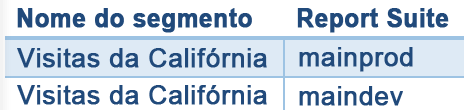
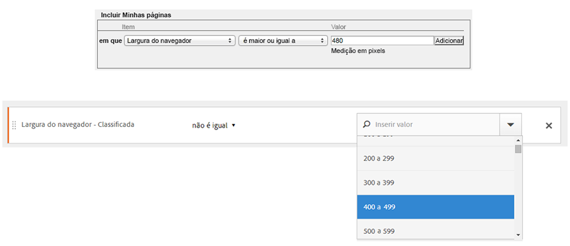

# Segmentos herdados

Este artigo responde às perguntas frequentes sobre as práticas recomendadas para gerenciar segmentos herdados. Segmentos herdados são segmentos que foram criados antes de 2014.

## Gerenciamento de segmentos herdados {#legacy}

+++ **O que aconteceu com meus segmentos existentes?**

Os segmentos existentes continuam a funcionar como antes. Os relatórios que têm esses segmentos aplicados continuam a funcionar corretamente.

A maioria dos segmentos pré-definidos e de conjunto são migrados como modelos de segmento no Construtor de segmentos. Os modelos de segmento são usados para criar rapidamente segmentos personalizados com públicos-alvo comuns. Os modelos de segmento não podem ser aplicados diretamente a um relatório, mas podem ser facilmente salvos em um segmento personalizado.

Os modelos de segmento são marcados com um ícone especial  no Construtor de segmentos.

+++

+++ **O que aconteceu com os relatórios agendados com segmentos aplicados?**

Os relatórios agendados continuam a ser executados corretamente com os segmentos definidos.

Quando você exclui um segmento, os relatórios agendados e os painéis de controle que têm esse segmento aplicado continuam a funcionar normalmente, ou seja, o segmento ou painel de controle continua a usar o segmento excluído.

Os relatórios agendados não são atualizados ao editar um segmento com o mesmo nome. Este é um exemplo: Suponhamos que você tenha dois segmentos com o mesmo nome em conjuntos de relatórios diferentes:

Você tem uma visualização que faz referência ao segmento para o conjunto de relatórios **[!UICONTROL mainprod]**. Em seguida, você exclui esse segmento, pois é uma duplicata. A visualização continua a ser executada, fazendo referência à definição do segmento excluído. Se você alterar a definição de segmento para que o segmento principal inclua a ilha da Catalunha e Tijuana, México, o segmento aplicado à visualização não será alterado e usará a definição antiga. Para usar a nova definição, atualize a visualização para fazer referência à nova definição. Se não tiver certeza se uma visualização, projeto ou relatório agendado está usando um segmento excluído, altere o nome do segmento restante para mostrar se a visualização usa o segmento restante.

+++

+++ **O que aconteceu com os segmentos do data warehouse?**

Todos os segmentos existentes no data warehouse ainda funcionam nele. A maioria dos segmentos do Data Warehouse também funciona em outros componentes, como o Analysis Workspace.

Você pode criar ou editar novos segmentos de Data Warehouse no gerenciador/construtor de segmentos. O mecanismo de Compatibilidade do produto no Construtor de segmentos determina automaticamente se um segmento é compatível com o Data Warehouse.

+++

+++ **O que aconteceu com os segmentos pré-configurados?**

* **Visitas únicas à página**
* **Visitas de dispositivos móveis**
* **Visitas da pesquisa natural**
* **Visitantes da pesquisa paga**
* **Visitantes com cookie de ID do visitante**

Esses segmentos são migrados como modelos de segmentos no Construtor de segmentos. Relatórios existentes que utilizam esses segmentos continuam funcionando corretamente.

+++

+++ **O que aconteceu com os segmentos do CX Enterprise (Suite):**

* Não compradores
* Compradores
* Novas visitas
* Visitas de redes sociais
* Visitas de mais de 10 minutos*
* Visitas com mais 5 visitas anteriores*
* Visitas do Facebook*

A maioria desses segmentos (exceto os marcados com um asterisco *) foram migrados como modelos de segmento para o construtor de segmentos. Além disso, vários novos modelos de segmento foram adicionados.

Relatórios existentes que utilizam esses segmentos continuam funcionando corretamente.

+++

+++ **O que aconteceu com os segmentos Admin (também conhecidos como segmentos “Globais”)?**

Segmentos **Admin** são migrados para a nova interface de segmento e exibidos como segmentos compartilhados com todos.

O proprietário desses segmentos está definido como o administrador com a conta mais antiga de usuários administradores. No entanto, todos os administradores podem excluir, editar e compartilhar esses segmentos.

A interface de gerenciamento de segmentos na Admin Console em que os administradores criaram e gerenciaram esses segmentos globais não está mais disponível. Agora, os administradores devem usar o novo construtor de segmentos para criar segmentos e compartilhá-los com grupos ou indivíduos apropriados ou com todos.

Os segmentos existentes que usam a lógica alterada conforme descrito neste documento continuam a funcionar corretamente, embora os segmentos devam ser atualizados para que possam ser salvos novamente. Por exemplo, se você tiver um segmento existente no qual **[!UICONTROL Estados dos EUA]** **[!UICONTROL contém]** `New York`, esse segmento continuará a funcionar corretamente. Na próxima vez que você editar o segmento, precisará atualizar o segmento para usar o tipo enumerado com uma condição **[!UICONTROL igual a]**.

+++

+++ **O que devo fazer com segmentos duplicados que possuem o mesmo nome, mas podem ter definições diferentes?** 
Agora que os segmentos funcionam em vários conjuntos de relatórios, você pode acabar descobrindo que possui vários segmentos com o mesmo nome. Você deve:

* Renomeie segmentos que tenham o mesmo nome, mas definições diferentes, ou
* Exclua segmentos que não são mais necessários.

+++

+++ **O que a Adobe recomenda em relação à limpeza de segmentos?**

* Marcar todos os segmentos com tag herdada.
* Revise os segmentos que você tem.
* Adicione-os à biblioteca de segmentos onde aplicável.
* Aprove segmentos que são canônicos.
* Marque os segmentos de acordo com as [práticas recomendadas](/help/components/segmentation/segmentation-workflow/seg-workflow.md).

+++

### Dicas de migração

As seguintes dicas ajudam a migrar dimensões comuns:

* Cidade/regiões/país geográfico - pesquise e selecione cidades, regiões ou países específicos em vez de usar uma correspondência parcial.
* Navegadores - use a dimensão Tipos de navegador para obter todos os navegadores em um tipo, por exemplo, Google Chrome
* Sistemas operacionais - use as dimensões Tipos de sistema operacional para obter todos os sistemas operacionais em um tipo, por exemplo, Microsoft Windows.
* Consulte “Dimensões novas e renomeadas” (veja abaixo)

## Dimensões novas e renomeadas {#renamed}

A tabela a seguir contém uma lista de dimensões que foram renomeadas no Construtor de segmentos.

| Novo nome do Dimension | Nome anterior | Notas |
|--- |--- |--- |
| Tipos de sistema operacional | Novo | Adicionado na primavera de 2015. |
| Largura do navegador - Classificada | Largura da janela do navegador | Essa dimensão é compatível com todas as interfaces e é dividida em uma lista enumerada de intervalos, em vez de valores inteiros específicos. Se você precisar segmentar valores específicos, use a versão granular dessa dimensão em um segmento do Data Warehouse. |
| Altura do navegador - Classificada | Altura da janela do navegador | Essa dimensão é compatível com todas as interfaces e é dividida em uma lista enumerada de intervalos, em vez de valores inteiros específicos. Se você precisar segmentar valores específicos, use a versão granular dessa dimensão em um segmento do Data Warehouse. |
| Largura do navegador – Granular | Largura da janela do navegador | Essa dimensão foi renomeada e agora é compatível somente com o Data Warehouse. Ao definir segmentos compatíveis com todas as interfaces, use o tipo enumerado, Largura do navegador - Classificada. |
| Altura do navegador – Granular | Altura da janela do navegador | Essa dimensão foi renomeada e agora é compatível somente com o Data Warehouse. Ao definir segmentos compatíveis com todas as interfaces, use o tipo enumerado, Altura do navegador - Classificada. |
| Suporte a cookies | Cookies | - |
| Intensidade de cor | Intensidade de cor do monitor | - |
| - | &quot;Aplicativo - *&quot; | os prefixos &quot;App -&quot; foram removidos de vários tipos de dimensão. Como os dados do aplicativo móvel geralmente são capturados em um conjunto de relatórios que não contém dados da Web, esses prefixos não foram necessários. |
| Página de entrada original | Página de Entrada Original | - |
| Java habilitado | Java | - |
| Extensão máx. do URL do navegador para dispositivo móvel | Extensão do URL do Navegador Remoto | - |
| Decoração de correio para dispositivo móvel | Suporte a E-mail de Decoração Remoto | - |
| Dispositivo móvel | Nome do dispositivo móvel | - |
| Extensão max do marcador de dispositivo móvel | Extensão Max do URL do Marcador Remoto | - |
| Extensão máx. de email móvel | Extensão Max do URL do Email Remoto | - |
| sistema operacional do dispositivo móvel (obsoleto) | SO Móvel | Em vez disso, use a dimensão Sistema operacional e aplique uma visita de segmentos de dispositivos móveis. |
| Push To Talk para dispositivo móvel | PTT Remoto | - |
| Exibições da pesquisa | Total de visualizações da pesquisa | - |
| Respostas da pesquisa | Total de Respostas da Pesquisa | - |
| Profundidade da visita | Comprimento do caminho | - |
| Código postal | CEP | - |

{style="table-layout:auto"}

## Alterações nas dimensões baseadas em sequência de caracteres com valores conhecidos {#string-based-dims}

As dimensões baseadas em cadeia de caracteres com um conjunto de valores conhecido foram alteradas para os tipos enumerados. Ao criar um segmento usando essas dimensões, a lista é pré-preenchida com todos os valores conhecidos e o único operador com suporte é **[!UICONTROL igual a]**. Essa população de valores permite segmentar rapidamente os valores exatos que você estava procurando sem selecionar valores não intencionais ao usar uma correspondência menos restritiva.

As seguintes dimensões foram alteradas para listas discriminadas:

| Nome da dimensão | Nome da dimensão | Nome da dimensão |
| --- | --- | --- |
| fabricante do dispositivo móvel | tamanho do email móvel | intensidade de cor |
| tamanho da tela do dispositivo móvel | número do dispositivo móvel | resolução do monitor |
| altura da tela do dispositivo móvel | Push To Talk para dispositivo móvel | plug-in |
| Suporte a cookie em dispositivo móvel | Decoração de correio para dispositivo móvel | sistema operacional |
| Suporte a imagem em dispositivo móvel | serviços de informação para dispositivos móveis | tipo de referenciador |
| intensidade de cor de dispositivo móvel | tipo de dispositivo móvel | mecanismo de pesquisa |
| suporte a áudio remoto | tipo de navegador | estado |
| suporte a vídeo em dispositivo móvel | navegador | país geográfico |
| drm móvel | tipo de conexão | região geográfica |
| protocolos de rede para dispositivo móvel | operadora de celular | cidade geográfica |
| so móvel | cookie | geo dma |
| java VM para dispositivo móvel | fidelização do cliente | cookie persistente |
| tamanho do marcador de página móvel | java ativado | pesquisa paga |
| comprimento do url móvel | idioma |  |

## Alterações nas dimensões com base em número inteiro com valores conhecidos {#integer-based-dims}

As dimensões com base em números inteiros (como a largura do navegador) com um conjunto conhecido de valores são divididas em intervalos enumerados para que você possa definir rapidamente segmentos para um intervalo específico. Essas listas enumeradas são anexadas com &quot; - Classificado&quot; após o nome da dimensão. A seguinte tela demonstra como essas dimensões são segmentadas usando a interface anterior e a nova interface do construtor de segmentos:

Os operadores menor que, maior que e semelhante agora são compatíveis somente com os segmentos do Data Warehouse. Segmentos destinados a serem compatíveis com todas as interfaces de relatórios devem usar a versão &quot;Classificada&quot; da métrica com o operador **[!UICONTROL igual a]**.
