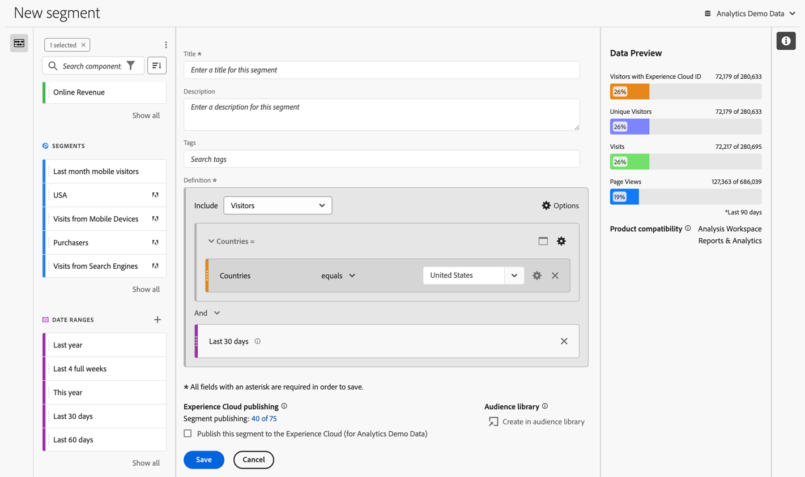
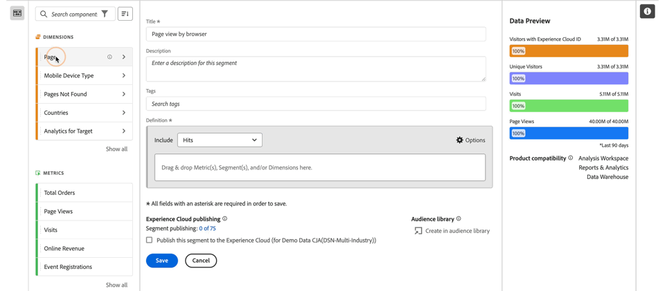

# Construtor de segmentos {#segment-builder}

>[!CONTEXTUALHELP]
>id="components_segments_productcompatibility"
>title="Compatibilidade do produto"
>abstract="Uma quantidade reduzida de critérios de segmento disponíveis não é compatível com todas as ferramentas do Adobe Analytics. As ferramentas compatíveis com o segmento são indicadas nesta lista. Para tornar um segmento compatível com todas as ferramentas do Adobe Analytics, edite seus critérios."

>[!CONTEXTUALHELP]
>id="components_filters_createaudience"
>title="Criar público-alvo"
>abstract="Os públicos-alvo podem ser criados a partir de um segmento e compartilhados com a Adobe Experience Platform para ativação."

>[!CONTEXTUALHELP]
>id="components_filters_datapreview"
>title="Visualização de dados"
>abstract="Compara os dados desse segmento com os da visualização de dados. A porcentagem de visualização é baseada no número total na visualização de dados dos **últimos 90 dias**.  Se a visualização não estiver carregando, a conexão ainda pode estar preenchendo os dados."

A caixa de diálogo **[!UICONTROL Construtor de segmentos]** é usada para criar novos segmentos ou editar segmentos existentes. A caixa de diálogo é intitulada **[!UICONTROL Novo segmento]** ou **[!UICONTROL Editar segmento]** para segmentos que você cria ou gerencia no [[!UICONTROL Gerenciador de segmentos]](/help/components/segmentation/segmentation-workflow/seg-manage.md).

>[!BEGINTABS]

>[!TAB Construtor de segmentos]

>[!TAB Criar ou editar segmento]

>[!ENDTABS]

1. Especifique os seguintes detalhes ( é obrigatório):

   | Elemento | Descrição |
   | --- | --- |
   | **[!UICONTROL Conjunto de relatórios]** | É possível selecionar o conjunto de relatórios do segmento. |
   | **[!UICONTROL Segmento somente de projeto]** | Uma caixa de informações para explicar que o segmento só fica visível no projeto em que foi criado e que o segmento não será adicionado à sua lista de componentes. Habilite a opção **[!UICONTROL Tornar este segmento disponível para todos os seus projetos e adicioná-lo à sua lista de componentes]** para alterar essa configuração. Esta caixa de informações só fica visível quando você cria um [segmento rápido](seg-quick.md) e transforma as informações do segmento rápido em um segmento regular usando a opção **[!UICONTROL Abrir construtor]** na interface [!UICONTROL Segmento rápido]. |
   | **[!UICONTROL Título]**  | Nomeie o segmento, por exemplo, `Last month mobile visitors`. |
   | **[!UICONTROL Descrição]** | Forneça uma descrição para o segmento, por exemplo, `Segment to define the mobile customers for the last month`. |
   | **[!UICONTROL Tags]** | Organize o segmento criando ou aplicando uma ou mais tags. Comece a digitar para encontrar as tags existentes que você pode selecionar. Ou pressione **[!UICONTROL ENTER]** para adicionar uma nova tag. Selecione  para remover uma tag. |
   | **[!UICONTROL Definição]**  | Defina o segmento usando o [Criador de definições](#definition-builder). |

   {style="table-layout:auto"}

1. Para verificar se a definição do seu segmento está correta, use a visualização constantemente atualizada dos resultados do segmento no canto superior direito.
1. Para publicar seu segmento na Experience Cloud, selecione **[!UICONTROL Publicar este segmento na Experience Cloud (para *conjunto de relatórios*)]**. Consulte [Publicar segmentos na Experience Cloud](/help/components/segmentation/segmentation-workflow/seg-publish.md) para obter mais informações.
1. Selecione:
   * **[!UICONTROL Salvar]** para salvar o segmento.
   * **[!UICONTROL Salvar como]** para salvar uma cópia do segmento.
   * **[!UICONTROL Excluir]** para excluir o segmento.
   * **[!UICONTROL Cancelar]** para cancelar quaisquer alterações feitas no segmento ou cancelar a criação de um novo segmento.

## Construtor de definições

Use o construtor de definições para construir a definição de segmento. Nessa construção, você usa componentes, containers, operadores e lógica.

Você pode configurar o tipo e o escopo da sua definição:

1. Para especificar o tipo de definição, especifique se deseja criar uma definição de inclusão ou exclusão. Selecione  **[!UICONTROL Opções]** e no menu suspenso **[!UICONTROL Incluir]** ou **[!UICONTROL Excluir]**.
1. Para especificar o escopo da sua definição, selecione no menu suspenso **[!UICONTROL Incluir]** ou **[!UICONTROL Excluir]** se deseja que o escopo da definição seja **[!UICONTROL Ocorrências]**, **[!UICONTROL Visitas]** ou **[!UICONTROL Visitantes]**.

É sempre possível alterar essas configurações posteriormente.

### Componentes

Uma parte essencial da construção da definição do segmento é usar dimensões, métricas, segmentos existentes e intervalos de datas. Todos esses componentes estão disponíveis no painel de componentes no Construtor de segmentos.

{width=100%}

Para adicionar um componente:

1. Arraste e solte um componente do painel de componentes em **[!UICONTROL Arraste e solte métricas, segmentos e/ou dimensões aqui]**. Você pode usar a  na barra de componentes para procurar componentes específicos.
1. Especifique os detalhes do componente. Por exemplo, selecione um valor em **[!UICONTROL Selecionar valor]**. Ou insira um valor. Como você pode especificar um ou mais valores, bem como quais podem ser selecionados, depende do componente e do operador.
1. Opcionalmente, modifique o operador padrão. Por exemplo, de **[!UICONTROL é igual a]** para **[!UICONTROL é igual a qualquer um entre]**. Consulte [Operadores](../seg-reference/seg-operators.md) para obter uma visão geral detalhada dos operadores disponíveis.

Para editar um componente:

* Selecione um novo operador para o componente no menu suspenso de operadores.
* Selecione ou especifique um valor diferente para o operador, se for o caso.
* Se o tipo de componente for uma dimensão, será possível definir o modelo de atribuição. Consulte [Modelo de atribuição](#attribution) para mais informações.

Para excluir um componente:

* Selecione  em um componente.

### Containers

É possível agrupar vários componentes em um ou mais containers, e definir a lógica dentro e entre containers. Os containers permitem criar definições complexas para seu segmento.

{Width=100%}

* Para adicionar um container, selecione **[!UICONTROL Adicionar container]** em  **[!UICONTROL Opções]**.
* Para adicionar um componente existente ao container, arraste e solte o componente no container.
* Para adicionar outro componente ao container, arraste e solte um componente do painel de componentes no container. Use a linha de inserção azul como guia.
* Para adicionar outro componente fora do container, arraste e solte um componente do painel de componentes fora do container, mas dentro do container da definição principal. Use a linha de inserção azul como guia.
* Para modificar a lógica entre componentes em um container, entre containers ou entre um container e um componente, selecione a opção  apropriada entre **[!UICONTROL E]**, **[!UICONTROL Ou]** e **[!UICONTROL Então]**. Ao selecionar **[!UICONTROL Então]**, você transforma o segmento em um segmento sequencial. Veja [Criar segmento sequencial](seg-sequential-build.md) para mais informações.
* Para alternar o nível do container, selecione  **[!UICONTROL Ocorrências]**,  **[!UICONTROL Visitas]** ou  **[!UICONTROL Visitantes]**.

Você pode usar a  de um container para realizar as seguintes ações:

| Ação do container | Descrição |
|---|---|
| **[!UICONTROL Adicionar container]** | Adicione um container aninhado ao container. |
| **[!UICONTROL Excluir]** | Exclua o resultado do container na definição do segmento. Uma barra vermelha fina à esquerda identifica um container de exclusão. |
| **[!UICONTROL Incluir]** | Inclua o resultado do container na definição do segmento. O padrão é incluir. Uma barra cinza fina à esquerda identifica um container de inclusão. |
| **[!UICONTROL Container de nome]** | Renomeie o container a partir de sua descrição padrão. Digite um nome no campo de texto. Se você não digitar nada, a descrição padrão será usada. |
| **[!UICONTROL Excluir container]** | Exclua o contêiner da definição. |

## Intervalos de datas

Você pode criar segmentos que contêm intervalos de datas contínuos. Assim, é possível responder a perguntas sobre campanhas ou eventos em andamento. Por exemplo, você pode criar um segmento que inclua *todos que fizeram uma compra online nos últimos 60 dias*.

>[!BEGINSHADEBOX]

Consulte  [Intervalos de datas contínuos em segmentos](https://video.tv.adobe.com/v/25403/?quality=12&learn=on){target="_blank"} para assistir a um vídeo de demonstração.

>[!ENDSHADEBOX]

## Empilhar segmentos {#stack}

Você pode criar um segmento usando segmentos. Ao usar segmentos em um segmento, você pode otimizá-lo e reduzir a complexidade.

Imagine que você deseja segmentar a combinação de canal de interação (5) e estados dos EUA (50). Você pode criar 250 segmentos, cada um para uma combinação exclusiva de tipo de dispositivo (celular x tablet) e um estado dos EUA. Para obter os usuários de tablets na Califórnia, você usaria um dos 250 segmentos:

Ou você pode definir 55 segmentos: 50 segmentos para os estados dos EUA e 5 para os possíveis canais de interação. Em seguida, empilhe os segmentos para obter os mesmos resultados. Para obter os usuários de aplicativos móveis da Califórnia, você empilharia dois segmentos:

## Atribuição {#attribution}

>[!CONTEXTUALHELP]
>id="components_filters_attribution_repeating"
>title="Repetição"
>abstract="Inclui instâncias e valores persistentes da dimensão."

>[!CONTEXTUALHELP]
>id="components_filters_attribution_instance"
>title="Instância"
>abstract="Inclui instâncias da dimensão."

>[!CONTEXTUALHELP]
>id="components_filters_attribution_nonrepeatinginstance"
>title="Instância não repetida"
>abstract="Inclui as instâncias exclusivas (não repetidas) da dimensão."

Ao usar uma dimensão no Construtor de segmentos, você tem opções para especificar o modelo de atribuição para essa dimensão. O modelo de atribuição selecionado determina se os dados se qualificam para a condição especificada para o componente de dimensão.

Selecione  dentro do componente de dimensão e escolha um dos modelos de atribuição na janela pop-up:

| Modelos | Descrição |
|---|---|
| **[!UICONTROL Modelo repetido (padrão)]** | Inclua a instância e os valores persistentes da dimensão para determinar a qualificação. |
| **[!UICONTROL Instância]** | Inclua apenas valores de instância da dimensão para determinar a qualificação. |
| **[!UICONTROL Instância não repetida]** | Inclua os valores de instância exclusiva (não repetida) da dimensão para determinar a qualificação. |

### Exemplo

Como parte de uma definição de segmento, você especificou a seguinte condição: Nome da página é igual a Mulheres. Semelhante ao exemplo acima. Repita esta definição de segmento usando os outros dois modelos de atribuição. Você tem três segmentos, cada um com seu próprio modelo de atribuição:

* Página - Atribuição - Repetição (padrão) de mulheres
* Página - Atribuição - Instância de mulheres
* Página - Atribuição - Instância não repetida de mulheres

A tabela abaixo explica, para cada modelo de atribuição, quais eventos de entrada são qualificados  para essa condição.

| Página - Atribuição -  *modelo de atribuição* de mulheres | Evento 1: Nome da página igual a Mulheres | Evento 2: Nome da página igual a Homens | Evento 3: Nome da página igual a Mulheres | Evento 4: Nome da página igual a Mulheres (que persistiram) | Evento 5: Nome da página igual a Check-out | Evento 6: Nome da página igual a Mulheres | Evento 7: Nome da página igual a Página inicial |
|---|:---:|:---:|:---:|:---:|:---:|:---:|:--:|
| Repetição (padrão) |  |  |  |  |  |  |  |
| Instância |  |  |  |  |  |  |  |
| Instância não repetida |  |  |  |  |  |  |  |

Um exemplo de relatório sobre eventos usando os três segmentos ficaria assim:

<!--

The [!UICONTROL Segment builder] lets you build simple or complex segments that identify visitor attributes and actions across visits and page hits. It provides a canvas to drag and drop metric dimensions, events, or other segments in order to segment visitors based on hierarchy logic, rules, and operators.

There are several ways to access the Segment builder:

* **Analytics top navigation**: Click **[!UICONTROL Analytics]** > **[!UICONTROL Components]** > **[!UICONTROL Segments]**.
* **[!UICONTROL Analysis Workspace]**: Click **[!UICONTROL Analytics]** > **[!UICONTROL Workspace]**, open a project and click **[!UICONTROL + New]** > **[!UICONTROL Create Segment]**.
* **[!UICONTROL Report Builder]**: [Add or edit segments in Report Builder](https://experienceleague.adobe.com/en/docs/analytics/analyze/report-builder/work-with-segments).

## Builder criteria {#section_F61C4268A5974C788629399ADE1E6E7C}

You can add rule definitions and containers to define your segments.

1. **[!UICONTROL Title]**: Name the segment.
1. **[!UICONTROL Description]**: Provide a description for the segment. 
1. **[!UICONTROL Tags]**: [Tag the segment](/help/components/segmentation/segmentation-workflow/seg-workflow.md) you are creating by picking from a list of existing tags or creating a new tag.
1. **[!UICONTROL Definitions]**: This is where you [build and configure segments](/help/components/segmentation/segmentation-workflow/seg-workflow.md), add rules, and nest and sequence containers. 
1. **[!UICONTROL Show]**: (Top Container selector.) Lets you select the top-level [container](/help/components/segmentation/seg-overview.md) ( [!UICONTROL Visitor], [!UICONTROL Visit], [!UICONTROL Hit]). The default top-level container is the Hit container.
1. **[!UICONTROL Options]**: (gear) icon

   * **[!UICONTROL + Add container]**: Lets you add a new container (below the top-level container) to the segment definition.
   * **[!UICONTROL Exclude]**: Lets you define the segment by excluding one or more dimensions, segments, or metrics.

1. **[!UICONTROL Dimensions]**: Components are dragged and dropped from the Dimensions list (orange sidebar).
1. **[!UICONTROL Operator]**: You can compare and constrain values using selected operators.
1. **[!UICONTROL Value]**: The value you entered or selected for the dimension or segment or metric.
1. **[!UICONTROL Attribution Models]**: Available for dimensions only, these models determine what values in a dimension to segment for. Dimension models are particularly useful in sequential segmentation.

   * **[!UICONTROL Repeating]** (default): Includes instances and persisted values for the dimension.
   * **[!UICONTROL Instance]**: Includes instances for the dimension.
   * **[!UICONTROL Non-repeating instance]**: Includes unique instances (non-repeating) for the dimension. This is the model applied in Flow when repeat instances are excluded.

   

   **Example: Hit segment where eVar1 = A** 

   |  Example  | A  | A  |  A (persisted) | B  | A  | C  |
   |---|---|---|---|---|---|---|
   |  Repeating  | X  | X  | X  | -  | X  | -  |
   |  Instance  | X  | X  | - | - | X | - |
   |  Non-repeating instance  | X | - | - | -  | X  | -  |

1. **[!UICONTROL And/Or/Then]**: Assigns the [!UICONTROL AND/OR/THEN] operators between containers or rules. The THEN operator lets you [define sequential segments](/help/components/segmentation/segmentation-workflow/seg-sequential-build.md).
1. **[!UICONTROL Metric]**: (Green sidebar) Metric that was dragged and dropped from the Metrics list.
1. **[!UICONTROL Comparison]** operator: You can compare and constrain values using selected operators.
1. **[!UICONTROL Value]**: The value you entered or selected for the dimension or segment or metric.
1. **[!UICONTROL X]**: (Delete) Lets you delete this part of the segment definition.
1. **[!UICONTROL Experience Cloud publishing]**: Publishing an Adobe Analytics segment to the Experience Cloud lets you use the segment for marketing activity in [!DNL Audience Manager] and in other activation channels. [Learn more...](/help/components/segmentation/segmentation-workflow/seg-publish.md)
1. **[!UICONTROL Audience library]**: Adobe's audience services manage the translation of visitor data into audience segmentation. As such, creating and managing audiences is similar to creating and using segments, with the added ability to share the audience segment to the Experience Cloud. [Learn more...](https://experienceleague.adobe.com/docs/core-services/interface/audiences/audience-library.html)
1. **[!UICONTROL Search]**: Searches the list of dimensions, segments, or metrics.
1. **[!UICONTROL Dimensions]**: (List) Click the header to expand.
1. **[!UICONTROL Metrics]**: Click the header to expand.
1. **[!UICONTROL Segments]**: Click the header to expand.
1. **[!UICONTROL Report suite selector]**: Lets you select the report suite that this segment will be saved under. You can still utilize the segment in all report suites.
1. **[!UICONTROL Segment Preview]**: Lets you preview the key metrics to see whether you have a valid segment and how broad the segment is. Represents the breakdown of the data set you can expect to see if you apply this segment. Shows 3 concentric circles and a list to show the number and percentage of matches for [!UICONTROL Hits], [!UICONTROL Visits], and [!UICONTROL Visitors] for a segment run against a data set. This chart is updated immediately after you create or make changes to your segment definition.
1. **[!UICONTROL Product Compatibility]**: Provides a list of which Adobe Analytics products (Analysis Workspace, Data Warehouse) with which the segment you created is compatible. Most segments are compatible with all products. However, not all operators and dimensions are compatible with all Analytics products, especially [Data Warehouse](/help/components/segmentation/seg-reference/seg-compatibility.md). This chart is updated immediately after you make changes to your segment definition.
1. **[!UICONTROL Save]** or **[!UICONTROL Cancel]**: Saves or cancels the segment. After clicking **[!UICONTROL Save]**, you are taken to the Segment manager where you can manage the segment.

## Build segments {#build-segments}

1. Simply drag a Dimension, Segment, or Metric Event from the left pane to the [!UICONTROL Definitions] field.

   

   The default top-level [!UICONTROL Hit] container is shown after dragging an element to [!UICONTROL Definitions]. You can change the container type to Visit or Visitor from the **[!UICONTROL Show]** drop-down menu.

1. Set the [operator](/help/components/segmentation/seg-reference/seg-operators.md) from the drop-down menu.
1. Enter or select a value for the item selected.
1. Add additional containers if needed, using **[!UICONTROL And]**, **[!UICONTROL Or]**, or **[!UICONTROL Then]** rules.
1. After placing the containers and setting the rules, see the results of the segment in the validation chart at the top right. The validator indicates the percentage and absolute number of page views, visits, and unique visitors that match the segment you created.
1. Under **[!UICONTROL Tags]**, [tag](/help/components/segmentation/segmentation-workflow/seg-tag.md) the container by selecting an existing tag or creating a new one.
1. Click **[!UICONTROL Save]** to save the segment.

You are now taken to the [Segment manager](/help/components/segmentation/segmentation-workflow/seg-manage.md), where you can tag, share, and manage your segment in multiple ways.

## Add containers {#section_1C38F15703B44474B0718CEF06639EFD}

You can [build a framework of containers](/help/components/segmentation/seg-overview.md) and then place logic rules and operators between.

1. Click **[!UICONTROL Options > Add Container]**.

   

   A new [!UICONTROL Hit] container opens without a [!UICONTROL Hit] (Page View) identified.

   

1. Change the container type as needed.
1. Drag a Dimension, Segment, or Event from the left pane to the container.
1. Continue to add new containers from the top-level **[!UICONTROL Options]** > **[!UICONTROL Add container]** button at the top of the definition, or add containers from within a container to nest logic.

   **OR**

   Select one or more rules and then click **[!UICONTROL Options]** > **[!UICONTROL Add container from selection]**. This turns your selection into a separate container.

## Use date ranges {#concept_252A83D43B6F4A4EBAB55F08AB2A1ACE}

You can build segments that contain rolling date ranges in order to answer questions about ongoing campaigns or events.

For example, you can easily build a segment that includes "everyone who has made a purchase over the past 60 days".

You create a Visit container and within it, add the [!UICONTROL Last 60 days] time range and the metric [!UICONTROL Orders is greater than or equal to 1], with an AND operator:

>[!BEGINSHADEBOX]

See  [Rolling date ranges in segments](https://video.tv.adobe.com/v/25403?quality=12&learn=on){target="_blank"} for a demo video.

>[!ENDSHADEBOX]

## Stack segments {#task_58140F17FFD64FF1BC30DC7B0A1B0E6D}

Stacking segments works by combining the criteria in each segment using an 'and' operator, and then applying the combined criteria. This can be done in a Workspace project directly or in segment builder. 

For example, stacking a "mobile phone users" segment and a "US geography" segment would return data only for mobile phone users in the US.

Think of these segments as building blocks or modules that you can include in a segment library, for users to use as they see fit. That way, you can dramatically reduce the number of segments needed. For example, assume you have 40 segments:

* 20 for mobile phone users in different countries (US_mobile, Germany_mobile, France_mobile, Brazil_mobile, etc.) 
* 20 for tablet users in different countries (US_tablet, Germany_tablet, France_tablet, Brazil_tablet, etc.)

By using segment stacking, you can reduce your segment count to 22 and stack them as needed. You would need to create these segments:

* one segment for mobile users 
* one segment for tablet users 
* 20 segments for the different geographies

>[!NOTE]
>
>When stacking two segments, they are by default joined by an AND statement. This cannot be changed to an OR statement.

1. Go to the Segment builder.
1. Provide a title and description for the segment.

   Step Result 1. Click **[!UICONTROL Show Segments]** to bring up the list of segments in the left navigation.

   Step Result 1. Drag and drop the segments you want to stack to the segment definition canvas. Here is an example of a segment that stacks the existing segments "Visits from Tablets" and "US Geo":

   

1. Save the segment.

   Step Result 

-->

## Modelos de segmento {#concept_5098446CC78D441E93B8E4D1D1EA6558}

Os modelos de segmentos são fornecidos para casos de uso comum de segmentação, como &quot;Novas visitas&quot; ou &quot;Visitas de dispositivos móveis&quot;. Eles estão disponíveis em projetos do Espaço de trabalho e no construtor de segmentos como blocos de construção para novos segmentos.

Os modelos são indicados pelo logotipo &quot;A&quot; da Adobe. Uma amostra dos modelos está listada abaixo:

<table id="table_98B87D807E9344C9BEBF072C65D87B1B"> 
 <thead> 
  <tr> 
   <th colname="col1" class="entry"> Nome do modelo </th> 
   <th colname="col2" class="entry"> Definição </th> 
  </tr> 
 </thead>
 <tbody> 
  <tr> 
   <td colname="col1"> Abandonar carrinho </td> 
   <td colname="col2">Visualizar dados para visitantes que adicionaram itens aos carrinhos, mas não fizeram nenhum pedido. Em Definição de segmento, o contêiner é Visita. A regra para esse segmento sequencial é 
 Adições de carrinho não é nulo 
 
Então 
 
Pedidos equivale a 0. 
 </td> 
  </tr> 
  <tr> 
   <td colname="col1"> Novas visitas </td> 
   <td colname="col2">Exibição de dados para visitantes que visitaram [1] uma vez no máximo. Em Definição de segmento, o contêiner é Visita. A regra é 
Número de visitas é igual a 1. 
 </td> 
  </tr> 
  <tr> 
   <td colname="col1"> Não compradores </td> 
   <td colname="col2">Exibição de dados a visitantes que não participaram de um evento de compra. Na Definição do segmento, o contêiner é Visitante. Esse segmento usa a lógica Excluir. A regra é 
Pedidos não é nulo. 
 </td> 
  </tr> 
  <tr> 
   <td colname="col1"> Visita de página não única (sem retornos) </td> 
   <td colname="col2">Exibir dados para visitantes que visitaram mais de uma vez. Na Definição do segmento, o contêiner é Visitante. Esse segmento usa a lógica Excluir. A regra é 
Acesso único não é nulo. 
 </td> 
  </tr> 
  <tr> 
   <td colname="col1"> Pesquisa paga </td> 
   <td colname="col2">Exibir dados de visitantes de uma pesquisa paga. Em Definição de segmento, o contêiner é Visita. A regra é 
Pesquisa paga igual a 1. 
 </td> 
  </tr> 
  <tr> 
   <td colname="col1"> Compradores </td> 
   <td colname="col2">Exibição de dados a visitantes que participaram de um evento de compra. Na Definição do segmento, o contêiner é Visitante. A regra é 
Pedidos não é nulo. 
 </td> 
  </tr> 
  <tr> 
   <td colname="col1"> Visitas de Retorno </td> 
   <td colname="col2">Exibir dados de visitantes que visitaram pelo menos uma vez. Em Definição de segmento, o contêiner é Visita. A regra é 
Número de visitas superior a 1. 
 </td> 
  </tr> 
  <tr> 
   <td colname="col1"> Visitas em única página </td> 
   <td colname="col2"> Exibir dados de visitas onde você visualiza um valor de página única, embora você possa enviar várias visualizações de página durante essa visita. Visitas de página única com eventos de link de saída são incluídas no segmento. Em Definição de segmento, o contêiner é Visita. A regra é 
Visitas Únicas à Página é igual a 1. 
 </td> 
  </tr> 
  <tr> 
   <td colname="col1"> Produto visualizado não adicionado ao carrinho </td> 
   <td colname="col2">Exibir dados para visitantes que visualizaram produtos, mas não adicionaram nada ao carrinho. Em Definição de segmento, o contêiner é Visita. A regra para esse segmento sequencial é 
Visualizações de produto não é nulo 
 
Então 
 
 Adições de carrinho é igual a 0. 
 </td> 
  </tr> 
  <tr> 
   <td colname="col1"> Visitas da campanha </td> 
   <td colname="col2">Exibir de dados de visitantes enviados por redes sociais. Em Definição de segmento, o contêiner é Visita. A regra é 
Código de rastreamento não é nulo. 
 </td> 
  </tr> 
  <tr> 
   <td colname="col1"> Visitas de dispositivos móveis </td> 
   <td colname="col2">Exibir dados de visitantes com dispositivos móveis. Em Definição de segmento, o contêiner é Visita. A regra é 
Dispositivo móvel não é nulo. 
 </td> 
  </tr> 
  <tr> 
   <td colname="col1"> Visitas da pesquisa natural </td> 
   <td colname="col2">Exibir dados de visitantes não originários de uma pesquisa paga. Em Definição de segmento, o contêiner é Visita. A regra é 
Pesquisa paga igual a 0. 
 </td> 
  </tr> 
  <tr> 
   <td colname="col1"> Visitas de dispositivos não móveis </td> 
   <td colname="col2">Exibir dados de visitantes que não usam dispositivos móveis. Em Definição de segmento, o contêiner é Visita. Esse segmento usa a lógica Excluir. A regra é 
O tipo do dispositivo móvel equivale a telefone celular 
 
Ou 
 
O tipo do dispositivo móvel equivale a tablet. 
 </td> 
  </tr> 
  <tr> 
   <td colname="col1"> Visitas de telefones </td> 
   <td colname="col2">Exibir dados de visitantes com telefones. Em Definição de segmento, o contêiner é Visita. A regra é 
Tipo de dispositivo igual a Telefone móvel. 
 </td> 
  </tr> 
  <tr> 
   <td colname="col1"> Visitas de mecanismos de pesquisa </td> 
   <td colname="col2">Exibir dados de visitantes enviados por mecanismos de pesquisa. Em Definição de segmento, o contêiner é Visita. A regra é 
Tipo de referenciador igual a Mecanismos de pesquisa. 
 </td> 
  </tr> 
  <tr> 
   <td colname="col1"> Visitas de sites sociais </td> 
   <td colname="col2">Exibição de dados do visitante enviados por redes sociais. Em Definição de segmento, o contêiner é Visita. A regra é 
Tipo de referenciador igual às redes sociais. 
 </td> 
  </tr> 
  <tr> 
   <td colname="col1"> Visitas de tablets </td> 
   <td colname="col2">Exibir dados de visitantes com tablets. Em Definição de segmento, o contêiner é Visita. A regra é 
Tipo de dispositivo equivale a Tablet. 
 </td> 
  </tr> 
  <tr> 
   <td colname="col1"> Visitantes com cookie de ID do visitante </td> 
   <td colname="col2">Exibir dados de visitantes do site, onde é necessário um cookie persistente. Em Definição de segmento, o contêiner é Visita. A regra é 
Cookies persistentes igual a 1. 
 </td> 
  </tr> 
 </tbody> 
</table>
