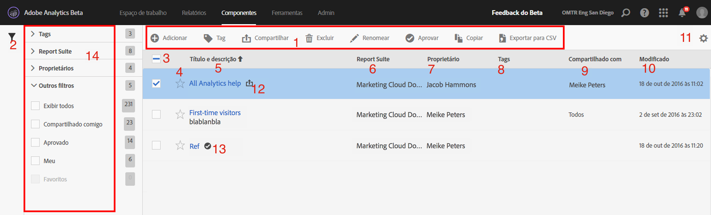

# Gerenciar segmentos

O Gerenciador de segmentos oferece várias formas de cuidar de segmentos, como compartilhar, filtrar, marcar, aprovar, copiar, excluir e marcar como favoritos.

O Gerenciador de segmentos do Analytics mostra todos os seus segmentos e os compartilhados com você. Os usuários de nível administrativo podem visualizar todos os segmentos na organização. Essa visão geral apresenta a interface do usuário e os recursos do Gerenciador de segmentos. Acesse o Gerenciador de segmentos ao

* Acesse **[!UICONTROL Analytics]** > **[!UICONTROL Componentes]** > **[!UICONTROL Segmentos]** na navegação superior.
* Exiba um relatório existente e clicar no ícone Segmentos  na navegação à esquerda. Em seguida, clique em **[!UICONTROL Gerenciar]**.

## Vídeo passo a passo {#section_B3C5DA22DC5248DBA17C56E03DA2D4F2}

Este [vídeo do sobre o Adobe Analytics](https://docs.adobe.com/content/help/pt-BR/analytics-learn/tutorials/components/segmentation/segment-management-and-sharing.html) proporciona uma breve visão geral sobre como usar o Gerenciador de segmentos.

## Interface do usuário do Gerenciador de segmentos {#section_7FDCD12949BE4741A402DB83AB7B37DF}

| # | Recurso da interface do usuário | Descrição |
|---|---|---|
| 1 | Barra de ferramentas de gerenciamento do segmento | Depois de marcar um segmento, essa barra de ferramentas aparece. A maioria das tarefas de gerenciamento podem ser concluídas a partir dessa barra de ferramentas. |
| 2 | Exibir filtros | Ao clicar no ícone de filtro, o menu de filtro aparece. É possível filtrar por Tags, Proprietários, Mostrar tudo (somente Administrador), Meu, Favoritos, Aprovado e Compartilhado comigo. |
| 3 | Caixas de seleção | Marque um segmento para gerenciá-lo. |
| 4 | Favoritos | Ao clicar na estrela ao lado do segmento, ela fica amarela e marca o segmento como favorito. |
| 5 | Títulos e descrições do segmento | Fornecido no Construtor de segmentos. Para editar o título e a descrição, clique no link de título; isso leva você até o Construtor de segmentos. |
| 6 | Conjuntos de relatórios | Essa coluna indica em qual conjunto de relatórios o segmento foi salvo pela última vez. |
| 7 | Proprietário | Indica quem é o proprietário do segmento. Como um não administrador, você pode visualizar somente seus segmentos ou os compartilhados com você. |
| 8 | Tags (não marcadas no seletor de colunas, portanto, a coluna não aparece) | Tags aplicadas ao segmento, por você ou outras pessoas que compartilharam o segmento com você. |
| 9 | Compartilhado com | Lista indivíduos ou grupos (somente Administrador) ou Todos (somente Administrador) com os quais você compartilhou o segmento. |
| 10 | Data de modificação | Mostra a data na qual o segmento foi modificado pela última vez. |
| 11 | Seletor de coluna | Permite que você selecione ou cancele a seleção de coluna no Gerenciador de segmentos. |
| 12 | Ícone Compartilhado | Indica que este segmento foi compartilhado por você ou com você. |
| 13 | Ícone Aprovado | Indica que o segmento foi aprovado pelo Administrador. |
| 14 | Filtros | Permite que você veja e selecione os filtros em Tags, Conjuntos de relatórios, Proprietários e Outros (Exibir tudo, Meus, Compartilhados comigo, Aprovados, Favoritos). |
