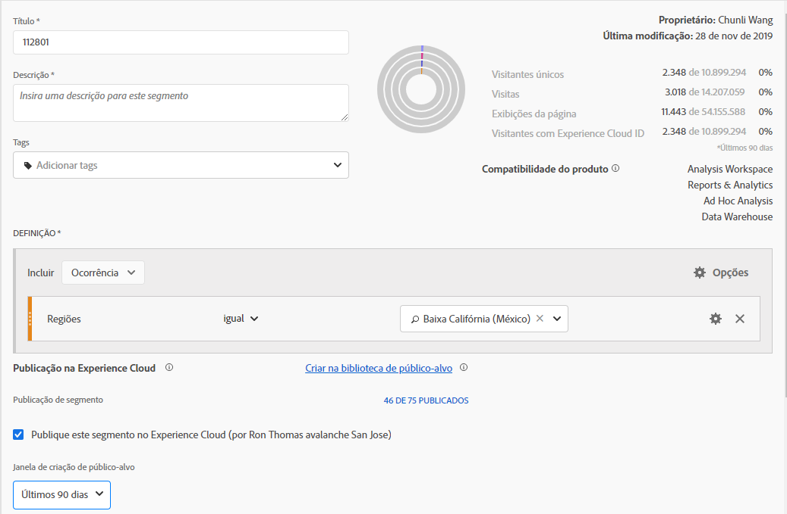
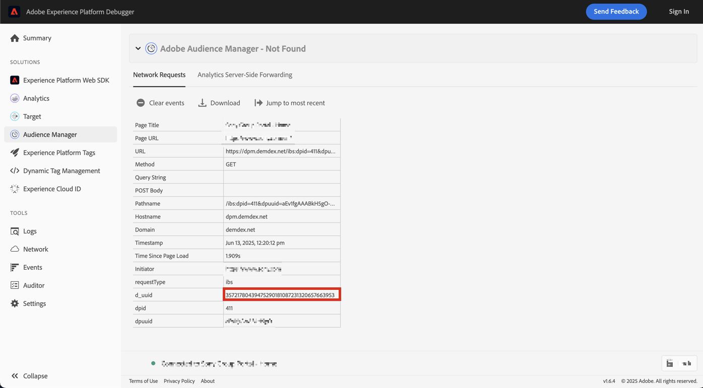

# Publicar segmentos {#publish-segments}

>[!CONTEXTUALHELP]
>id="components_segments_publishing"
>title="Publicação na Experience Cloud"
>abstract="Você pode publicar o público-alvo derivado deste segmento na biblioteca de públicos-alvo, onde ele pode ser usado para atividades de marketing no Target e outras soluções da Experience Cloud."

>[!CONTEXTUALHELP]
>id="components_segments_audiencelibrary"
>title="Biblioteca de público-alvo"
>abstract="Os segmentos criados na biblioteca de públicos-alvo estão disponíveis instantaneamente e não dependem das atualizações do Analytics."

Você pode publicar um segmento do Adobe Analytics na Experience Cloud para usar o segmento em atividades de marketing no [!DNL Audience Manager] e em outros canais de ativação, incluindo o [!DNL Advertising Cloud], [!DNL Target] e [!DNL Campaign] da Adobe.

Você pode publicar segmentos do Analytics no Experience Cloud em menos de 8 horas. Use esses segmentos para ativar públicos-alvo no Audience Manager para todos os destinos downstream.

>[!BEGINSHADEBOX]

Consulte  [Publicar segmentos](https://video.tv.adobe.com/v/32842?quality=12&learn=on){target="_blank"} para ver um vídeo de demonstração.

>[!ENDSHADEBOX]

>[!NOTE]
>
>O Adobe Campaign (Classic e Standard) se comporta de forma diferente, pois incorre em uma latência adicional de 24 horas acima da latência de 8 horas.

## Pré-requisitos

* Verifique se o conjunto de relatórios em que você está salvando este segmento está [habilitado para o Experience Cloud](https://experienceleague.adobe.com/docs/core-services/interface/audiences/t-publish-audience-segment.html?lang=pt-BR). Caso contrário, não será possível publicá-lo no Experience Cloud.
* Verifique se sua organização está usando Experience Cloud IDs.
* Antes de publicar segmentos, o Administrador precisa atribuir a permissão [!UICONTROL Publicação de segmentos] a um perfil de produto no [Admin Console](https://experienceleague.adobe.com/docs/core-services/interface/manage-users-and-products/admin-getting-started.html?lang=pt-BR) e adicionar você ao perfil de produto.

## Considerações

* **Limites do conjunto de relatórios**: você pode publicar até 75 segmentos por conjunto de relatórios. Este limite é aplicado. Se você já tiver 75 segmentos publicados, não poderá publicar segmentos adicionais até cancelar a publicação de segmentos suficientes para ficar abaixo do limite de 75 segmentos.
* **Limites de associação**: públicos-alvo compartilhados com a [!DNL Experience Cloud] a partir do Adobe Analytics não podem exceder 20 milhões de membros únicos.
* **Privacidade dos dados**: os públicos-alvo não são filtrados com base no estado de autenticação de um visitante. Se um visitante consegue navegar em seu site em estados de autenticação e de não autenticação, as ações que ocorrem quando um visitante não está autenticado podem fazer com que um visitante seja incluído em um público-alvo. Revise a [privacidade da Adobe Experience Cloud](https://www.adobe.com/br/privacy/experience-cloud.html) para entender todas as implicações de privacidade do compartilhamento de público-alvo.
* Para uma discussão sobre as **diferenças entre segmentos em [!DNL Adobe Analytics] e[!DNL Audience Manager]**, consulte [Entender os segmentos no Analytics e no Audience Manager](https://experienceleague.adobe.com/docs/analytics/integration/audience-analytics/audience-analytics-workflow/aam-analytics-segments.html?lang=pt-BR).

## Linha do tempo de publicação do segmento

| O que está disponível | Quando está disponível | Onde está disponível |
|---|---|---|
| Metadados (título e definição do segmento) | Imediatamente após a publicação | [!DNL Audience Manager], [!UICONTROL Biblioteca de público-alvo da Experience Cloud], [!DNL Target] |
| Segmento utilizável com associação | ~ 8 horas após a publicação | Visualizador de perfil do visitante em [!DNL Audience Manager] |
| Características e população de associação | Em 24-48 horas | [!DNL Audience Manager] |

>[!NOTE]
>Uma vez por semana, todos os dados serão sincronizados completamente para levar em conta qualquer delta ou discrepância não capturada na semana anterior.

## Publicar segmentos no [!UICONTROL Construtor de segmentos]

1. No Adobe Analytics, vá para **[!UICONTROL Componentes]** > **[!UICONTROL Segmentos]**
1. Selecione **[!UICONTROL Adicionar]** para criar um novo segmento.
   
1. Forneça um título e uma descrição para o segmento. Esses campos são obrigatórios antes de salvar o segmento.
1. Na seção **[!UICONTROL Publicação do Experience Cloud]**, selecione a opção **[!UICONTROL Publicar este segmento na Experience Cloud (para *conjunto de relatórios*)]**.

   >[!IMPORTANT]
   >
   >Monitore **[!UICONTROL Visitantes com Experience Cloud ID]** na **[!UICONTROL Visualização de Dados]** em vez dos **[!UICONTROL Visitantes únicos]** ao comparar números Adobe Analytics com números Audience Manager.
   >

| Elemento | Descrição |
|---|---|
| **[!UICONTROL Publicar este segmento na Experience Cloud (para *conjunto de relatórios*)]** | Quando essa opção é ativada, o título e a definição do segmento (ou seja, o público-alvo da shell, como muitas vezes é usado em plataformas de anúncios) são compartilhados com a Experience Cloud instantaneamente, enquanto a associação do segmento é avaliada e compartilhada a cada 4 horas.   Quando esse público-alvo é associado a uma atividade no [!DNL Target], por exemplo, o [!DNL Analytics] começa a enviar IDs para os visitantes que se qualificaram para esse público-alvo da Experience Cloud e do [!DNL Target]. Nesse momento, o nome do público-alvo e os dados correspondentes começam a ser exibidos na página [!DNL Audience Library] no Experience Cloud.   |
| **[!UICONTROL Janela de criação de público-alvo]** | O período selecionado é usado para criar o público-alvo com base no calendário rotativo. Por exemplo, **[!UICONTROL Últimos 30 dias]** (padrão) inclui visitantes que se qualificaram para o público-alvo nos últimos 30 dias a partir da data de hoje (NÃO a partir da data original quando o segmento foi criado). |
| **[!UICONTROL Criar na biblioteca de público-alvo]** | Os segmentos criados e publicados podem ser disponibilizados sem latência na página [!DNL Audience Library] do Experience Cloud. Eles não dependem das atualizações do Analytics. Esses segmentos não contam com o limite de 75 segmentos publicados. |
| **[!UICONTROL x de 75 Publicados]** | Mostra o número de segmentos publicados no Experience Cloud. Clique no link para ver uma lista de segmentos publicados e seu conjunto de relatórios associado e o proprietário. |
| **[!UICONTROL Salvar]** | Salva este segmento. |

## Cancelar a publicação ou excluir segmentos

>[!CAUTION]
>
>Para excluir um segmento publicado no Experience Cloud, é necessário cancelar a publicação do segmento primeiro. Para cancelar a publicação de um segmento, basta desmarcar **[!UICONTROL Publicar este segmento na Experience Cloud (para *conjunto de relatórios*)]**.

>[!NOTE]
>
>**Não é possível** cancelar a publicação de um segmento que está em uso por qualquer uma das seguintes soluções da Adobe: [!DNL Analytics] (no [!DNL Audience Analytics]), [!DNL Campaign], [!DNL Advertising Cloud] (para cliente do [!DNL Core Service] e [!DNL Audience Manager]) e todos os outros parceiros externos (para clientes do [!DNL Audience Manager]). Você **pode** cancelar a publicação de um segmento em uso pelo [!DNL Target].

## Exibir o status de publicação de segmentos

O número máximo de segmentos do Adobe Analytics publicáveis é 75.

Para exibir segmentos publicados:

1. No Adobe Analytics, vá para **[!UICONTROL Componentes]** > **[!UICONTROL Segmentos]**.

1. Exiba a coluna **[!UICONTROL Publicado]**. **[!UICONTROL Sim]** nesta coluna indica que o segmento foi publicado no Experience Cloud. **[!UICONTROL Não]** indica que o segmento não foi publicado.

## Recuperar a [!DNL Audience Manager] UUID

Há duas maneiras de capturar a UUID do Adobe Audience Manager associada ao navegador no momento:

* Adobe Experience Cloud Debugger
* Ferramenta de desenvolvedor nativa nos navegadores (por exemplo, Ferramentas de desenvolvedor do Chrome)

As capturas de tela a seguir mostram como recuperar a UUID do Adobe Audience Manager no navegador e usá-la no Visualizador de perfil do visitante da Audience Manager para validar a característica e a associação do segmento.

### Método 1: usar o Adobe Experience Cloud Debugger

1. Baixe e instale o [Adobe Experience Cloud Debugger](/help/implement/validate/debugger.md) na loja na Web do Chrome.
1. Inicie o depurador ao carregar uma página.
1. Role até a seção Audience Manager e localize a UUID do Adobe Audience Manager definida na página atual do navegador
(`35721780439475290181087231320657663953` no exemplo abaixo)

   

### Método 2: usar as ferramentas de desenvolvedor do Chrome (ou as ferramentas de desenvolvedor de outro navegador)

1. Inicie as Ferramentas de desenvolvedor do Chrome antes de carregar uma página
1. Carregue a página e marque Aplicativos > Cookies. A UUID do Adobe Audience Manager deve ser definida no provedor de
Cookie demdex ([adobe.demdex.net](https://experienceleague.adobe.com/docs/audience-manager/user-guide/reference/demdex-calls.html?lang=pt-BR) no exemplo abaixo). O demdex de campo é o conjunto de UUIDs do Adobe Audience Manager
no navegador (`35721780439475290181087231320657663953` no exemplo abaixo).

   

## Usar [!UICONTROL Visualizador de perfil do visitante] do Audience Manager

A UUID do Adobe Audience Manager no navegador será usada por padrão quando o [!UICONTROL Visualizador de Perfil do Visitante] for carregado. Se verificar as realizações de características de outros usuários, insira uma UUID no campo UUID e clique em [!UICONTROL Atualizar]. Consulte o [Visualizador de perfil do visitante](https://experienceleague.adobe.com/docs/audience-manager/user-guide/features/visitor-profile-viewer.html?lang=pt-BR) para obter mais informações.

## Exibir as características do segmento em [!DNL Audience Manager]

No Adobe Audience Manager, a lista de visitantes com ECIDs para um determinado segmento é avaliada continuamente, à medida que o Analytics compartilha segmentos com a Experience Cloud.

1. Em [!DNL Audience Manager], vá para **[!UICONTROL Dados de público-alvo]** > **[!UICONTROL Características]** > **[!UICONTROL Características do Analytics]**. Você verá uma pasta para cada conjunto de relatórios do Analytics mapeada para a organização da Experience Cloud. Essas pastas (para Características, Segmentos e Fontes de Dados) são criadas quando os serviços principais de Perfis e Públicos-alvo/Pessoas são iniciados ou provisionados.
1. Selecione a pasta do conjunto de relatórios em que você criou o segmento com o qual deseja compartilhar [!DNL Audience Manager]. Você verá o segmento/público-alvo criado. Quando você compartilha um segmento, duas coisas acontecem em [!DNL Audience Manager]:
   * Uma característica é criada, primeiro sem dados. Aproximadamente. oito horas após o segmento ser publicado no [!DNL Analytics], a lista de ECIDs é atualizada e compartilhada com [!DNL Audience Manager] e outras soluções da Experience Cloud.

     

   * Um segmento com uma única característica é criado. Ele usa a fonte de dados associada ao conjunto de relatórios em que você publicou o segmento.
   * A expiração da característica agora está definida para 16 dias (antes eram 2 dias).

## Exibir o segmento em [!DNL Adobe Target]

A caixa de seleção **[!UICONTROL Publicar este segmento na Experience Cloud]** durante o processo de criação de segmento no Adobe Analytics permite que o segmento fique disponível na biblioteca de público-alvo personalizado no Adobe Target. Um segmento criado no Analytics ou no Audience Manager pode ser usado em atividades no Target. Por exemplo, é possível criar atividades de campanha baseadas nas métricas de conversão do Analytics e nos segmentos de público-alvo criados no Analytics.

No Adobe Target:

1. Selecione **[!UICONTROL Públicos]**.
1. Na página **[!UICONTROL Públicos-alvo]**, localize o público-alvo proveniente da [!DNL Experience Cloud]. Esses públicos-alvo estão disponíveis para uso em atividades [!DNL Target].

   
