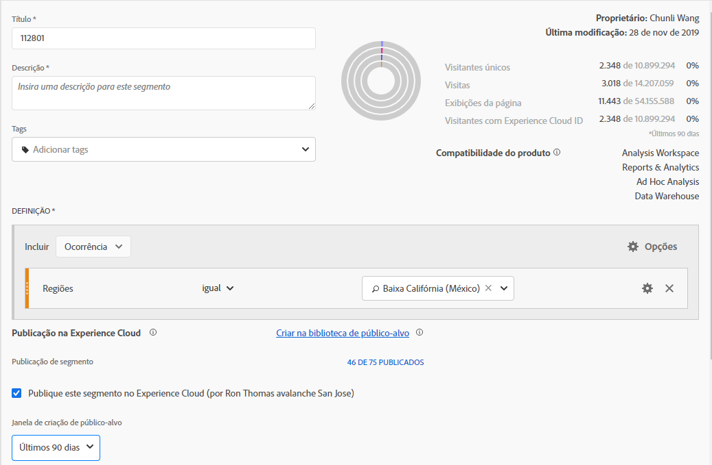
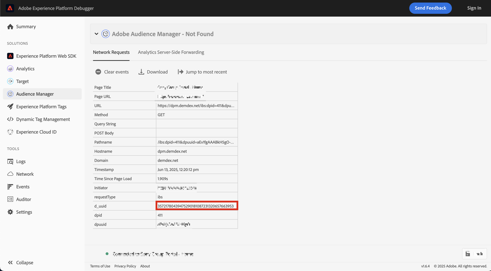
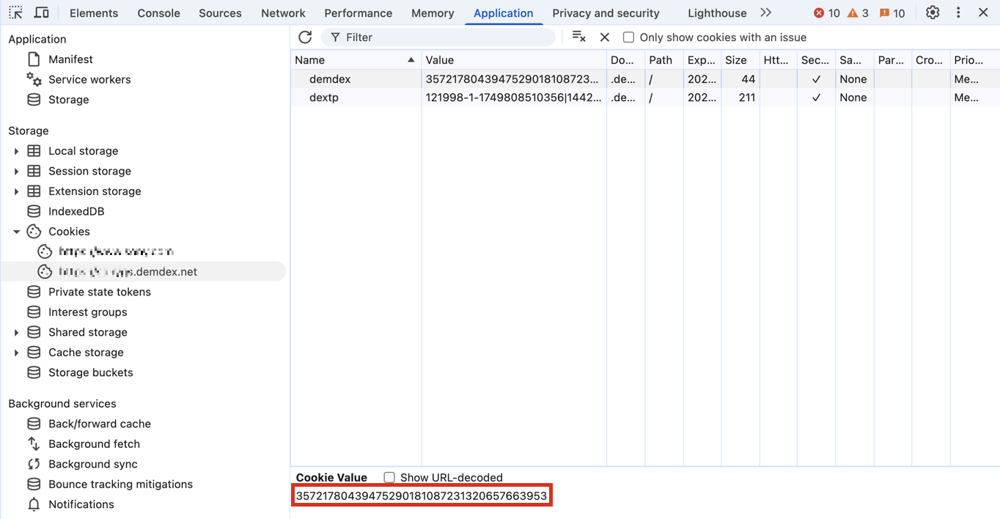
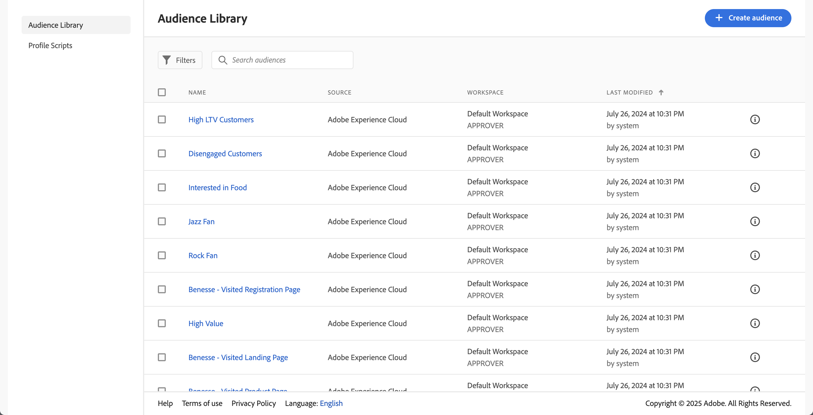

# Publicar segmentos {#publish-segments}

>[!CONTEXTUALHELP]
>id="components_segments_publishing"
>title="Publicação na Experience Cloud"
>abstract="É possível publicar o público-alvo na biblioteca de públicos-alvo, onde ele pode ser usado para atividades de marketing no Target e outras soluções da Experience Cloud."

>[!CONTEXTUALHELP]
>id="components_segments_audiencelibrary"
>title="Biblioteca de público-alvo"
>abstract="Os segmentos criados na biblioteca de públicos-alvo estão disponíveis instantaneamente e não dependem das atualizações do Analytics."

Você pode publicar um segmento do Adobe Analytics na Experience Cloud. Assim, você pode usar o segmento para atividade de marketing em [!DNL Audience Manager] e em outros canais de ativação, incluindo [!DNL Advertising Cloud], [!DNL Target] e [!DNL Campaign].

Você pode publicar segmentos do Analytics no Experience Cloud em menos de 8 horas. Use esses segmentos para ativar públicos-alvo no Audience Manager para todos os destinos downstream.

>[!BEGINSHADEBOX]

Consulte  [Publicar segmentos](https://experienceleague.adobe.com/pt-br/docs/analytics-learn/tutorials/integrations/experience-cloud/improved-experience-cloud-audience-publishing){target="_blank"} para ver um vídeo de demonstração.

>[!ENDSHADEBOX]

>[!NOTE]
>
>O Adobe Campaign (Classic e Standard) se comporta de forma diferente, pois incorre em uma latência adicional de 24 horas acima da latência de 8 horas.

## Pré-requisitos

* Verifique se o conjunto de relatórios em que você está salvando este segmento está [habilitado para o Experience Cloud](/help/components/segmentation/segmentation-workflow/seg-publish.md). Caso contrário, não será possível publicá-lo no Experience Cloud.
* Verifique se sua organização está usando Experience Cloud IDs.
* Antes de publicar segmentos, o Administrador precisa atribuir a permissão [!UICONTROL Publicação de segmentos] a um perfil de produto no [Admin Console](https://experienceleague.adobe.com/pt-br/docs/core-services/interface/administration/admin-tool-experience-cloud) e adicionar você ao perfil de produto.

## Considerações

* **Limites do conjunto de relatórios**: você pode publicar até 75 segmentos por conjunto de relatórios. Este limite é aplicado. Se você já tiver 75 segmentos publicados, não poderá publicar segmentos adicionais até cancelar a publicação de segmentos suficientes para ficar abaixo do limite de 75 segmentos.
* **Limites de associação**: públicos-alvo compartilhados com a [!DNL Experience Cloud] a partir do Adobe Analytics não podem exceder 20 milhões de membros únicos.
* **Privacidade dos dados**: os públicos-alvo não são filtrados com base no estado de autenticação de um visitante. A visitor might be able to browse your site in un-authenticated and authenticated states. Actions that occur when a visitor is un-authenticated can still cause a visitor to be included in an audience. Revise a [privacidade da Adobe Experience Cloud](https://www.adobe.com/br/privacy/experience-cloud.html) para entender todas as implicações de privacidade do compartilhamento de público-alvo.
* For a discussion about the **differences between segments in [!DNL Adobe Analytics] and[!DNL Audience Manager]**, see [Understand segments in Analytics and Audience Manager](/help/integrate/c-audience-analytics/aam-analytics-segments.md).

## Linha do tempo de publicação do segmento

| O que está disponível | Quando está disponível | Onde está disponível |
|---|---|---|
| Metadados (título e definição do segmento) | Imediatamente após a publicação | [!DNL Audience Manager], [!UICONTROL Biblioteca de público-alvo da Experience Cloud], [!DNL Target] |
| Segmento utilizável com associação | ~ 8 horas após a publicação | Visualizador de perfil do visitante em [!DNL Audience Manager] |
| Características e associação da população | Em 24-48 horas | [!DNL Audience Manager] |

>[!NOTE]
>Uma vez por semana, todos os dados são sincronizados completamente para levar em conta qualquer delta ou discrepância não capturada na semana anterior.

## Publicar segmentos no [!UICONTROL Construtor de segmentos]

1. In Adobe Analytics, go to **[!UICONTROL Components]** > **[!UICONTROL Segments]**
1. Select **[!UICONTROL Add]** to create a new segment.
   
1. Provide a title and a description for the segment. These fields are required before you can save the segment.
1. In the **[!UICONTROL Experience Cloud publishing]** section, select the option **[!UICONTROL Publish this segment to the Experience Cloud (for *report suite*)]**.

   >[!IMPORTANT]
   >
   >Make sure that you monitor **[!UICONTROL Visitors with Experience Cloud ID]** in the **[!UICONTROL Data Preview]** instead of the **[!UICONTROL Unique Visitors]**  when you compare Adobe Analytics numbers to Audience Manager numbers.
   >

| Elemento | Descrição |
|---|---|
| **[!UICONTROL Publicar este segmento na Experience Cloud (para *conjunto de relatórios*)]** | Quando essa opção está ativada, o título e a definição do segmento são compartilhados com a Experience Cloud instantaneamente, enquanto a associação do segmento é avaliada e compartilhada a cada 4 horas.   Quando esse público-alvo é associado a uma atividade no [!DNL Target], por exemplo, o [!DNL Analytics] começa a enviar IDs para os visitantes que se qualificaram para esse público-alvo da Experience Cloud e do [!DNL Target]. Nesse momento, o nome do público-alvo e os dados correspondentes começam a ser exibidos na página [!DNL Audience Library] no Experience Cloud.   |
| **[!UICONTROL Janela de criação de público-alvo]** | The time frame that you select is used to create the audience on a rolling-calendar basis. Por exemplo, **[!UICONTROL Últimos 30 dias]** (padrão) inclui visitantes que se qualificaram para o público-alvo nos últimos 30 dias a partir da data de hoje (NÃO a partir da data original quando o segmento foi criado). |
| **[!UICONTROL Criar na biblioteca de público-alvo]** | Os segmentos criados e publicados podem ser disponibilizados sem latência na página [!DNL Audience Library] do Experience Cloud. Eles não dependem das atualizações do Analytics. Esses segmentos não contam com o limite de 75 segmentos publicados. |
| **[!UICONTROL x de 75 Publicados]** | The number of segments that you have published to Experience Cloud. Clique no link para ver uma lista de segmentos publicados e seu conjunto de relatórios associado e o proprietário. |
| **[!UICONTROL Salvar]** | Salva este segmento. |

## Cancelar a publicação ou excluir segmentos

>[!CAUTION]
>
>To delete a segment that has been published to Experience Cloud, you have to unpublish the segment first. To unpublish a segment, just unselect **[!UICONTROL Publish this segment to the Experience Cloud (for *report suite*)]**.

>[!NOTE]
>
>**Não é possível** cancelar a publicação de um segmento que está em uso por qualquer uma das seguintes soluções da Adobe: [!DNL Analytics] (no [!DNL Audience Analytics]), [!DNL Campaign], [!DNL Advertising Cloud] (para cliente do [!DNL Core Service] e [!DNL Audience Manager]) e todos os outros parceiros externos (para clientes do [!DNL Audience Manager]). Você **pode** cancelar a publicação de um segmento em uso pelo [!DNL Target].

## View the publishing status of segments

The maximum number of publishable Adobe Analytics segments is 75.

Para exibir segmentos publicados:

1. No Adobe Analytics, vá para **[!UICONTROL Componentes]** > **[!UICONTROL Segmentos]**.

1. Exiba a coluna **[!UICONTROL Publicado]**. **[!UICONTROL Sim]** nesta coluna indica que o segmento foi publicado no Experience Cloud. **[!UICONTROL Não]** indica que o segmento não foi publicado.

## Recuperar a [!DNL Audience Manager] UUID

Há duas maneiras de capturar a UUID do Adobe Audience Manager associada ao navegador no momento:

* Adobe Experience Cloud Debugger
* Ferramenta de desenvolvedor nativa nos navegadores (por exemplo, Ferramentas de desenvolvedor do Chrome)

As capturas de tela a seguir mostram como recuperar a UUID do Adobe Audience Manager no navegador e usá-la no Visualizador de perfil do visitante da Audience Manager para validar a característica e a associação do segmento.

### Método 1: usar o Adobe Experience Cloud Debugger

1. Baixe e instale o [Adobe Experience Cloud Debugger](/help/implement/validate/debugger.md) na loja na Web do Chrome.
1. Inicie o depurador ao carregar uma página.
1. Scroll to the Audience Manager section and find the Adobe Audience Manager UUID set on the current browser page
(`35721780439475290181087231320657663953` in the example below)

   

### Método 2: usar as ferramentas de desenvolvedor do Chrome (ou as ferramentas de desenvolvedor de outro navegador)

1. Inicie as Ferramentas de desenvolvedor do Chrome antes de carregar uma página
1. Carregue a página e marque Aplicativos > Cookies. The Adobe Audience Manager UUID should be set in the third-party
Demdex cookie ([adobe.demdex.net](https://experienceleague.adobe.com/pt-br/docs/audience-manager/user-guide/reference/demdex-calls) in the example below). The field demdex is the Adobe Audience Manager UUID set
on the browser (`35721780439475290181087231320657663953` in the example below).

   

## Usar [!UICONTROL Visualizador de perfil do visitante] do Audience Manager

The Adobe Audience Manager UUID on the browser is by default when [!UICONTROL Visitor Profile Viewer] is loaded. If you verify trait realizations for other users, input a UUID in the UUID field and click [!UICONTROL Refresh]. Consulte o [Visualizador de perfil do visitante](https://experienceleague.adobe.com/pt-br/docs/audience-manager/user-guide/features/visitor-profile-viewer) para obter mais informações.

## Exibir as características do segmento em [!DNL Audience Manager]

No Adobe Audience Manager, a lista de visitantes com ECIDs para um determinado segmento é avaliada, enquanto o Analytics compartilha segmentos com a Experience Cloud.

1. Em [!DNL Audience Manager], vá para **[!UICONTROL Dados de público-alvo]** > **[!UICONTROL Características]** > **[!UICONTROL Características do Analytics]**. Você vê uma pasta para cada conjunto de relatórios do Analytics mapeada para a organização da Experience Cloud. Essas pastas (para Características, Segmentos e Fontes de Dados) são criadas quando os serviços principais de Perfis e Públicos-alvo/Pessoas são iniciados ou provisionados.
1. Selecione a pasta do conjunto de relatórios em que você criou o segmento com o qual deseja compartilhar [!DNL Audience Manager]. Você verá o segmento/público-alvo criado. Quando você compartilha um segmento, duas coisas acontecem em [!DNL Audience Manager]:
   * Uma característica é criada, primeiro sem dados. Aproximadamente. oito horas após o segmento ser publicado no [!DNL Analytics], a lista de ECIDs é atualizada e compartilhada com [!DNL Audience Manager] e outras soluções da Experience Cloud.

     

   * Um segmento com uma única característica é criado. Ele usa a fonte de dados associada ao conjunto de relatórios em que você publicou o segmento.
   * A expiração da característica agora está definida para 16 dias (antes eram 2 dias).

## Exibir o segmento em [!DNL Adobe Target]

The **[!UICONTROL Publish this segment to the Experience Cloud]** allows the segment to be available within the Adobe Target&#39;s custom audience library. Um segmento criado no Analytics ou no Audience Manager pode ser usado em atividades no Target. Por exemplo, é possível criar atividades de campanha baseadas nas métricas de conversão do Analytics e nos segmentos de público-alvo criados no Analytics.

In Adobe Target:

1. Select **[!UICONTROL Audiences]**.
1. Na página **[!UICONTROL Públicos-alvo]**, localize o público-alvo proveniente da [!DNL Experience Cloud]. Esses públicos-alvo estão disponíveis para uso em atividades [!DNL Target].

   
