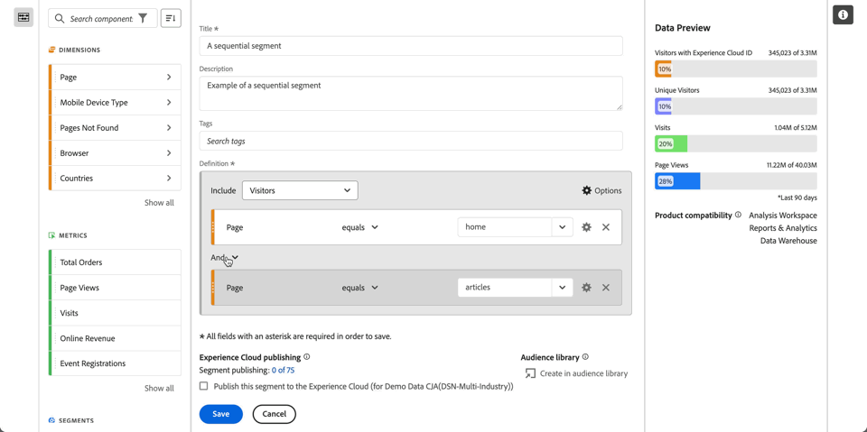
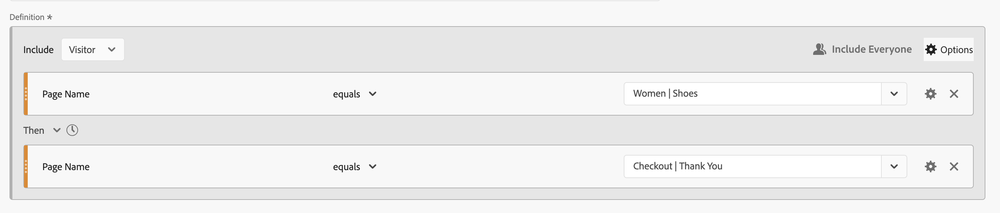
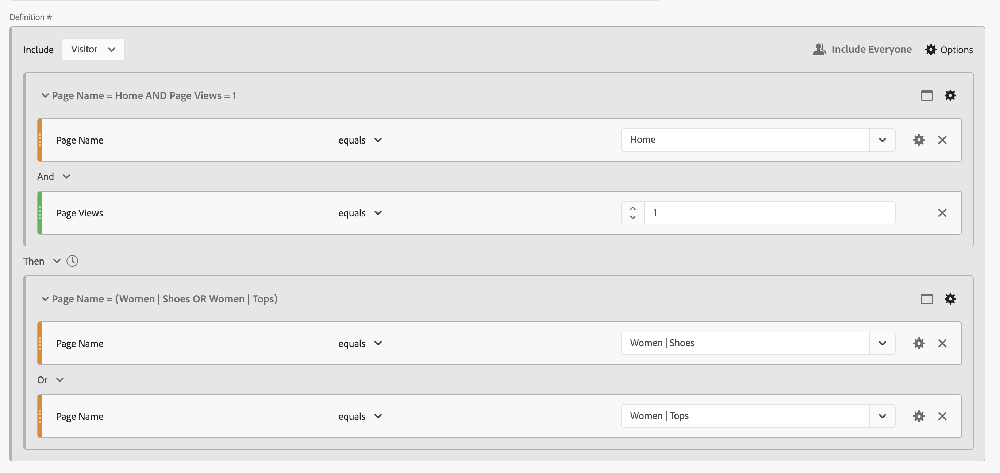

# Segmentos sequenciais

Você cria segmentos sequenciais usando o operador lógico [!UICONTROL Then] entre componentes, contêineres e componentes ou contêineres. O operador lógico [!UICONTROL Then] implica que uma condição de segmento ocorre, seguida de outra.

Além disso, é possível restringir os segmentos sequenciais a uma duração de tempo, granularidade e contagens específicas entre pontos de verificação ao usar os operadores **[!UICONTROL After]** e **[!UICONTROL Within]**.

>[!BEGINSHADEBOX]

Consulte  [Segmentação sequencial](https://video.tv.adobe.com/v/25405?quality=12&learn=on){target="_blank"} para ver um vídeo de demonstração.

>[!ENDSHADEBOX]

Um segmento sequencial tem alguma [funcionalidade básica](#basics) e opções adicionais que você pode configurar para adicionar mais complexidade ao segmento sequencial:

## Noções básicas

As noções básicas para construir um segmento sequencial não são diferentes de construir um segmento regular usando o [Construtor de segmentos](seg-build.md). Um segmento regular se torna um segmento sequencial automaticamente assim que você seleciona o operador **[!UICONTROL Then]** na definição principal ou em qualquer um dos contêineres usados no [Construtor de segmentação](seg-build.md).

### Exemplos

Os exemplos abaixo ilustram como você usa segmentos sequenciais em vários casos de uso.

#### Sequência simples

Identifique visitantes que visualizaram uma página e, depois, outra página. Os dados em nível de ocorrência são segmentados usando essa sequência. Independentemente de visitas de visitantes anteriores, passadas ou temporárias, ou do tempo ou número de visualizações de página que ocorrem entre as visitas.

#### Sequência entre visitas

Identifique os visitantes que visualizaram uma página em uma visita e, em seguida, visualizaram outra página em outra visita. Para diferenciar visitas, use contêineres para criar a sequência e definir o nível de  **[!UICONTROL Visita]** para cada contêiner.

#### Sequência de nível misto

Identifique visitantes que visualizam duas páginas em um número indeterminado de visitas e visualize uma terceira página em uma visita separada. Novamente, use contêineres para criar a sequência e definir o nível de  **[!UICONTROL Visita]** no contêiner que define a visita separada.

#### Sequência agregada

Identifique os visitantes que, na primeira visita, visitaram uma página específica e, posteriormente, visitaram algumas outras páginas. Para diferenciar a sequência de ocorrências, use contêineres para separar a lógica em um nível de contêiner de  **[!UICONTROL Visita]**.

#### Aninhar uma sequência

Identifique todas as visitas em que um visitante visita uma página antes de outra e tenha visitas de acompanhamento que envolvam duas outras páginas. Por exemplo, identifique todas as visitas em que um visitante visita a home page pela primeira vez e, em seguida, uma página de categoria 1 e tem outras visitas em que, em cada visita, as páginas de categoria 2 e categoria 3 são visitadas.

## [!UICONTROL Depois] e [!UICONTROL Dentro]

Você pode usar  **[!UICONTROL Depois]** e  **[!UICONTROL Dentro]** o operador **[!UICONTROL Então]** para definir [restrições de tempo](#time-constraints) ou [restrições adicionais para Ocorrências, Visitas ou Dimension](#event-session-and-dimension-constraints).

### Restrições de tempo

Para aplicar restrições de tempo ao operador **[!UICONTROL Then]**:

1. Selecione .
1. Selecione **[!UICONTROL Dentro]** ou **[!UICONTROL Depois]** no menu de contexto.
1. Especifique um período (**[!UICONTROL Minuto]**, **[!UICONTROL Hora]**, até **[!UICONTROL Anos]**).
1. Selecione a  **[!UICONTROL *número *]**para abrir um pop-up que permita digitar ou especificar um número usando**[!UICONTROL -]**ou**[!UICONTROL +]**.

Para remover uma restrição de tempo, use .

A tabela abaixo explica com mais detalhes os operadores de restrição de tempo.

| Operadores | Descrição |
|--- |--- |
| **[!UICONTROL Depois]** | O operador [!UICONTROL After] é usado para especificar um limite mínimo na quantidade de tempo entre dois pontos de verificação. Ao definir os valores de After, o limite de tempo começa quando o segmento é aplicado. Por exemplo, se o operador [!UICONTROL After] estiver definido em um contêiner para identificar visitantes que visitaram a página A, mas não retornam para visitar a página B depois de um dia, esse dia começará quando o visitante sair da página A.  Para que o visitante seja incluído no segmento, no mínimo, 1440 minutos (um dia) devem se passar após sair da página A para visualizar a página B. |
| **[!UICONTROL Dentro]** | O operador [!UICONTROL Dentro] é usado para especificar um limite máximo na quantidade de tempo entre dois pontos de verificação. Por exemplo, se o operador [!UICONTROL Within] estiver definido em um contêiner para identificar visitantes que visitam a página A e retornam para visitar a página B dentro de um dia, esse dia começará quando o visitante sair da página A. Para ser incluído no segmento, o visitante tem um tempo máximo de um dia antes de abrir a página B. Para que o visitante seja incluído no segmento, a abertura da página B deve ocorrer em no máximo 1440 minutos (um dia) após sair da página A para visualizar a página B. |
| **[!UICONTROL Depois, mas Dentro]** | Ao usar ambos os operadores [!UICONTROL After] e [!UICONTROL Within], ambos os operadores iniciam e terminam em paralelo, não em sequência.  Por exemplo, você compila um segmento com o contêiner definido como: `After = 1 Week(s) and Within = 2 Week(s)`. As condições para identificar visitantes neste segmento são atendidas somente entre uma e duas semanas. Ambas as condições são aplicadas a partir da primeira exibição de página. |

#### Exemplos

Alguns exemplos de uso das restrições de tempo.

##### Operador [!UICONTROL Depois]

Identifique os visitantes que visitaram uma página e depois outra página somente após duas semanas. Por exemplo, os visitantes que visitaram a página inicial, mas as mulheres | Página de sapatos só depois de duas semanas.

Se ocorrer uma exibição de página da Página inicial em 1 de junho de 2024 às 00:01, será exibida uma exibição de página para a Página mulheres | Os sapatos corresponderão, desde que essa exibição de página ocorra após 15 de junho de 2024 às 00:01.

##### Operador [!UICONTROL Within]

Identifique os visitantes que visitaram uma página e depois outra página dentro de cinco minutos. Por exemplo, os visitantes que visitaram a página inicial e, em seguida, as mulheres | Página de sapatos em 5 minutos.

Se uma exibição de página da Página inicial ocorrer em 1 de junho de 2024 às 12h01, uma exibição de página para a Página inicial será exibida para Mulheres | Os sapatos corresponderão, desde que essa exibição de página ocorra antes de 15 de junho de 2024 às 12h16.

##### [!UICONTROL Depois] mas [!UICONTROL Dentro] operador

Identifique os visitantes que visitaram uma página e, em seguida, visitaram outra página após duas semanas, mas dentro de um mês. Por exemplo, os visitantes que visitaram a Página inicial e depois após duas semanas e dentro de um mês as mulheres | Página de sapatos.

Qualquer visitante que acesse a página inicial em 1 de junho de 2024 e que retorne para visitar as mulheres | Página de sapatos após 15 de junho de 2019 às 00:01, mas antes de 1 de julho de 2019, qualifique-se para o segmento.

### Restrições de [!UICONTROL Hit], [!UICONTROL Visit] e [!UICONTROL Dimension]

As restrições  **[!UICONTROL After]** e  **[!UICONTROL Within]** permitem não apenas especificar uma restrição de tempo, mas também uma restrição de ocorrência, visita ou dimensão. Selecione **[!UICONTROL Ocorrência(s)]**, **[!UICONTROL Visita(s)]** ou **[!UICONTROL Outras dimensões]**  **[!UICONTROL *nome do Dimension *]**. Você pode usar o campo [!UICONTROL *Pesquisa*] para procurar uma dimensão.

#### Exemplo

Abaixo está um exemplo de um segmento sequencial procurando visitantes que visitaram uma página de categoria de produto (Mulheres) | Sapatos), seguido por uma página de check-out (Check-out | Obrigado) em uma página.

Os exemplos de sequências a seguir correspondem ou não:

| Sequência |  |
|--- | :---: |
| Página `Women \| Shoes` seguida pela página `Checkout \| Thank You` |  |
| Página `Women \| Shoes` seguida pela página `Women \| Tops` seguida pela página `Checkout \| Thank You` |  |

## [!UICONTROL Incluir]

Você pode especificar quais dados incluir no segmento sequencial ou em um contêiner sequencial que faça parte do segmento sequencial.

### [!UICONTROL Todos] {#include_everyone}

Para criar um segmento sequencial que inclua todos, selecione a opção  **[!UICONTROL Incluir todos]**.

O segmento sequencial identifica dados que correspondem ao padrão como um todo.  Veja abaixo um exemplo de um segmento de sequência básica procurando visitantes que visitaram uma página de categoria de produto (Mulheres) | Sapatos), seguido por uma página de check-out (Check-out | Obrigado). O segmento está definido como  **[!UICONTROL Incluir todos]**.

Os exemplos de sequências a seguir correspondem ou não:

| | Sequência |  |
|---:|--- | --- |
| 1 | `Women \| Shoes` então `Checkout \| Thank You` na mesma visita |  |
| 2 | `Women \| Shoes` então `Men \| Shoes` então `Checkout \| Thank You` (em diferentes visitas) |  |
| 3 | `Checkout \| Thank You` então `Women \| Shoes` |  |

### [!UICONTROL Somente antes da sequência] e [!UICONTROL Somente depois da sequência]

As opções  **[!UICONTROL Somente Antes de Sequence]** e  **[!UICONTROL Somente Depois de Sequence]** segmentam os dados para um subconjunto antes ou depois da sequência especificada.

*  **Only Before Sequence**: inclui todos os dados antes de uma sequência e os primeiros dados da própria sequência. Se uma sequência aparece várias vezes como parte dos dados, [!UICONTROL Somente antes da sequência] inclui a primeira ocorrência da última ocorrência da sequência e todas as ocorrências anteriores.
*  **Only After Sequence**: inclui todas as ocorrências após uma sequência e os últimos dados da própria sequência. Se uma sequência aparece várias vezes como parte dos dados, [!UICONTROL Somente depois da sequência] inclui a última ocorrência da primeira ocorrência da sequência e todas as ocorrências subsequentes.

Considere uma definição que especifique uma sequência de um componente com critérios identificados por B, seguido (Then) por um componente com critérios identificados por D. As três opções identificariam os dados da seguinte forma:

| B Então D | A | B | C | D | E | F |
|---|:---:|:---:|:---:|:---:|:---:|:---:|
| Incluir todos |  |  |  |  |  |  |
| Somente antes da sequência |  |  |  |  |  |  |
| Somente após sequência |  |  |  |  |  |  |

| B Então D (ocorre várias vezes) | A | B | C | D | B | C | D | E |
|---|:---:|:---:|:---:|:---:|:---:|:---:|:---:|:---:|
| Incluir todos |  |  |  |  |  |  |  |  |
| Somente antes da sequência |  |  |  |  |  |  |  |  |
| Somente após sequência |  |  |  |  |  |  |  |  |

#### Exemplo

Você definiu três versões de um segmento sequencial para seções do site. Um com a opção  **[!UICONTROL Incluir Todos]**, um com a opção  **[!UICONTROL Apenas Antes da Sequência]** e um com a opção  **[!UICONTROL Apenas Após a Sequência]**. Você nomeou os três segmentos de acordo.

Ao criar relatórios em seções do site usando esses três segmentos, o exemplo de saída em uma tabela de forma livre é semelhante a:

## [!UICONTROL Excluir]

As definições de segmento incluem todos os dados, a menos que você exclua especificamente dados de  [!UICONTROL Pessoa],  [!UICONTROL Visita] ou  [!UICONTROL Ocorrência] usando **[!UICONTROL Excluir]**.

[!UICONTROL Excluir] permite que você descarte dados comuns e crie segmentos com mais foco. Excluir também permite criar segmentos, excluindo grupos específicos de visitantes. Por exemplo, para definir um segmento que especifique visitantes que fizeram pedidos e, em seguida, excluir esse grupo de visitantes para identificar *não compradores*. Uma prática recomendada é criar regras que usem uma definição ampla em vez de tentar usar [!UICONTROL Excluir] para direcionar visitantes específicos que correspondam a valores de inclusão específicos.

Exemplo de definições de exclusão:

* **Excluir páginas**. Use uma definição de segmento para retirar uma página específica (como *Página inicial*) de um relatório, criar uma regra de Ocorrência em que a página seja igual a `Home Page` e, em seguida, excluir a regra. Essa definição inclui automaticamente todas as páginas, exceto a *Página inicial*.
* **Excluir os domínios de referência**. Use uma definição que inclua apenas domínios de referência de Google.com e exclua todos os outros.
* **Identificar não compradores**. Identifique quando os pedidos forem maiores que zero e exclua a [!UICONTROL Pessoa].

[!UICONTROL Excluir] pode ser usado para identificar uma sequência em que os visitantes não fazem parte de visitas específicas ou realizam ocorrências específicas. [!UICONTROL Excluir] também pode ser incluído em um [!UICONTROL Grupo lógico] (veja abaixo).

É possível excluir contêineres, não componentes.

### Exemplos

Veja abaixo exemplos de uso de [!UICONTROL Excluir].

#### [!UICONTROL Excluir] dentro de

Identifique os visitantes que visitaram uma página, não visitaram outra página e visitaram outra página. Você exclui o contêiner usando  [!UICONTROL Exclusão]. Um contêiner excluído é identificado por uma barra vermelha fina à esquerda.

#### [!UICONTROL Excluir] no início

Identifique os visitantes que visitaram uma página sem nunca ir para outra página. Por exemplo, pessoas que fizeram check-out de uma compra sem nunca terem visitado a página inicial.

#### [!UICONTROL Excluir] no final

Identifique os visitantes que visitaram uma página, mas nunca visitaram outras páginas. Por exemplo, visitantes que visitaram sua página inicial, mas nunca as páginas de check-out.

## [!UICONTROL Grupo lógico]

>[!NOTE]
>
>Um [!UICONTROL Grupo lógico] só pode ser definido em um segmento sequencial, o que significa que o operador [!UICONTROL Then] é usado no contêiner.

O Grupo lógico permite agrupar as condições em um único ponto de verificação de segmento sequencial. Como parte da sequência, a lógica definida no contêiner identificado como Grupo lógico é avaliada após qualquer ponto de verificação sequencial anterior e antes de qualquer ponto de verificação sequencial posterior.

As condições no próprio Grupo lógico podem ser cumpridas em qualquer ordem. Por outro lado, os contêineres não sequenciais (ocorrência, visita, visitante) não exigem que suas condições sejam atendidas na sequência geral, produzindo possíveis resultados não intuitivos, se usados com um operador **[!UICONTROL Then]**.

O [!UICONTROL Grupo lógico] foi projetado para tratar *várias condições como um grupo, sem qualquer ordem* entre as condições agrupadas. Caso contrário, a ordem das condições em um Grupo lógico é irrelevante.

Algumas práticas recomendadas para usar o Grupo lógico são:

* Para agrupar pontos de verificação sequenciais.
* Para simplificar a construção de segmentos sequenciais.

### Exemplos

Estes são exemplos sobre como usar o contêiner do Grupo lógico.

#### Qualquer pedido

Identifique os visitantes que visitaram uma página e, em seguida, visualizaram cada página de outro conjunto de páginas em qualquer ordem. Por exemplo, os visitantes que visitaram a página inicial do e, em seguida, visitaram cada uma das páginas Homens, Mulheres e Crianças, independentemente da ordem.

Você pode criar este segmento sem um [!UICONTROL Grupo lógico], mas a construção será complexa e trabalhosa. Especifique cada sequência de páginas que o visitante poderia visualizar. Para maior clareza, apenas o primeiro contêiner é aberto  e os outros contêineres são fechados . Você pode derivar o conteúdo dos outros contêineres pelos títulos.

Você pode usar o [!UICONTROL Grupo lógico] para simplificar a criação deste segmento, conforme mostrado abaixo. Selecione o  **[!UICONTROL Grupo lógico]** para o contêiner.

#### Primeira correspondência

Identifique os visitantes que visitaram uma página ou outra página e, em seguida, visitaram outra página. Por exemplo, os visitantes que visitaram a página Mulheres ou a página Homens e, em seguida, visitaram o Check-out | Página de agradecimento.

#### [!UICONTROL Excluir] [!UICONTROL E]

Identifique os visitantes que visitaram uma página e explicitamente não visitaram um conjunto de outras páginas, mas visitaram outra página. Por exemplo, os visitantes que visitaram a página inicial do, não visitaram a página Homens ou Mulheres, mas visitaram a página Crianças.

#### [!UICONTROL Excluir] [!UICONTROL Ou]

Identifique os visitantes que visitaram uma página e explicitamente não visitaram nenhuma página de um conjunto de páginas, mas visitaram outra página. Por exemplo, os visitantes que visitaram a página inicial do, não visitaram a página Homens e mulheres, mas visitaram a página Crianças.

<!--
An example of a complex sequential segment if you want to find the visitors that 

| visit One | visit Two | visit Three |
| --- | --- | --- |
| The visitor went to the main landing page A, excluded the campaign page B, and then viewed the Product page C.| The visitor again went to the main landing page A, excluded the campaign page B, and went again to the Product page C, and then to a new page D. | The visitor entered and followed that same path as in the first and second visits, then excluded page F to go directly to a targeted product on page G. |
-->

## Um exemplo final

Como exemplo final, você deseja identificar os visitantes que aprenderam sobre uma página de produto específica, sem que esses visitantes nunca tenham sido tocados pela campanha Empower Your Move. E em sua primeira visita à sua loja on-line visualizaram a página inicial, mas não olharam mais para qualquer produto fitness (engrenagem) da categoria Homens. No entanto, em sua próxima visita diretamente depois disso, eles foram a uma página de produto e fizeram um pedido online sem passar pela página inicial primeiro.

