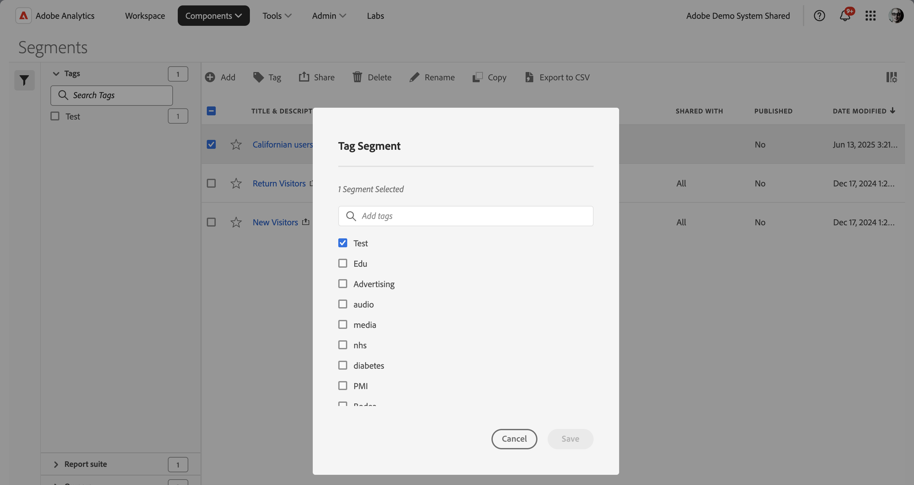

# Marcar segmentos

No [Gerenciador de segmentos](seg-manage.md), você pode usar marcas para organizar segmentos. Os administradores podem marcar todos os segmentos. Os não administradores podem marcar somente os segmentos que criam ou que foram compartilhados com eles.

Para marcar um ou mais segmentos:

1. No [Gerenciador de segmentos](seg-manage.md), selecione um ou mais segmentos que deseja marcar.
1. Na barra de ações, selecione  **[!UICONTROL Marca]**.
1. Na caixa de diálogo **[!UICONTROL Segmento de Marca]**:

   

   1. (opcionalmente) use a  para pesquisar e limitar a lista de marcas.

   2. Com base na lista de tags:

      * selecione uma ou mais tags existentes na lista, ou
      * digite uma nova marca e pressione **[!UICONTROL ENTER]**. Repita para adicionar mais de uma nova tag.

1. Selecione **[!UICONTROL Salvar]** para salvar as marcas do segmento. Selecione **[!UICONTROL Cancelar]** para cancelar.

Depois de salvas, as marcas são listadas no campo [!UICONTROL Marca] para os segmentos selecionados no [Construtor de segmentos](seg-build.md).

## Sugestões

Abaixo estão algumas sugestões para organizar tags com base em:

* **Equipe**: Por exemplo, Marketing Social, Marketing para Dispositivos Móveis.

* **Projeto**: por exemplo, Análise de página de entrada.

* **Categoria**:. Por exemplo, Homens, Mulheres, Crianças.

* **Geografia**: Por exemplo: Estados Unidos, Califórnia.

* **Fluxo de trabalho**: Por exemplo: Para ser aprovado, preparado

<!--
In the [Segment manager](seg-manage.md), you can use tags to organize segments. Administrators can tag all segments. Non administroators can tags only the segments they create or have been shared with them.

To tag one or more segments:

1. In the [Segment manager](seg-manage.md), select one or more of the segments you want to tag.
1. From the action bar, select  **[!UICONTROL Tag]**.
1. In the **[!UICONTROL Tag Segments]** dialog:
   
   

   1. (optionally) use  to search for and limit the list of tags.

   2. Based on the list of tags:
   
      * select one or more existing tags from the list, or
      * enter a new tag and press **[!UICONTROL ENTER]**. Repeat to add more than one new tag.

1. Select **[!UICONTROL Save]** to save the tags for the segment. Select **[!UICONTROL Cancel]** to cancel.

Once saved, the tags are listed in the [!UICONTROL Tag] field for the selected segments in the [Segment builder](seg-builder.md). 

## Suggestions

Below are some suggestions to organize tags based on:

* **Team**: For example, Social Marketing, Mobile Marketing.
    
* **Project**: For example, Entry-page analysis.
    
* **Category**:. For example, Men, Women, Kids.

* **Geography**: For example: United States, California.
    
* **Workflow**: For example: To be approved,  Curated

-->