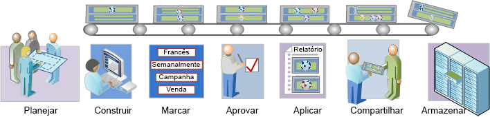

# Visão geral do fluxo de trabalho de segmentação

Descreve um fluxo de trabalho sugerido para segmentos criados com o Construtor de segmentos e gerenciado pelo Gerenciador de segmentos.

 [Planejar Segmentos](/help/components/segmentation/segmentation-workflow/seg-plan.md)

Você fez todas as perguntas apropriadas antes de construir segmentos e configurar um ambiente de gerenciamento de segmentos? Você projetou o segmento com a finalidade pretendida e uso distinto em mente?

Consulte a Lista de verificação do planejamento de segmentos para obter ajuda no planejamento e na organização dos segmentos.

 [Construir segmentos](/help/components/segmentation/segmentation-workflow/seg-build.md)

Construa e edite segmentos para uso em todos os recursos do Analytics.

Consulte [Criar segmentos sequenciais](/help/components/segmentation/segmentation-workflow/seg-sequential-build.md) para saber como construir segmentos com o operador THEN.

 [Segmentos de tag](/help/components/segmentation/segmentation-workflow/seg-tag.md)

Marque segmentos para facilitar a organização e o compartilhamento. Consulte como planejar e atribuir tags para pesquisas e organização simples e avançada.

 [Aprovar Segmentos](/help/components/segmentation/segmentation-workflow/seg-approve.md)

Aprove segmentos para transformá-los em canônicos.

 [Aplicar Segmentos](/help/components/segmentation/segmentation-workflow/t-seg-apply.md)

Você pode aplicar segmentos diretamente de um relatório, de um trilho de segmentos (Mostrar segmentos).

 [Compartilhar Segmentos](/help/components/segmentation/segmentation-workflow/t-seg-share.md)

Compartilhe seus segmentos com o público-alvo pretendido em outras ferramentas do Analytics e no Adobe Target e na Adobe Experience Cloud.

 [Filtrar Segmentos](/help/components/segmentation/segmentation-workflow/t-seg-filter.md)

Filtrar por tags, proprietários e outros filtros (Mostrar tudo, Meu, Compartilhado comigo, Favoritos e Aprovado).

 [Marcar segmento como favorito](/help/components/segmentation/segmentation-workflow/t-seg-favorite.md)

Outra maneira de organizá-los para facilitar o uso é marcar os segmentos como favoritos.

[Gerenciar segmentos](/help/components/segmentation/segmentation-workflow/seg-manage.md)

O Gerenciador de segmentos oferece várias formas de cuidar de segmentos, como compartilhar, filtrar, marcar, aprovar, copiar, excluir e marcar como favoritos.
