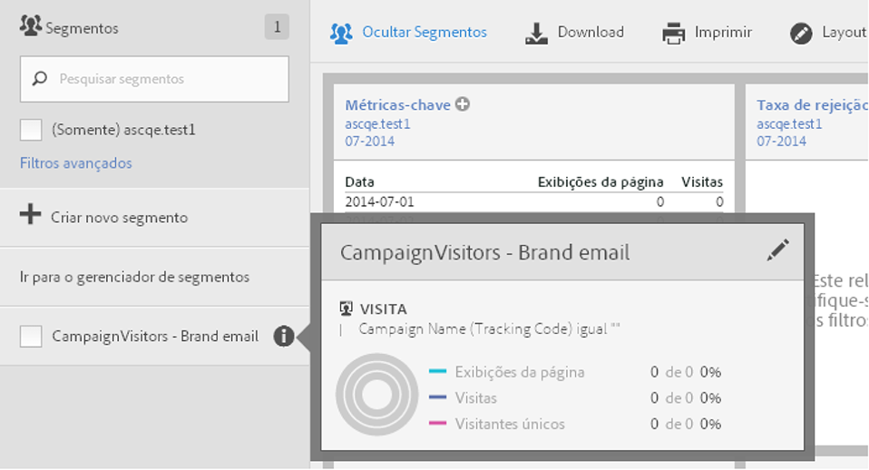
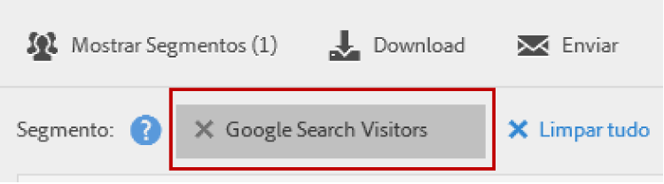

# Usar segmentos

Para usar segmentos no Analysis Workspace, basta arrastar um ou mais segmentos de **[!UICONTROL Segmentos]** no painel de componentes e soltar em:

* Um [painel](/help/analyze/analysis-workspace/c-panels/panels.md) no Analysis Workspace para segmentar todas as visualizações no painel.
* Uma linha de cabeçalho em uma [tabela de forma livre](/help/analyze/analysis-workspace/visualizations/freeform-table/freeform-table.md) no Analysis Workspace para substituir a dimensão.
* Uma linha em uma [tabela de forma livre](/help/analyze/analysis-workspace/visualizations/freeform-table/freeform-table.md) no Analysis Workspace para iniciar um detalhamento.
* Uma coluna em uma [tabela de forma livre](/help/analyze/analysis-workspace/visualizations/freeform-table/freeform-table.md) no Analysis Workspace para adicionar ou substituir uma coluna ou para iniciar um filtro.
* Painéis de configurações para visualização ou painéis que permitem soltar segmentos. Por exemplo, em um painel [Comparação de segmentos](/help/analyze/analysis-workspace/c-panels/c-segment-comparison/segment-comparison.md) ou em uma visualização de resumo da [métrica principal](/help/analyze/analysis-workspace/visualizations/key-metric.md)
* O [construtor de definições de um segmento](/help/components/segmentation/segmentation-workflow/seg-build.md#definition-builder), para que você inclua um segmento na definição do segmento.
* O [construtor de definições para uma métrica calculada](/help/components/c-calcmetrics/c-workflow/cm-workflow/c-build-metrics/cm-build-metrics.md#definition-builder), para que você inclua um segmento na definição da métrica calculada.

<!--
How to apply one or more segments to a report from the segment rail.

1. Bring up the report to which you want to apply a segment, for example the [!UICONTROL Pages Report].
1. Click **[!UICONTROL Show Segments]** above the report. The segment rail opens.

   

1. Mark the checkbox next to one or more of the segments or **[!UICONTROL Search Segments]** to find the right segment.

   >[!NOTE]
   >
   >You can apply more than one segment to a report (this is called segment stacking). When multiple segments are applied, the criteria in each segment is combined using an 'and' operator and then applied. There is no limit to how many segments you can stack.

   >[!NOTE]
   >
   >Clicking the Information icon (i) next to the segment name lets you preview the key metrics to see whether you have a valid segment and how broad the segment is.

1. You can filter by report suite by selecting the **[!UICONTROL (Only) `<report suite name>`]** check box. This will show only those segments that were last saved in that report suite.
1. Click **[!UICONTROL Apply Segment]** and the report will refresh. The segment or segments that are applied now display at the top of the report:

   

-->
