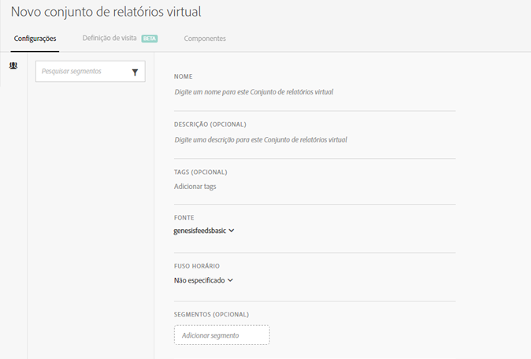

# Criar conjuntos de relatórios virtuais

Antes de começar a criar conjuntos de relatórios virtuais, lembre-se das informações a seguir.

* Usuários não administradores não podem visualizar o Gerenciador de conjunto de relatórios virtuais.
* Os conjuntos de relatórios virtuais não podem ser compartilhados. O “Compartilhamento” é efetuado por grupos/permissões.
* No Gerenciador de conjunto de relatórios virtuais, você pode exibir apenas seus próprios conjuntos de relatórios virtuais. É necessário clicar em “mostrar tudo” para exibir o restante.

1. Navigate to **[!UICONTROL Components]** &gt; **[!UICONTROL Virtual Report Suites]**.
1. Click **[!UICONTROL Add +]**.

   

1. Preencha os campos:

<table id="table_0F85B56480BB46CBA5BE236BBD70156D"> 
 <thead> 
  <tr> 
   <th colname="col1" class="entry"> Elemento </th> 
   <th colname="col2" class="entry"> Descrição </th> 
  </tr> 
 </thead>
 <tbody> 
  <tr> 
   <td colname="col1"> Nome </td> 
   <td colname="col2"> 
O nome do conjunto de relatórios virtual não é herdado do conjunto de relatórios pai e não deve ser distinto. 
 </td> 
  </tr> 
  <tr> 
   <td colname="col1"> Descrição </td> 
   <td colname="col2"> 
Adicione uma boa descrição para beneficiar seus usuários comerciais. 
 </td> 
  </tr> 
  <tr> 
   <td colname="col1"> Tags </td> 
   <td colname="col2"> 
É possível adicionar tags para organizar seus conjuntos de relatórios. 
 </td> 
  </tr> 
  <tr> 
   <td colname="col1"> Grupos </td> 
   <td colname="col2"> 
Selecione os grupos de permissões que você deseja que acessem essa VRS. (Você também pode gerenciar permissões de grupo em Administrador &gt; Gerenciamento de usuários &gt; Grupos.) 
 </td> 
  </tr> 
  <tr> 
   <td colname="col1"> Conjunto de relatórios pai </td> 
   <td colname="col2"> 
O conjunto de relatórios do qual este conjunto de relatórios virtual herda as seguintes configurações. A maioria dos níveis e recursos do serviço (por exemplo, configurações de eVar, Regras de processamento, Classificações e assim por diante) são herdados. Para alterar essas configurações herdadas em um VRS, é necessário editar o conjunto de relatórios pai (Administrador &gt; Conjuntos de relatórios). 
 </td> 
  </tr> 
  <tr> 
   <td colname="col1"> Fuso horário </td> 
   <td colname="col2"> 
A escolha de um fuso horário é opcional. 
 
Se você escolher um fuso horário, ele será salvo com o VRS. Se não escolher um, o fuso horário do conjunto de relatórios principal é usado. 
 
Ao editar um VRS, o seletor suspenso exibe o fuso horário salvo com o VRS. Se o VRS tiver sido criado antes da adição do suporte a fuso horário, o seletor suspenso mostrará o fuso do conjunto de relatórios pai. 
 </td> 
  </tr> 
  <tr> 
   <td colname="col1"> Segmentos </td> 
   <td colname="col2"> 
Você pode adicionar um segmento ou <a href="https://marketing.adobe.com/resources/help/en_US/analytics/segment/seg_stack.html" format="https" scope="external">empilhá-los</a>. 
 
 
Observação: ao empilhar dois segmentos, eles são unidos por padrão por uma instrução E. Isso não pode ser alterado para uma instrução OU. 
 
 
Ao tentar excluir ou modificar um segmento usado em um conjunto de relatórios virtuais, você receberá um aviso. 
 </td> 
  </tr> 
 </tbody> 
</table>

