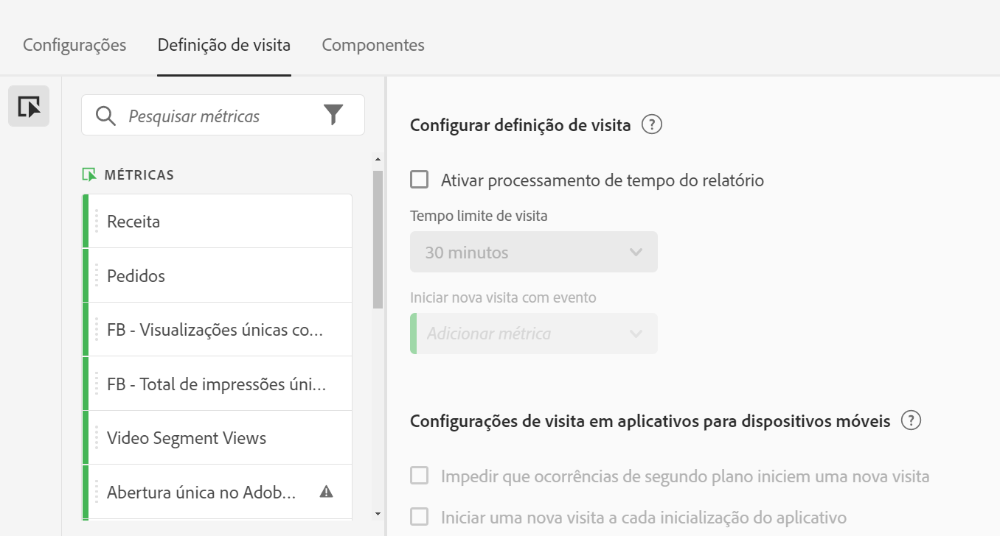
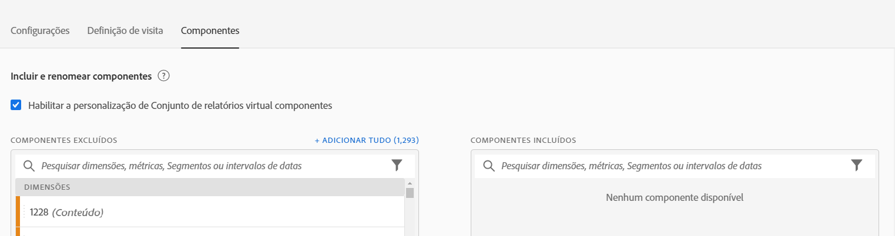

# Criar conjuntos de relatórios virtuais

Antes de começar a criar conjuntos de relatórios virtuais, lembre-se das informações a seguir.

* Usuários não administradores não podem ver o relatório virtual se adapta ao gerenciador.
* Os conjuntos de relatórios virtuais não podem ser compartilhados. O “Compartilhamento” é efetuado por grupos/permissões.
* No gerenciador de Conjuntos de relatórios virtuais, você pode exibir apenas seus próprios conjuntos de relatórios virtuais. É necessário clicar em &quot;mostrar tudo&quot; para exibir o restante.

1. Navegue até **[!UICONTROL Componentes]** > **[!UICONTROL Conjuntos de relatórios virtuais]**.
1. Clique em **[!UICONTROL Adicionar +]**.

   

## Definir configurações

Na guia [!UICONTROL Configurações], defina essas configurações e clique em **[!UICONTROL Continuar]**.

| Elemento | Descrição |
| --- |--- |
| Nome | O nome do conjunto de relatórios virtual não é herdado do conjunto de relatórios pai e não deve ser distinto. |
| Descrição | Adicione uma boa descrição para beneficiar seus usuários comerciais. |
| Tags | É possível adicionar tags para organizar seus conjuntos de relatórios. |
| Origem | O conjunto de relatórios do qual este conjunto de relatórios virtual herda as seguintes configurações. A maioria dos níveis e recursos do serviço (por exemplo, configurações de eVar, Regras de processamento, Classificações e assim por diante) são herdados. Para alterar essas configurações herdadas em um Conjunto de relatórios virtual, é necessário editar o conjunto de relatórios pai (Administrador > Conjuntos de relatórios). |
| Fuso horário | A escolha de um fuso horário é opcional. Se você escolher um fuso horário, ele será salvo junto com o Conjunto de relatórios virtual. Se não escolher um, o fuso horário do conjunto de relatórios principal é usado.  Ao editar um Conjunto de relatórios virtual, o fuso horário salvo com o Conjunto de relatórios virtual é exibido no seletor suspenso. Se o conjunto de relatórios virtual tiver sido criado antes da adição do suporte a fuso horário, o fuso horário do conjunto de relatórios principal será mostrado no seletor suspenso. |
| Segmentos | Você pode adicionar um segmento ou empilhá-los.   Observação: ao empilhar dois segmentos, eles são unidos por padrão por uma instrução AND. Isso não pode ser alterado para uma instrução OR. Ao tentar excluir ou modificar um segmento usado em um conjunto de relatórios virtuais, você receberá um aviso. |

## Configurar as definições de visita

Na guia [!UICONTROL Definição de visita], defina essas configurações e clique em **[!UICONTROL Continuar]**.

Este é um vídeo sobre como ajustar uma definição de visita em um conjunto de relatórios virtual:

>[!VIDEO](https://video.tv.adobe.com/v/23545/?quality=12)

| Elemento | Descrição |
| --- |--- |
| **Configurar definição de visita** |  |
| Ativar processamento de tempo do relatório | Use o processamento do tempo do relatório para alterar a duração padrão do tempo limite da visita. Essas configurações não são destrutivas e se aplicam apenas ao Analysis Workspace. [Saiba mais](/help/components/vrs/vrs-report-time-processing.md) |
| Tempo limite de visita | Define a quantidade de inatividade que um visitante único deve ter antes que uma nova visita seja iniciada automaticamente. Essa quantidade afetará a métrica de visitas, o contêiner do segmento de visitas e as eVars que expiram na visita. |
| Iniciar nova visita com evento | Inicia uma nova sessão quando qualquer um dos eventos especificados é acionado, independentemente de o tempo limite da sessão expirar. |
| **Configurações de visita em aplicativos para dispositivos móveis** | Modifique como as visitas são definidas para ocorrências de aplicativos para dispositivos móveis coletados pelos SDKs para dispositivos móveis do Adobe. Essas configurações não são destrutivas e se aplicam somente ao Analysis Workspace. |
| Impedir que ocorrências de segundo plano iniciem uma nova visita | Evita que as ocorrências de segundo plano iniciem uma nova visita e aumentem as métricas de visitas e visitantes únicos. |
| Iniciar uma nova visita a cada inicialização do aplicativo | Inicia uma nova sessão quando ocorre uma inicialização do aplicativo. [Saiba mais](/help/components/vrs/vrs-mobile-visit-processing.md) |

## Incluir e renomear componentes

1. Na guia [!UICONTROL Componentes], marque a caixa de seleção para aplicar a curadoria a fim de incluir, excluir e renomear componentes desse conjunto de relatórios virtual no Analysis Workspace.
Para obter mais informações sobre a preparação do conjunto de relatórios virtual, consulte [Curadoria do componente do conjunto de relatórios virtual](https://experienceleague.adobe.com/docs/analytics/components/virtual-report-suites/vrs-components.html?lang=pt-BR#virtual-report-suites).

1. Arraste os componentes (dimensões, métricas, segmentos ou intervalos de datas) que deseja incluir no Conjunto de relatórios virtuais para a [!UICONTROL Componentes incluídos] seção.

1. Quando terminar, clique em **[!UICONTROL Salvar]**.

## Visualizar dados

No lado direito de cada guia, é possível visualizar o total de ocorrências, o total de visitas e o total de visitantes neste conjunto de relatórios virtual, em comparação com o conjunto de relatórios original.

## Exibir compatibilidade do produto

Alguns recursos dos conjuntos de relatórios virtuais não são compatíveis com todos os produtos da Adobe Analytics. A lista de compatibilidade de produto permite ver quais produtos no Adobe Analytics são compatíveis com base nas configurações atuais do conjunto de relatórios virtuais.
