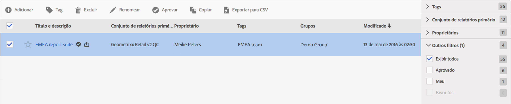

# Gerenciar conjuntos de relatórios virtuais

O Gerenciador de conjuntos de relatórios virtuais permite aos administradores editar, adicionar, marcar, excluir, renomear, aprovar, copiar, exportar e filtrar conjuntos de relatórios virtuais. Não é visível para usuários não administrativos.

**[!UICONTROL Analytics]** &gt; **[!UICONTROL Componentes]** &gt; **[!UICONTROL Conjuntos de relatórios virtuais]**

>[!NOTE]
>
>No Gerenciador de conjunto de relatórios virtuais, você pode exibir apenas seus próprios conjuntos de relatórios virtuais. É necessário clicar em **[!UICONTROL Mostrar tudo]para exibir o restante.**

| Tarefa | Descrição |
|--- |--- |
| Adicionar | Direciona você ao construtor de conjunto de relatórios virtual, onde é possível criar novos conjuntos de relatórios virtuais. |
| Tag | Todos os usuários podem criar tags para segmentos e aplicar uma ou mais tags a um segmento. Entretanto, você pode exibir tags somente dos segmentos proprietários. Que tipos de tags você deve criar? Estas são algumas sugestões para tags úteis:<ul><li>Tags com base em nomes de equipe, como Marketing social, Marketing móvel</li><li>Tags de projeto (tags de análise), como análises de página de entrada</li><li>Tags de categoria: masculino; geografia</li><li>Tags de fluxo de trabalho: organizado para (uma unidade de negócio específica); Aprovado</li></ul> |
| Excluir | Se você excluir um conjunto de relatórios virtual, os relatórios agendados e painéis com ele aplicado continuam a funcionar normalmente, isto é, o relatório e o painel continuam a usar o conjunto excluído até que o relatório agendado seja salvo novamente.  Os relatórios agendados não são atualizados ao editar um conjunto de relatórios virtuais com o mesmo nome. Por exemplo: Suponha que você tenha dois conjuntos de relatórios virtuais com o mesmo nome e conjuntos de relatórios pai diferentes: Você tem um marcador que faz referência ao conjunto de relatórios virtuais do conjunto de relatórios mainprod. Em seguida, você exclui o conjunto de relatórios virtuais porque é uma duplicata. O marcador continuará a funcionar, mencionando a definição do VRS excluído. Se você alterar a definição do VRS restante, o VRS aplicado ao marcador não mudará. Usa a definição antiga. Para corrigir isso, atualize o marcador para fazer referência à nova definição. Se você não tiver certeza se um marcador, painel ou relatório agendado está usando um VRS excluído, é possível alterar o nome do VRS restante para que fique mais claro se o marcador usa o VRS restante. |
| Renomear | Onde o conjunto de relatórios virtual for exibido, como no seletor de conjunto de relatórios, ele apresenta o novo nome. |
| Aprovar/Cancelar aprovação | Aprove os conjuntos de relatórios virtuais para torná-los “oficiais” ou “canônicos”. É possível reverter o processo ao cancelar a aprovação. |
| Copiar | Crie uma cópia distinta da nova ID do conjunto de relatórios, mas com o mesmo nome e a mesma definição. |
| Exportar para CSV | Exporte a definição do conjunto de relatórios virtuais para um arquivo .csv. |
| Filtro | Filtre por tags, conjunto de relatórios pai, proprietários e outros filtros (Mostrar tudo, Meu, Favoritos e Aprovado). |
