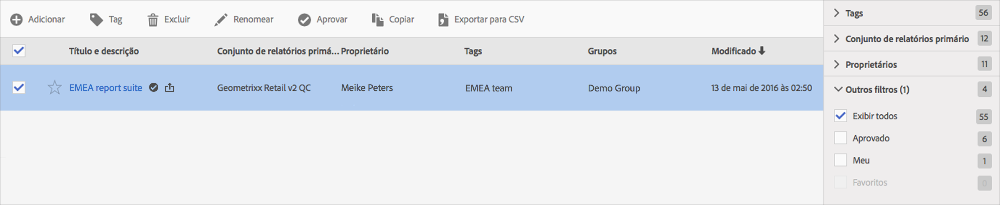

# Gerenciar conjuntos de relatórios virtuais

O gerenciador de Conjuntos de relatórios virtuais permite que os administradores editem, adicionem, marquem, excluam, renomeiem, aprovem, copiem, exportem e filtrem conjuntos de relatórios virtuais. Não é visível para usuários não administrativos.

**[!UICONTROL Analytics]** > **[!UICONTROL Componentes]** > **[!UICONTROL Conjuntos de relatórios virtuais]**

>[!NOTE]
>
>No gerenciador de Conjunto de relatórios virtual, você pode visualizar apenas seus próprios conjuntos de relatórios virtuais. É necessário clicar em **[!UICONTROL Mostrar tudo]** para exibir o restante.

| Tarefa | Descrição |
| --- | --- |
| Adicionar | Direciona para o construtor de conjuntos de relatórios virtuais, onde é possível criar novos conjuntos de relatórios virtuais. |
| Tag | Todos os usuários podem criar tags para conjuntos de relatórios virtuais e aplicar uma ou mais tags a um conjunto de relatórios virtual. Entretanto, só é possível ver as tags dos seus conjuntos de relatórios. Que tipos de tags você deve criar? Estas são algumas sugestões de tags úteis:<ul><li>Tags baseadas em nomes de equipe, como Marketing social, Marketing móvel</li><li>Tags de projeto (tags de análise), como Análise de entrada de página</li><li>Tags de categoria: Masculino; geografia</li><li>Tags de fluxo de trabalho: organizado para (uma unidade de negócio específica); Aprovado</li></ul> |
| Excluir | Se você excluir um conjunto de relatórios virtual, os relatórios agendados e os painéis que têm esse conjunto de relatórios virtual aplicado continuarão a funcionar normalmente. O relatório ou painel continua a usar o conjunto de relatórios virtuais excluído até que você salve novamente o relatório agendado.  Os relatórios agendados não são atualizados ao editar um conjunto de relatórios virtuais com o mesmo nome. Por exemplo: suponha que você tem dois conjuntos de relatórios virtuais com o mesmo nome e conjuntos de relatórios primários diferentes: você tem um marcador que faz referência ao conjunto de relatórios virtual para o conjunto de relatórios principal. Em seguida, você exclui o conjunto de relatórios virtuais porque é uma duplicata. O marcador continua a ser executado, fazendo referência à definição dos Conjuntos de relatórios virtuais excluídos. Se você alterar a definição dos conjuntos de relatórios virtuais restantes, o conjunto de relatórios virtuais aplicado ao marcador não será alterado. Ele usa a definição antiga. Para corrigir isso, atualize o marcador para fazer referência à nova definição. Se você não tiver certeza se um marcador, painel ou relatório agendado está usando um conjunto de relatórios virtual excluído, é possível alterar o nome dos conjuntos de relatórios virtuais restantes para que fique mais claro se o marcador usa os conjuntos de relatórios virtuais restantes. |
| Renomear | Em todos os locais em que o conjunto de relatórios virtual é exibido, como no seletor de conjunto de relatórios, ele mostra o novo nome. |
| Aprovar/Cancelar aprovação | Aprove conjuntos de relatórios virtuais para torná-los &quot;oficiais&quot; ou &quot;canônicos&quot;. Você pode reverter o processo cancelando a aprovação. |
| Copiar | Cria uma cópia distinta com sua própria ID de conjunto de relatórios nova, mas com o mesmo nome e definição. |
| Exportar para CSV | Exporte a definição do conjunto de relatórios virtual para um arquivo .csv. |
| Filtro | Filtre por tags, conjunto de relatórios principal, proprietários e outros filtros (Mostrar tudo, Meus, Favoritos e Aprovados). |
