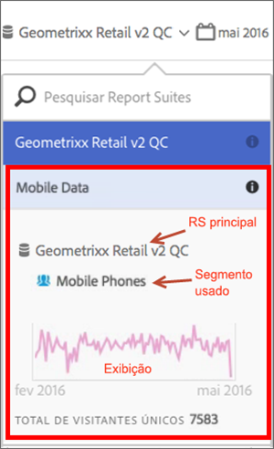

# Exibir informações do conjunto de relatórios virtuais

Clique no ícone i (Informações) ao lado do nome do conjunto de relatórios para obter informações sobre ele.

## No Seletor de conjunto de relatórios {#section_74E43B60C1CA4180B5ACA57574C1FA0F}

Ao clicar no ícone Informações ao lado do conjunto de relatórios virtual no seletor de Conjuntos de relatórios, você fornece as seguintes informações:

* O nome do conjunto de relatórios pai.
* O nome de qualquer segmento aplicado a ele.
* Uma visualização simples do conjunto de relatórios com o segmento aplicado.
* Contagem total de visitantes únicos.

