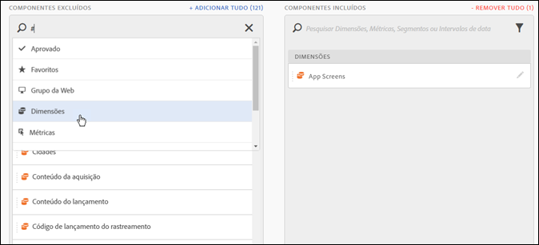
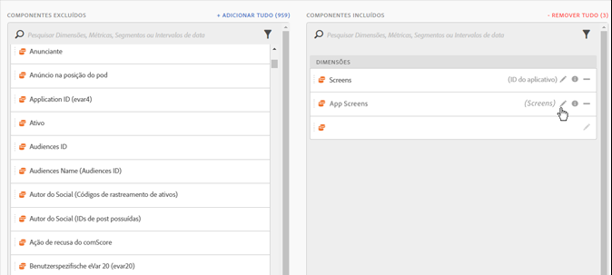
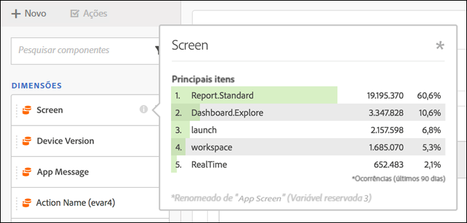
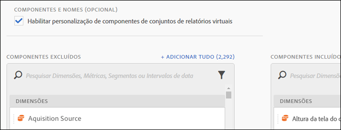

# Curadoria do componente de conjunto de relatórios virtual

Conjuntos de relatórios virtuais podem ser curados para incluir e excluir componentes na Analysis Workspace.

> [!NOTE] As alterações foram feitas aos componentes que são visíveis por administradores e não administradores em projetos preparados da Workspace e em conjuntos de relatórios virtuais preparados (VRSs). Anteriormente, qualquer pessoa podia ver componentes não preparados ao clicar no botão **[!UICONTROL Mostrar todos os componentes]**. A [experiência atualizada de preparação](https://marketing.adobe.com/resources/help/pt_BR/analytics/analysis-workspace/curate-projects-vrs.html) permite um controle mais polido sobre quais componentes ficam visíveis.

Para permitir a curadoria de componentes,

1. Acesse **[!UICONTROL Análises]** > **[!UICONTROL Componentes]** > **[!UICONTROL Conjuntos de relatórios virtuais]** > **[!UICONTROL Criar novo conjunto de relatórios virtual]**.
1. Depois de definir as **[!UICONTROL Configurações]**, clique na guia **[!UICONTROL Componentes]**.

1. Marque a caixa de seleção **[!UICONTROL Habilitar personalização de componentes de conjuntos de relatórios virtuais]**:

   

   >[!NOTE]
   >
   >Se a personalização de componentes estiver ativada, o conjunto de relatórios virtuais poderá ser acessado **somente na Analysis Workspace** e não em:

   * [!UICONTROL Reports &amp; Analytics]
   * [!UICONTROL Ad Hoc Analysis]
   * [!UICONTROL Data Warehouse]
   * [!UICONTROL Report Builder]
   * API em relatórios do Analytics
   Uma vez verificado, você pode adicionar os componentes que deseja incluir no conjunto de relatórios virtual, arrastando os componentes aplicáveis da coluna “componentes excluídos” para a coluna “componentes incluídos”. Os componentes que podem ser incluídos e excluídos são:

   * Dimensões
   * Métricas
   * Segmentos
   * Intervalos de datas
   >[!NOTE]
   >
   >Não há necessidade de *compartilhar* componentes com curadoria (segmentos, métricas calculadas, intervalos de datas). Eles sempre estarão visíveis na Analysis Workspace se tiverem curadoria para o conjunto de relatórios virtual, mesmo se não forem compartilhados.

1. Além disso, você pode filtrar ou pesquisar os componentes e adicionar toda a seleção filtrada à coluna incluída clicando em **[!UICONTROL Adicionar tudo]**.

   

## Renomear componentes {#section_0F7CD9F684FE4765BC00A2AFED56550E}

Você pode alterar os nomes de exibição dos componentes incluídos especificamente para o conjunto de relatórios virtual. Por exemplo, se você quiser incluir o Nome da página no conjunto de relatórios virtual, mas quiser renomeá-lo para algo no contexto dos dispositivos móveis, poderá fazer isso nas Telas do aplicativo. O novo nome é exibido na Analysis Workspace sempre que este conjunto de relatórios virtual é usado.

Na Analysis Workspace, clique no ícone de informações de qualquer componente incluído para revelar o nome original do componente renomeado:

## Grupos de componentes  {#section_483BEC76F49E46ADAAA03F0A12E48426}

Use grupos de componentes para criar adições de componentes em massa ao seu conjunto de relatórios virtual. Por exemplo, se você quiser importar um conjunto padrão de componentes específicos da análise de aplicativos móveis, selecione o grupo de aplicativos móveis. Um conjunto correspondente de dimensões e métricas (já renomeadas) é adicionado automaticamente à lista de Incluídos do conjunto de relatórios virtual.

## Comportamento do Workspace {#section_6C32F8B642804C0097FCB14E21028D4A}

Para obter mais informações sobre a preparação na Analysis Workspace, consulte [Preparar e compartilhar um projeto](https://marketing.adobe.com/resources/help/pt_BR/analytics/analysis-workspace/curate.html).
