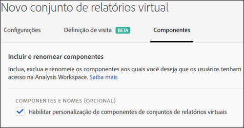

# Curadoria de componentes do conjunto de relatórios virtual

Os conjuntos de relatórios virtuais podem ser gerenciados para incluir e excluir componentes no Analysis Workspace.

>[!BEGINSHADEBOX]

Consulte  [Curadoria de componentes](https://experienceleague.adobe.com/en/docs/analytics-learn/tutorials/components/virtual-report-suites/component-curation-in-virtual-report-suites){target="_blank"} para ver um vídeo de demonstração.

>[!ENDSHADEBOX]

>[!NOTE]
>
>As alterações foram feitas nos componentes que são visíveis em projetos preparados do Workspace e em conjuntos de relatórios virtuais preparados. Anteriormente, qualquer pessoa podia ver componentes não preparados ao clicar no botão **[!UICONTROL Mostrar todos os componentes]**. A [experiência atualizada de preparação](/help/analyze/analysis-workspace/curate-share/curate.md) permite um controle mais polido sobre quais componentes ficam visíveis.

Para permitir a curadoria de componentes,

1. Vá para **[!UICONTROL Analytics]** > **[!UICONTROL Componentes]** > **[!UICONTROL Conjuntos de relatórios virtuais]** > **[!UICONTROL Criar novo conjunto de relatórios virtual]**.
1. Depois de definir as **[!UICONTROL Configurações]**, clique na guia **[!UICONTROL Componentes]**.

1. Marque a caixa de seleção **[!UICONTROL Habilitar personalização de componentes do conjunto de relatórios virtual]**:

   

   >[!NOTE]
   >
   >Se a personalização de componentes estiver habilitada, o conjunto de relatórios virtuais poderá ser acessado **somente na Analysis Workspace** e não em:
   >
   >* [!UICONTROL Data Warehouse]
   >* [!UICONTROL Report Builder]
   >* [!UICONTROL Activity Map]
   >* API em relatórios do Analytics

   Depois de marcado, você pode adicionar os componentes que gostaria de incluir no conjunto de relatórios virtual arrastando os componentes aplicáveis da coluna &quot;componentes excluídos&quot; para a coluna &quot;componentes incluídos&quot;. Os componentes que podem ser incluídos e excluídos são:

   * Dimensões
   * Métricas
   * Segmentos
   * Intervalos de datas

   >[!NOTE]
   >
   >Não há necessidade de *compartilhar* componentes com curadoria (segmentos, métricas calculadas, intervalos de datas). Eles sempre estarão visíveis na Analysis Workspace se tiverem curadoria para o conjunto de relatórios virtual, mesmo se não forem compartilhados.

1. Além disso, você pode filtrar ou pesquisar os componentes e adicionar toda a seleção filtrada à coluna incluída clicando em **[!UICONTROL Adicionar tudo]**.

   

## Renomear componentes {#section_0F7CD9F684FE4765BC00A2AFED56550E}

Você pode alterar os nomes de exibição dos componentes incluídos específicos do conjunto de relatórios virtual. Por exemplo, se você deseja incluir o Nome da página no conjunto de relatórios virtual, mas deseja renomeá-lo para um contexto mais móvel, é possível alterá-lo para App Screens. O novo nome é exibido no Analysis Workspace sempre que esse conjunto de relatórios virtual é usado.

No Analysis Workspace, clique no ícone de informações de qualquer componente incluído para revelar o nome original do componente renomeado:

## Grupos de componentes {#section_483BEC76F49E46ADAAA03F0A12E48426}

Use grupos de componentes para fazer adições de componentes em massa ao conjunto de relatórios virtual. Por exemplo, se você quiser importar um conjunto padrão de componentes específicos para a análise de aplicativos móveis, selecione o grupo de aplicativos móveis. Um conjunto correspondente de dimensões e métricas (já renomeado) é adicionado automaticamente à lista Incluídos do conjunto de relatórios virtual.

## Comportamento do Workspace {#section_6C32F8B642804C0097FCB14E21028D4A}

Para obter mais informações sobre a preparação na Analysis Workspace, consulte [Preparar e compartilhar um projeto](/help/analyze/analysis-workspace/curate-share/curate.md).
