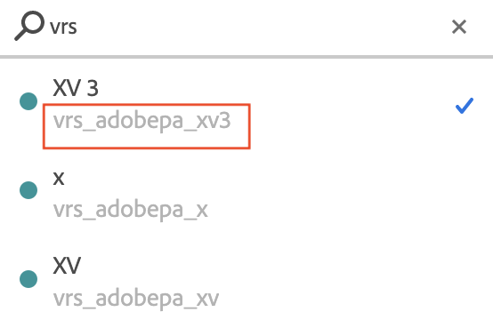

# Perguntas frequentes sobre conjuntos de relatórios virtuais

Dicas e práticas recomendadas para novos usuários dos conjuntos de relatórios virtuais.

| Pergunta | Resposta |
| --- | --- |
| **Devo consolidar minha implementação de diversos conjuntos de relatórios em um único conjunto de relatórios “global” e, em seguida, usar os conjuntos de relatórios virtuais para expor diferentes segmentos de dados para meus usuários?** | Talvez. Estas são algumas das circunstâncias sob as quais você deve considerar manter os conjuntos de relatórios individuais:<ul><li>Se você tiver variáveis/dimensões com uma grande quantidade de valores únicos, a consolidação em um único conjunto de relatórios pode exceder os limites de valor único mensal no conjunto global, resultando em truncamento (“Baixo tráfego” como um item de linha nos relatórios).</li><li>Se você precisar de relatórios em tempo real ou de &quot;Dados atuais&quot; para segmentos individuais (por exemplo, marcas, unidades de negócios etc.), de seus dados.</li><li>Seus vários conjuntos de relatórios podem ter requisitos únicos de rastreamento (ou seja, se eles usam variáveis e eventos do Adobe Analytics de maneira muito diferente). Se esse for o caso, observe que a consolidação em um conjunto de relatórios global não oferecerá variáveis ou eventos adicionais para rastreamento.</li></ul> |
| **Quais configurações dos conjuntos de relatórios virtuais são herdadas do conjunto de relatórios pai?** | Um conjunto de relatórios virtual herda a maioria dos níveis de serviço do conjunto de relatórios principal, como as configurações de eVar, as regras de processamento, as classificações etc.  As seguintes configurações NÃO foram herdadas:<ul><li>ID do conjunto de relatórios</li><li>Nome do conjunto de relatórios </li><li>Grupos de permissão (os conjuntos de relatórios virtuais podem ser atribuídos a seus próprios grupos de permissão)</li></ul>**Observação**: isso não inclui a maioria das entidades criadas pelo usuário, como Marcadores, Painéis, Relatórios Agendados etc.; esses itens não são herdados do pai e podem ser criados e usados especificamente no conjunto de relatórios Virtual (mais detalhes na próxima pergunta). |
| **Qual é a diferença entre trabalhar com um conjunto de relatórios virtual e com um conjunto de relatórios de base na interface do Analytics?** | Depois de criado, um conjunto de relatórios virtual é tratado como um conjunto de relatórios base na interface do usuário e geralmente é compatível com a maioria dos recursos estendidos. Por exemplo:<ul><li>Os conjuntos de relatórios virtuais são exibidos no seletor de Conjunto de relatórios e podem ser selecionados individualmente, como qualquer outro conjunto de relatórios base.</li><li>Relatórios, Marcadores, Painéis, Alvos, Alertas, Segmentos, Métricas calculadas etc. podem ser criados em relação a um conjunto de relatórios virtual e se comportam de forma independente do pai.</li><li>Os conjuntos de relatórios virtuais podem ser adicionados individualmente aos Grupos de permissões, como qualquer outro conjunto de relatórios.</li><li>Segmentos ainda podem ser aplicados ao executar relatórios no contexto de um conjunto de relatórios virtual; eles serão empilhados automaticamente com o(s) segmento(s) do conjunto de relatórios virtual quando os dados dos relatórios forem recuperados.</li></ul> |
| **Como os conjuntos de relatórios virtuais são tratados no Admin Console e na API de administração? É possível salvar recursos neles, como conjuntos de relatórios de base?** | Não, os conjuntos de relatórios virtuais não são compatíveis com a maioria dos recursos de administração. Como mencionado acima, um conjunto de relatórios virtual herda a maioria dos níveis de serviço e recursos do principal (por exemplo, configurações de eVar, regras de processamento, classificações etc.), portanto, para fazer alterações nessas configurações herdadas em um conjunto de relatórios virtual, é necessário alterar o conjunto de relatórios principal. Como resultado, os conjuntos de relatórios virtuais são mostrados na interface do usuário somente aqui:<ul><li>O gerenciador de conjuntos de relatórios virtuais, no qual você cria e edita conjuntos de relatórios virtuais. (Analytics > Componentes > Conjuntos de relatórios virtuais)</li><li>O Adobe [Admin Console](https://helpx.adobe.com/br/enterprise/using/admin-console.html). Para usar um conjunto de relatórios virtual em relatórios ou em todo o Adobe Analytics, as permissões funcionam exatamente como em um conjunto de relatórios. Isso significa que os conjuntos de relatórios virtuais são exibidos na ferramenta de seleção de um perfil de produto e são atribuídos a perfis de produtos exatamente como os conjuntos de relatórios.</li></ul>**Observação**: quando você usa a API de serviços da web e tenta salvar as configurações de recursos de um conjunto de relatórios virtual, ocorre uma exceção. Os recursos podem ser definidos somente com um conjunto de relatórios base. |
| **Eu marquei “Iniciar nova visita na inicialização”. Por que ainda vejo visitas muito maiores que inicializações?** | Quando &quot;Iniciar nova visita na inicialização&quot; está marcado, o tempo-limite ainda é aplicado. Assim, se um usuário usar o aplicativo por dez minutos com um intervalo de um minuto entre cada ação, uma nova visita será iniciada na inicialização e nove visitas adicionais serão criadas quando a visita atingir o tempo limite. Para manter inicializações e visitas o mais próximo possível ao usar a opção &quot;Iniciar nova visita na inicialização&quot;, você deve usar um tempo-limite mais longo que o tempo-limite da sessão definido no SDK. |
| **Eu defini “Iniciar nova visita na inicialização” e um tempo-limite mais longo que meu SDK. Por que minhas inicializações ainda são muito inferiores às visitas?** | Se o tempo limite for maior que o valor definido na SDK, é muito provável que seu aplicativo esteja enviando ocorrências enquanto está em segundo plano e essas ocorrências estão se registrando como novas visitas. Verifique isso usando a dimensão tipo de ocorrência no conjunto de relatórios pai para ver se há ocorrências em segundo plano. **Observação**: ocorrências em primeiro e segundo plano são diferenciadas somente na versão 4.13.6 e superior do SDK. Se estiver em uma versão anterior, todas as ocorrências serão mostradas em primeiro plano. Se tiver a versão correta do SDK, você deve habilitar a configuração &quot;Impedir ocorrências em segundo plano de iniciar uma nova visita&quot;.    Observação: se não tiver desativado o processamento herdado para ocorrências em segundo plano no Admin Console, eles não serão mostrados no conjunto de relatórios principal, mas aparecerão no conjunto de relatórios virtual. |
| **Que versão do SDK preciso ter para rastrear ocorrências em segundo plano?** | Você deve ter a versão 4.13.6 ou superior do SDK. |
| **Como encontrar a ID de um conjunto de relatórios virtual?** | <ul><li>Ao abrir um projeto do Workspace, clique no seletor de conjuntos de relatórios e procure pelo nome de um conjunto de relatórios virtual na caixa de pesquisa. A ID aparece abaixo do nome nos resultados da pesquisa: </li><li> Ou, de forma programática, na [API do conjunto de relatórios virtual](https://www.adobe.io/apis/experiencecloud/analytics/docs.html#!AdobeDocs/analytics-2.0-apis/master/vrs.md).</li></ul> |
