# Sessões sensíveis ao contexto

As Sessões sensíveis ao contexto em conjuntos de relatórios virtuais mudam a forma como o Adobe Analytics calcula as visitas de dispositivos móveis. Este artigo descreve as implicações do processamento de ocorrências em segundo plano e dos eventos de inicialização de aplicativos (ambos definidos pelo SDK móvel) na forma como as visitas móveis são definidas.

Você pode definir uma visita da maneira que quiser sem alterar os dados subjacentes, para corresponder a como seus visitantes interagem com seus aplicativos móveis.

## Parâmetro do URL de perspectiva do cliente  {#section_8B298006362341E3AC16A148422D1F65}

O processo de coleta de dados do Adobe Analytics permite que você defina um parâmetro de string de consulta especificando a perspectiva do cliente (denotado como o parâmetro de string de consulta &quot;cp&quot;). Este campo especifica o estado do aplicativo digital do usuário final. Isso ajuda você a saber se uma ocorrência foi gerada enquanto um aplicativo móvel estava em segundo plano.

## Processamento de ocorrências em segundo plano  {#section_D47B3161B7E145B6A32AB06E9AA03FA3}

Uma ocorrência em segundo plano é um tipo de ocorrência enviada para o Analytics a partir do SDK do Adobe Mobile versão 4.13.6 e superior quando o aplicativo faz uma solicitação de rastreamento em segundo plano. Exemplos típicos disso incluem:

* Dados enviados durante um cruzamento de fronteiras
* Uma interação de notificação por push

Os exemplos a seguir descrevem a lógica usada para determinar quando uma visita começa e termina para um visitante quando a configuração “Impedir ocorrências em segundo plano de iniciar uma nova visita” está ou não habilitada para um conjunto de relatórios virtual.

**Se “Impedir ocorrências em segundo plano de iniciar uma nova visita” não estiver ativado:**

Se esse recurso não estiver habilitado para um conjunto de relatórios virtual, as ocorrência em segundo plano serão tratadas como qualquer outro tipo, o que significa que iniciarão novas visitas e agirão exatamente como ocorrências em primeiro plano. Por exemplo, se uma ocorrência em segundo plano ocorrer menos de 30 minutos (o tempo limite padrão de sessão para um conjunto de relatórios) antes de um conjunto de ocorrências em primeiro plano, a ocorrência em segundo plano fará parte da sessão.

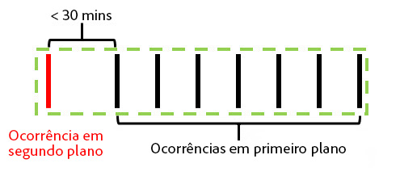

Se a ocorrência em segundo plano ocorrer mais de 30 minutos antes de qualquer ocorrência em primeiro plano, a ocorrência em segundo plano criará sua própria visita, para uma contagem total de 2 visitas.

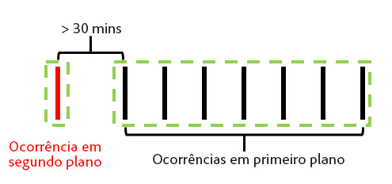

**Se “Impedir ocorrências em segundo plano de iniciar uma nova visita” estiver ativado:**

Os exemplos a seguir ilustram o comportamento das ocorrências em segundo plano quando esse recurso está habilitado.

Exemplo 1: uma ocorrência em segundo plano ocorre em algum período de tempo (t) antes de uma série de ocorrências em primeiro plano.

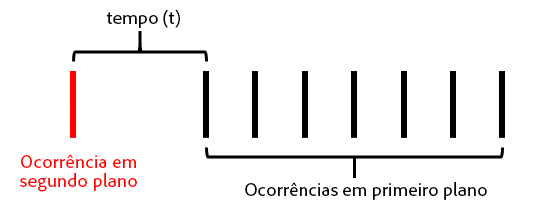

Neste exemplo, se *t* for maior do que o tempo limite de visita configurado para o conjunto de relatórios virtual, a ocorrência em segundo plano será excluída da visita formada pelas ocorrências em primeiro plano. Por exemplo, se o tempo limite de visita do conjunto de relatórios virtual for definido como 15 minutos e *t* for de 20 minutos, a visita formada por esta série de ocorrências (mostradas pelo contorno verde) excluirá a ocorrência em segundo plano. Isso significa que qualquer eVar configurada com uma expiração de “visita” na ocorrência em segundo plano **não** persiste na visita seguinte e que um contêiner do segmento de visita somente inclui as ocorrências em primeiro plano dentro do contorno verde.

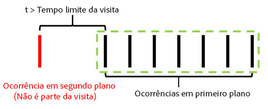

Por outro lado, se *t* for menor que o tempo limite de visita configurado para o conjunto de relatórios virtual, a ocorrência em segundo plano será incluída como parte da visita como se fosse uma ocorrência em primeiro plano (mostrada pelo contorno verde):

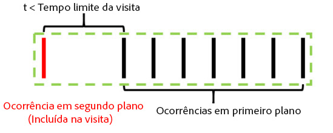

Isso significa que:

* Qualquer eVar definida com expiração de “visita” na ocorrência em segundo plano mantém seus valores sobre outras ocorrências nesta visita.
* Qualquer valor definido na ocorrência em segundo plano será incluído na avaliação da lógica de contêiner do segmento em nível de visita.

Em ambos os casos, a contagem total de visitas seria 1.

Exemplo 2: se uma ocorrência em segundo plano ocorre após uma série de ocorrências em primeiro plano, o comportamento é semelhante:

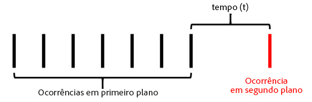

Se a ocorrência em segundo plano ocorrer após o tempo limite configurado para o conjunto de relatórios virtual, a ocorrência em segundo plano não fará parte de uma sessão (contornada em verde):

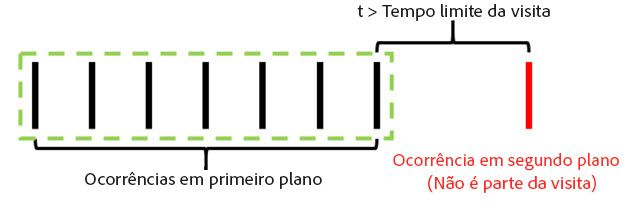

Da mesma forma, se o período de tempo *t* for menor que o tempo limite configurado para o conjunto de relatórios virtual, a ocorrência em segundo plano será incluída na visita formada pelas ocorrências em primeiro plano anteriores:

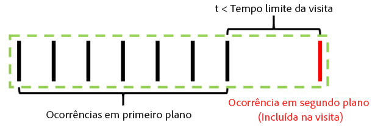

Isso significa que:

* Qualquer eVar definida com a expiração de “visita” nas ocorrências em primeiro plano anteriores manterá seus valores sobre as ocorrências em segundo plano nesta visita.
* Qualquer valor definido na ocorrência em segundo plano será incluído na avaliação da lógica de contêiner do segmento em nível de visita.

Como antes, a contagem total de visitas em ambos os casos seria 1.

Exemplo 3: em algumas circunstâncias, uma ocorrência em segundo plano pode fazer com que duas visitas separadas sejam combinadas em uma única visita. No cenário a seguir, uma ocorrência em segundo plano é precedida e seguida por uma série de ocorrências em primeiro plano:

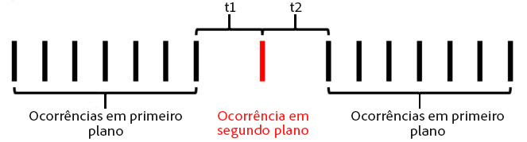

Se, neste exemplo, *t1* e *t2* fossem inferiores ao tempo limite de visita configurado para o conjunto de relatórios virtual, todas essas ocorrências seriam combinadas em uma única visita, mesmo que *t1* e *t2* fossem, juntas, maiores que o tempo limite de visita:

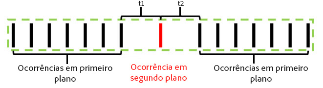

Contudo, se *t1* e *t2* fossem maiores do que o tempo limite configurado para o conjunto de relatórios virtual, essas ocorrências seriam separadas em duas visitas distintas:

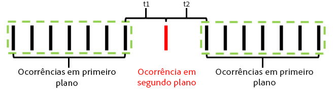

Da mesma forma (como em nossos exemplos anteriores), se *t1* fosse menor que o tempo limite e *t2* fosse menor que o tempo limite, a ocorrência em segundo plano seria incluída na primeira visita:

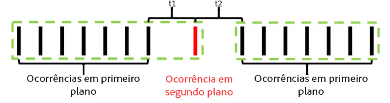

Se *t1* fosse maior que o tempo limite e *t2* fosse menor que o tempo limite, a ocorrência em segundo plano seria incluída na segunda visita:

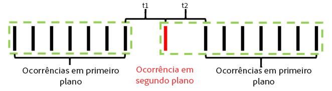

Exemplo 4: em cenários em que uma série de ocorrências em segundo plano ocorrem dentro do tempo limite de uma visita do conjunto de relatórios virtual, as ocorrências formam uma “visita em segundo plano” invisível que não é contabilizada na contagem de visitas e não pode ser acessada usando um contêiner de segmentação de visitas.

Mesmo que isso não seja considerado uma visita, qualquer conjunto de eVars com expiração de visita manterá seus valores para a outra ocorrência em segundo plano nesta “visita em segundo plano”.

Exemplo 5: para cenários em que várias ocorrências em segundo plano ocorrem sucessivamente após uma série de ocorrências em primeiro plano, é possível (dependendo da configuração de tempo limite) que as ocorrências em segundo plano mantenham uma visita ativa por mais tempo do que o tempo limite. Por exemplo, se *t1* e *t2* fossem juntos maiores do que o tempo limite de visita do conjunto de relatórios virtual, mas fossem, individualmente, menores do que o tempo limite, a visita ainda se estenderia para incluir as duas ocorrências em segundo plano:

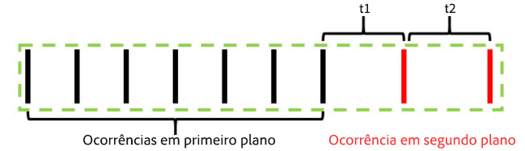

Da mesma forma, se uma série de ocorrências em segundo plano ocorressem antes de uma série de eventos em primeiro plano, um comportamento semelhante ocorreria:

As ocorrências em segundo plano se comportam desta maneira para preservar os efeitos de atribuição das eVars ou de outras variáveis definidas durante as ocorrências em segundo plano. Isso permite que os eventos de conversão em primeiro plano em downstream sejam atribuídos a ações tomadas enquanto um aplicativo estava em segundo plano. Também permite que um contêiner do segmento de visita inclua ocorrências em segundo plano que resultaram em uma sessão em primeiro plano em downstream, o que é útil para mensurar a eficácia da mensagem de push.

## Comportamento da métrica de visitas  {#section_50B82618A39B454493B33B1450CCBD3E}

A contagem de visitas baseia-se unicamente no número de visitas que inclui, pelo menos, uma ocorrência em primeiro plano. Isso significa que quaisquer ocorrências em segundo plano órfãs ou “visitas em segundo plano” não são contabilizadas na métrica Visita.

## Comportamento métrico de tempo gasto por visita  {#section_0A149ABB3E034B97BD0B3A7F3EB67383}

O tempo gasto ainda é calculado de forma análoga ao cálculo sem ocorrências em segundo plano usando o tempo entre as ocorrências. Contudo, se uma visita incluir ocorrências em segundo plano (porque ocorreram perto o suficiente das ocorrências em primeiro plano), essas ocorrências serão incluídas no cálculo do tempo gasto por visita, como se fossem uma ocorrência em primeiro plano.

## Configurações de processamento de ocorrências em segundo plano  {#section_C8B1D38C06FF4ABAAFA78CE9550C0F4B}

Como o processamento de ocorrências em segundo plano está disponível apenas para conjuntos de relatórios virtuais usando Processamento de tempo de relatório, o Adobe Analytics oferece suporte a duas formas de processamento de ocorrências em segundo plano para preservar as contagens de visitas no conjunto de relatórios base que não usa o Processamento de tempo de relatório. Para acessar esta configuração, navegue até o Admin Console do Adobe Analytics, vá para as configurações do conjunto de relatórios base aplicável, navegue até o menu “Gerenciamento de dispositivos móveis” e, em seguida, para o submenu “Relatórios de aplicativos móveis”.

1. “Processamento herdado ativado”: esta é a configuração padrão para todos os conjuntos de relatórios. Deixar o processamento herdado ativado processa as ocorrências em segundo plano como ocorrências normais em nosso pipeline de processamento no que diz respeito ao conjunto de relatórios base da Atribuição de tempo de não relatório. Isso significa que todas as ocorrências em segundo plano que aparecem no conjunto de relatórios base incrementam as visitas como uma ocorrência normal. Se você não quiser que as ocorrências em segundo plano apareçam em seu conjunto de relatórios base, altere essa configuração para “Desativado”.
1. “Processamento herdado desativado”: com o processamento herdado para ocorrências em segundo plano desativado, as ocorrências em segundo plano enviadas para o conjunto de relatórios base serão ignoradas por este e só poderão ser acessadas quando um conjunto de relatórios virtual criado neste conjunto de relatórios base for configurado para usar o Tempo de processamento de relatório. Isso significa que todos os dados capturados por ocorrências em segundo plano enviadas a este conjunto de relatórios base somente aparecem em um conjunto de relatórios virtual habilitado para processamento de tempo de relatório.

   Esta configuração destina-se a clientes que desejem tirar proveito do novo processamento de ocorrências em segundo plano sem alterar as contagens de visitas de seu conjunto de relatórios base.

Em ambos os casos, as ocorrências em segundo plano serão faturadas ao mesmo custo de qualquer outra ocorrência enviada ao Analytics.

## Iniciar novas visitas em cada inicialização de aplicativo  {#section_9DA9A8B9758248A6B311EFBA06AECA80}

Além do processamento de ocorrências em segundo plano, os conjuntos de relatórios virtuais podem forçar a inicialização de uma nova visita sempre que o SDK móvel envia um evento de inicialização de aplicativo. Com esta configuração ativada, sempre que um evento de lançamento de aplicativo for enviado do SDK, ele forçará a inicialização de uma nova visita, independentemente de uma visita aberta ter atingido seu tempo limite. A ocorrência que contém o evento de inicialização de aplicativo é incluída como a primeira ocorrência da próxima visita e incrementa a contagem de visitas e cria um contêiner de visitas distinto para segmentação.
