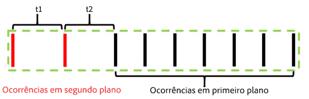

# Sessões sensíveis ao contexto

As sessões sensíveis ao contexto em conjuntos de relatórios virtuais mudam a forma como o Adobe Analytics calcula as visitas de dispositivos. Este artigo também descreve as implicações do processamento de ocorrências em segundo plano e dos eventos de inicialização de aplicativos (ambos definidos pelo SDK móvel) na forma como as visitas móveis são definidas.

Você pode definir uma visita da maneira que quiser sem alterar os dados subjacentes, para corresponder a como seus visitantes interagem com suas experiências digitais.

>[!BEGINSHADEBOX]

Consulte  [Sessões sensíveis ao contexto](https://experienceleague.adobe.com/en/docs/analytics-learn/tutorials/components/virtual-report-suites/context-aware-sessions-in-virtual-report-suites){target="_blank"} para ver um vídeo de demonstração.

>[!ENDSHADEBOX]

## Parâmetro do URL de perspectiva do cliente

O processo de coleta de dados do Adobe Analytics permite definir um parâmetro da sequência de consulta que especifica a perspectiva do cliente (denotado como o parâmetro da sequência de consulta &quot;cp&quot;). Esse campo especifica o estado do aplicativo digital do usuário final. Isso ajuda você a saber se uma ocorrência foi gerada enquanto um aplicativo móvel estava em segundo plano.

## Processamento de ocorrências em segundo plano

Uma ocorrência em segundo plano é um tipo de ocorrência enviada para o Analytics a partir do Adobe Mobile SDK versão 4.13.6 e superior quando o aplicativo faz uma solicitação de rastreamento em segundo plano. Exemplos típicos disso são:

* Dados enviados durante uma geolocalização
* Uma interação de notificação por push

Os exemplos a seguir descrevem a lógica usada para determinar quando uma visita começa e termina para qualquer visitante quando a configuração &quot;Impedir ocorrências em segundo plano de iniciar uma nova visita&quot; está ou não ativada para um conjunto de relatórios virtual.

**Se “Impedir ocorrências em segundo plano de iniciar uma nova visita” não estiver habilitado:**

Se esse recurso não estiver ativado para um conjunto de relatórios virtual, as ocorrências em segundo plano serão tratadas da mesma forma que qualquer outra ocorrência, o que significa que elas iniciam novas visitas e agem da mesma forma que as ocorrências em primeiro plano. Por exemplo, se uma ocorrência em segundo plano ocorrer menos de 30 minutos (o tempo limite padrão da sessão para um conjunto de relatórios) antes de um conjunto de ocorrências em primeiro plano, a ocorrência em segundo plano fará parte da sessão.

Se a ocorrência em segundo plano ocorrer mais de 30 minutos antes de qualquer ocorrência em primeiro plano, a ocorrência em segundo plano criará sua própria visita, para uma contagem total de visitas de 2.

**Se “Impedir ocorrências em segundo plano de iniciar uma nova visita” estiver habilitado:**

Os exemplos a seguir ilustram o comportamento das ocorrências em segundo plano quando esse recurso está habilitado.

Exemplo 1: uma ocorrência em segundo plano ocorre em algum período de tempo (t) antes de uma série de ocorrências em primeiro plano.

Neste exemplo, se *t* for maior que o tempo limite de visita configurado do conjunto de relatórios virtual, a ocorrência em segundo plano será excluída da visita formada pelas ocorrências em primeiro plano. Por exemplo, se o tempo limite de visita do conjunto de relatórios virtual fosse definido como 15 minutos e *t* fosse 20 minutos, a visita formada por essa série de ocorrências (mostrada pelo outline verde) excluiria a ocorrência em segundo plano. Isso significa que qualquer eVars definida com uma expiração de &quot;visita&quot; na ocorrência em segundo plano **não** persistiria na visita a seguir, e um contêiner de segmento de visita incluiria somente as ocorrências em primeiro plano dentro do contorno verde.

Por outro lado, se *t* for menor que o tempo limite de visita configurado para o conjunto de relatórios virtual, a ocorrência em segundo plano será incluída como parte da visita, como se fosse uma ocorrência em primeiro plano (mostrada pelo contorno verde):

Isso significa que:

* Qualquer eVars definida com expiração de &quot;visita&quot; na ocorrência em segundo plano manterá seus valores nas outras ocorrências nesta visita.
* Quaisquer valores definidos na ocorrência em segundo plano são incluídos na avaliação da lógica do contêiner de segmento no nível da visita.

Em ambos os casos, a contagem total de visitas seria 1.

Exemplo 2: se uma ocorrência em segundo plano ocorre após uma série de ocorrências em primeiro plano, o comportamento é semelhante:

Se a ocorrência em segundo plano ocorrer após o tempo limite configurado do conjunto de relatórios virtual, a ocorrência em segundo plano não fará parte de uma sessão (descrita em verde):

Da mesma forma, se o período de tempo *t* for menor que o tempo limite configurado para o conjunto de relatórios virtual, a ocorrência em segundo plano será incluída na visita formada pelas ocorrências em primeiro plano anteriores:

Isso significa que:

* Quaisquer eVars definidas com expiração de &quot;visita&quot; nas ocorrências em primeiro plano anteriores persistem seus valores na ocorrência em segundo plano nesta visita.
* Quaisquer valores definidos na ocorrência em segundo plano são incluídos na avaliação da lógica do contêiner de segmento no nível da visita.

Como antes, a contagem total de visitas em ambos os casos seria 1.

Exemplo 3: em algumas circunstâncias, uma ocorrência em segundo plano pode fazer com que duas visitas separadas sejam combinadas em uma única visita. No cenário a seguir, uma ocorrência em segundo plano é precedida e seguida por uma série de ocorrências em primeiro plano:

Se, neste exemplo, *t1* e *t2* forem menores que o tempo limite de visita configurado para o conjunto de relatórios virtual, todas essas ocorrências serão combinadas em uma única visita, mesmo que *t1* e *t2* juntos sejam maiores que o tempo limite de visita:

No entanto, se *t1* e *t2* forem maiores que o tempo limite configurado para o conjunto de relatórios virtual, essas ocorrências serão separadas em duas visitas distintas:

Da mesma forma (como em nossos exemplos anteriores), se *t1* for menor que o tempo limite e *t2* for maior que o tempo limite, a ocorrência em segundo plano será incluída na primeira visita:

Se *t1* for maior que o tempo limite e *t2* for menor que o tempo limite, a ocorrência em segundo plano será incluída na segunda visita:

Exemplo 4: em cenários em que uma série de ocorrências em segundo plano ocorrem dentro do tempo-limite de uma visita do conjunto de relatórios virtual, as ocorrências formam uma “visita em segundo plano” invisível que não é contabilizada na contagem de visitas e não pode ser acessada usando um contêiner de segmentação de visitas.

Mesmo que isso não seja considerado uma visita, qualquer conjunto de eVars com expiração de visita manterá seus valores para a outra ocorrência em segundo plano nesta “visita em segundo plano”.

Exemplo 5: para cenários em que várias ocorrências em segundo plano ocorrem sucessivamente após uma série de ocorrências em primeiro plano, é possível (dependendo da configuração de tempo-limite) que as ocorrências em segundo plano mantenham uma visita ativa por mais tempo do que o tempo-limite. Por exemplo, se *t1* e *t2* juntos forem maiores que o tempo limite de visita do conjunto de relatórios virtual, mas individualmente menores que o tempo limite, a visita ainda se estenderá para incluir ambas as ocorrências em segundo plano:

Da mesma forma, se uma série de ocorrências em segundo plano ocorrerem antes de uma série de eventos em primeiro plano, ocorrerá um comportamento semelhante:

As ocorrências em segundo plano se comportam dessa maneira para preservar quaisquer efeitos de atribuição de eVars ou outras variáveis definidas durante as ocorrências em segundo plano. Isso permite que os eventos de conversão em primeiro plano downstream sejam atribuídos a ações executadas enquanto um aplicativo estava no estado de segundo plano. Também permite que um contêiner de segmento de visita inclua ocorrências em segundo plano que resultaram em uma sessão em primeiro plano downstream, útil para medir a eficácia da mensagem de push.

## Comportamento da métrica de visitas

A contagem de visitas é baseada exclusivamente na contagem de visitas que incluem pelo menos uma ocorrência em primeiro plano. Isso significa que quaisquer ocorrências em segundo plano órfãs ou &quot;visitas em segundo plano&quot; não são contabilizadas na métrica Visita.

## Comportamento métrico de tempo gasto por visita

O tempo gasto ainda é calculado de forma análoga à forma como fica sem ocorrências em segundo plano usando o tempo entre as ocorrências. Embora, se uma visita incluir ocorrências em segundo plano (porque ocorreram perto o suficiente das ocorrências em primeiro plano), essas ocorrências são incluídas no cálculo de tempo gasto por visita como se fossem uma ocorrência em primeiro plano.

## Configurações de processamento de ocorrências em segundo plano

Como o processamento de ocorrências em segundo plano está disponível apenas para conjuntos de relatórios virtuais usando Processamento de tempo de relatório, o Adobe Analytics oferece suporte a duas formas de processamento de ocorrências em segundo plano para preservar as contagens de visitas no conjunto de relatórios base que não usa o Processamento de tempo de relatório. Para acessar essa configuração, acesse Ferramentas administrativas do Adobe Analytics, vá para as configurações do conjunto de relatórios base aplicável e navegue até o menu &quot;Gerenciamento de dispositivos móveis&quot; e, em seguida, até o submenu &quot;Relatório de aplicativos móveis&quot;.

1. &quot;Processamento herdado ativado&quot;: é a configuração padrão para todos os conjuntos de relatórios. Deixar o processamento herdado em processos em segundo plano como ocorrências normais em nosso pipeline de processamento no que diz respeito ao conjunto de relatórios base de Atribuição de tempo não relacionado ao relatório. Isso significa que qualquer ocorrência em segundo plano que apareça no conjunto de relatórios base incrementa as visitas como uma ocorrência normal. Se não quiser que ocorrências em segundo plano apareçam no conjunto de relatórios base, altere essa configuração para &quot;Desativado&quot;.
1. &quot;Processamento herdado desativado&quot;: com o processamento herdado para ocorrências em segundo plano desativado, todas as ocorrências em segundo plano enviadas para o conjunto de relatórios base são ignoradas pelo conjunto de relatórios base e só podem ser acessadas quando um conjunto de relatórios virtual criado nesse conjunto de relatórios base é configurado para usar o Processamento de tempo de relatório. Isso significa que quaisquer dados capturados por ocorrências em segundo plano enviadas para esse conjunto de relatórios base só aparecem em um conjunto de relatórios virtual habilitado para Processamento de tempo de relatório.

   Essa configuração é destinada aos clientes que desejam aproveitar o novo processamento de ocorrências em segundo plano sem alterar as contagens de visitas de seu conjunto de relatórios base.

Em ambos os casos, as ocorrências em segundo plano são cobradas ao mesmo custo de qualquer outra ocorrência enviada para o Analytics.

## Iniciar novas visitas em cada inicialização de aplicativo

Além do processamento de ocorrências em segundo plano, os conjuntos de relatórios virtuais podem forçar o início de uma nova visita sempre que o SDK móvel enviar um evento de inicialização de aplicativo. Com essa configuração ativada, sempre que um evento de inicialização de aplicativo é enviado pela SDK, ele força o início de uma nova visita, independentemente de uma visita aberta ter atingido o tempo limite. A ocorrência que contém o evento de inicialização do aplicativo é incluída como a primeira ocorrência na próxima visita, aumenta a contagem de visitas e cria um contêiner de visita distinto para segmentação.
