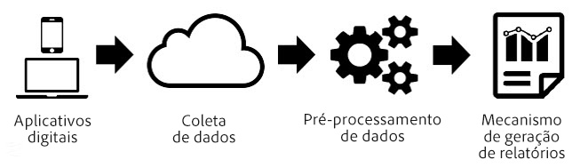
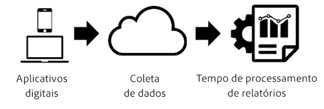

# Processamento de tempo do relatório

O processamento de tempo do relatório é uma configuração de conjunto de relatórios virtual que permite que os dados sejam processados de forma não destrutiva e retroativa.

> [!NOTE] O Processamento de tempo do relatório está disponível somente para a Analysis Workspace.

O Processamento de tempo do relatório somente afeta os dados no conjunto de relatórios virtual e não afeta nenhum dado ou coleta de dados no conjunto de relatórios base. A diferença entre o Processamento de tempo do relatório e o processamento analítico tradicional é melhor entendida usando o seguinte diagrama:

Durante o processamento de dados do Analytics, os dados fluem do pipeline de coleta de dados para uma etapa de pré-processamento, que prepara os dados para os relatórios. Esta etapa de pré-processamento aplica a lógica de expiração de visita e a lógica de persistência de eVar (entre outras coisas) aos dados conforme são coletados. A principal desvantagem deste modelo de pré-processamento é que ele exige que as configurações sejam feitas antes da coleta dos dados. Isso significa que qualquer alteração nas configurações de pré-processamento se aplica somente aos novos dados a partir desse momento. Isso será um problema se os dados chegarem fora de ordem ou se as configurações estiverem incorretas.

O Processamento de tempo do relatório é uma maneira fundamentalmente diferente de processar os dados do Analytics para a geração de relatórios. Em vez de predeterminar a lógica de processamento antes da coleta de dados, o Analytics ignora o conjunto de dados durante a etapa de pré-processamento e aplica essa lógica sempre que um relatório é executado:

Esta arquitetura de processamento permite opções de relatórios muito mais flexíveis. Por exemplo, você pode alterar o tempo limite de visita para qualquer duração desejada de forma não destrutiva e essas alterações são refletidas em sua persistência de eVar e nos contêineres dos segmentos retroativamente como se você tivesse aplicado essas configurações antes da coleta dos dados. Além disso, você pode criar qualquer número de conjuntos de relatórios virtuais, cada um com diferentes opções de Processamento de tempo do relatório com base em um mesmo conjunto de relatórios base, sem alterar os dados no conjunto de relatórios base.

O Processamento de tempo do relatório também permite que o Analytics evite que ocorrências em segundo plano iniciem novas visitas e permite que o [SDK móvel](https://marketing.adobe.com/developer/get-started/mobile/c-measuring-mobile-applications) informe os relatórios para iniciar uma nova visita sempre que um evento de inicialização de aplicativo for acionado.

As seguintes opções de configuração estão disponíveis atualmente para conjuntos de relatórios virtuais com o Processamento de tempo do relatório ativado:

* **Tempo limite da visita:** A configuração de tempo limite de visita define a quantidade de inatividade que um visitante único deve ter antes que uma nova visita seja iniciada automaticamente. O padrão é 30 minutos. Por exemplo, se o tempo limite de visita for definido para 15 minutos, um novo grupo de visitas será criado para cada sequência de ocorrências coletadas, separadas por 15 minutos de inatividade. Essa configuração afeta não apenas a sua visita, mas também a forma como os contêineres do segmento de visitas são avaliados e a lógica de expiração de visita para todas as eVars que expiram na visita. Diminuir o tempo limite de visita provavelmente aumentará o número total de visitas em seus relatórios, ao passo que aumentar o tempo limite provavelmente diminuirá o número total de visitas em seus relatórios.
* **Configurações de visita do aplicativo móvel:** Para conjuntos de relatórios que contêm dados gerados por aplicativos móveis por meio dos [sdks do Adobe Mobile](https://www.adobe.io/apis/cloudplatform/mobile.html), estão disponíveis configurações de visitas adicionais. Essas configurações não são destrutivas e afetam somente as ocorrências que foram coletadas por meio dos SDKs móveis. Essas configurações não têm impacto nos dados coletados fora do SDK móvel.
* **Impedir ocorrências em segundo plano de iniciar uma nova visita:** As ocorrências em segundo plano são coletadas pelos sdks móveis quando o aplicativo está em segundo plano.
* **Inicie uma nova visita em cada inicialização de aplicativo:** Além do tempo limite da visita, você pode forçar uma visita a começar sempre que um evento de Inicialização de aplicativo for gravado dos sdks móveis, independentemente da janela de inatividade. Essa configuração afeta a métrica de visitas e o contêiner do segmento de visitas, bem como a lógica de expiração de visita nas eVars.
* **Iniciar nova visita com evento:** Uma nova sessão é iniciada quando um evento é acionado, independentemente de uma sessão ter expirado. A sessão recentemente criada inclui o evento que a iniciou. Além disso, é possível usar vários eventos para começar uma sessão e uma nova sessão é acionada se qualquer um desses eventos for observado nos dados. Esta configuração afetará a contagem de visitas, o contêiner de segmentação de visitas e a lógica de expiração de visitas nas eVars.

O Processamento de tempo do relatório não suporta todas as métricas e dimensões disponíveis nos relatórios tradicionais do Analytics. Virtual report suites utilizing Report Time Processing are only accessible in Analysis Workspace and will not be accessible in [!UICONTROL Reports &amp; Analytics], Ad Hoc Analysis, Data Warehouse, Report Builder, Data Feeds, or the reporting API.

Além disso, o Processamento de tempo do relatório somente processa os dados provenientes do intervalo de datas do relatório (referido como “janela de datas” abaixo). Isso significa que os valores de eVar configurados como “nunca expiram” para um visitante antes do intervalo de datas do relatório não persistem nas janelas de relatórios e não aparecem nos relatórios. Isso também significa que as medições de lealdade do cliente são baseadas exclusivamente nos dados presentes no intervalo de datas do relatório e não em todo o histórico antes do intervalo de datas do relatório.

Abaixo está uma lista de métricas e dimensões que atualmente não são suportadas ao usar Processamento de tempo do relatório:

* **Analytics para Target:** Atualmente não suportado. O suporte futuro está planejado.
* **Métricas/dimensões reservadas do Analytics para Marketing Cloud:** Atualmente não suportado. O suporte futuro está planejado.
* **Métrica de acesso único:** Não suportado permanentemente.
* **List Vars:** Atualmente não suportado. O suporte futuro está planejado.
* **Evars de contador:** Não suportado permanentemente.
* **Variáveis de Canais de marketing:** Atualmente não suportado. O suporte futuro está planejado.
* **Dimensão de dias desde a última compra:** Devido à natureza da janela de datas Processamento de tempo do relatório, essa dimensão não é suportada.
* **Dimensão de dias antes da primeira compra:** Devido à natureza da janela de datas Processamento de tempo do relatório, essa dimensão não é suportada.
* **Dimensão da frequência de retorno:** Devido à natureza da janela de datas Processamento de tempo do relatório, essa dimensão não é suportada. Uma abordagem alternativa usando a métrica de contagem de visitas em um segmento é possível, ou usando a métrica de visitas em um relatório de histograma.
* **Dimensão de dias desde a última visita:** Devido à natureza da janela de datas Processamento de tempo do relatório, essa dimensão não é suportada.
* **Dimensão original da página de entrada:** Devido à natureza da janela de datas Processamento de tempo do relatório, essa dimensão não é suportada.
* **Evars de alocação linear:** Atualmente não suportado. O suporte futuro está planejado.
* **Dimensão do domínio de referência original:** Atualmente não suportado. O suporte futuro está planejado.
* **Número de visitas:** Devido à natureza da janela de datas Processamento de tempo do relatório, essa métrica não é suportada. Como alternativa em aplicativos móveis, você pode usar uma métrica calculada, incluindo visitantes/visitas com a métrica de Instalação de aplicativo para identificar novos visitantes ou visitas.
* **Fontes de dados da ID de transação:** Atualmente não suportado. O suporte futuro está planejado.

Abaixo está uma lista das dimensões e métricas afetadas, dependendo das configurações de Processamento de tempo do relatório selecionadas:

* Se «Impedir ocorrências em segundo plano de iniciar uma nova visita» estiver ativado, ocorrerá as seguintes alterações. Consulte [as sessões sensíveis ao contexto](vrs-mobile-visit-processing.md) para obter mais informações.
   * **Rejeições/Taxa de rejeição:** As ocorrências em segundo plano que não são seguidas por uma ocorrência em primeiro plano não são consideradas uma rejeição e não contribuem para a taxa de rejeição.
   * **Segundos gastos por visita:** Apenas as visitas que incluem ocorrências em primeiro plano contribuem para essa métrica.
   * **Tempo gasto por visita:** Apenas as visitas que incluem ocorrências em primeiro plano contribuem para essa métrica.
   * **Dimensões e métricas de entrada/saída:** Apenas entradas e saídas de visitas com ocorrências em primeiro plano aparecem nesta dimensão.
   * **Métrica de Visitantes Únicos:** Visitantes únicos não incluem visitantes que tiveram apenas ocorrências em segundo plano no intervalo de datas do relatório.
* **Visitas:** As visitas refletem as configurações que o conjunto de relatórios virtual configurou, o que pode ser diferente do conjunto de relatórios base.
* **Eventos serializados com IDs de evento:** Os eventos que usam Serialização de eventos com uma ID de evento são apenas desduplicados para eventos que ocorrem dentro do intervalo de datas do relatório para um visitante. Esses eventos não são desduplicados em todas as datas ou visitantes globalmente devido à janela de datas do Processamento de tempo de relatório.
* **Compras/Receita/Pedidos/Unidades:** Quando a ID de compra é usada, essas métricas são apenas desduplicadas para IDs de compra duplicadas que ocorrem dentro do intervalo de datas do relatório para um visitante, em vez de em todas as datas ou visitantes globalmente, devido à janela de datas do Processamento de tempo de relatório.
* **Evars de não merchandising/evars reservadas:** Os valores definidos em uma evar persistem somente se o valor foi definido dentro do intervalo de datas do relatório devido à janela de datas do Processamento de tempo de relatório. Além disso, as expirações baseadas em tempo podem expirar uma hora antes ou uma hora se a persistência abranger uma mudança de horário de verão.
* **Evars de comercialização/evars reservadas:** Veja acima. Além disso, para a sintaxe de conversão, onde a vinculação é definida como “qualquer evento”, é usado “qualquer ocorrência” no lugar disso.
* **Tipo de ocorrência:** Essa dimensão especifica se uma ocorrência é em primeiro ou segundo plano.
