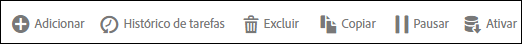

# Painel Feed de dados

É possível executar uma variedade de ações em um feed de dados.

Na interface do Feed de dados, ao marcar a caixa de seleção próxima a um ou mais feeds, as ações disponíveis são exibidas em um grupo de botões acima da lista.

Para editar um feed, clique no nome do feed na lista.
