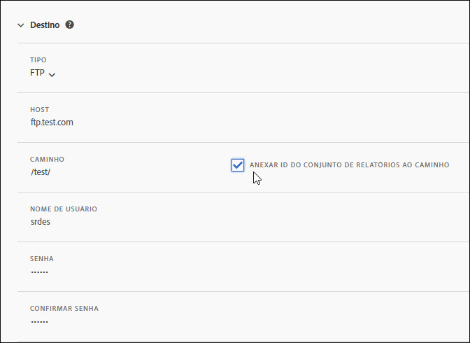
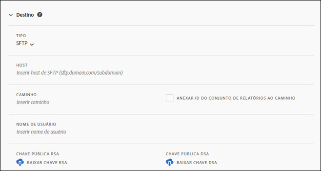
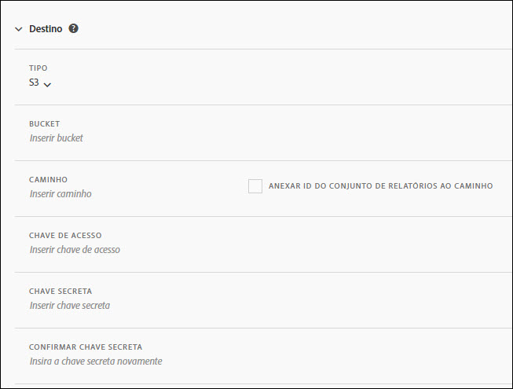
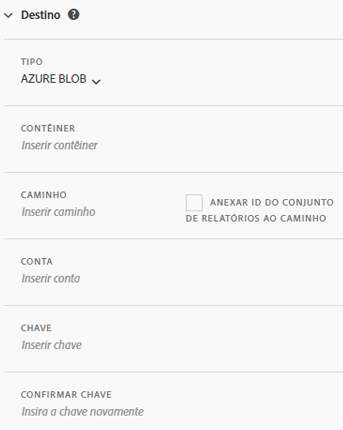

# Destino do feed

A seção de Destino do feed define como o feed é distribuído.

Há quatro canais de distribuição:

* FTP
* SFTP
* Amazon S3
* Azure Blob

## FTP {#section_D2B521C49BDE4F91A1999FE222CF306F}

Os dados do feed de dados podem ser entregues para um local FTP hospedado na Adobe ou no cliente.

Se optar por carregar os dados no servidor FTP, forneça à Adobe o nome de usuário, a senha e o caminho de carregamento apropriados. Você deve implementar seu próprio processo para gerenciar o espaço em disco no servidor, visto que a Adobe não exclui dados do servidor.

## SFTP {#section_8D9215E441474D2BBC56228C2BC926E5}

Os dados do feed de dados podem ser entregues para um local sFTP hospedado pela Adobe ou pelo cliente.

Se optar por carregar os dados no servidor FTP, forneça à Adobe o nome de usuário e o caminho de carregamento apropriados.

<!-- 

Adobe Customer Care will provide you with a Public key. Verify in recording.

 -->

Você deve implementar seu próprio processo para gerenciar o espaço em disco no servidor, visto que a Adobe não exclui dados do servidor.

## Amazon S3 {#section_4191CD7B8D3F419EB850B286B542C14A}

Você pode fazer o upload de seus arquivos para um bucket Amazon S3. A Amazon automaticamente criptografa os dados na parada (nos servidores da Amazon). Os dados são descriptografados automaticamente ao baixá-los.

Se você optar pelo envio por meio da Amazon S3, é necessário fornecer um nome de bucket, uma ID de chave de acesso, uma chave secreta e um nome de pasta.

Agora, os feeds de dados comunicam-se com as 11 regiões AWS a seguir (usando o algoritmo de assinatura apropriado, quando necessário):

* us-east-1
* us-west-1
* us-west-2
* ap-south-1
* ap-northeast-2
* ap-southeast-1
* ap-southeast-2
* ap-northeast-1
* eu-central-1
* eu-west-1
* sa-east-1

No momento, a região AWS de Pequim, China (cn-north-1) não é compatível.

## Azure Blob {#section_1E9F1D0E7EAB4189A5D748FCA57D63D1}

É possível fazer o upload de seus arquivos para um Azure Blob.

## Campos {#section_AD54B41BC7C945DC85F5FB8FCD4A4792}

A tabela a seguir mostra opções para todos os canais de distribuição. A opções disponíveis dependem do canal de distribuição selecionado.

<table id="table_F743C620C82349D9943A13B99EA312BA"> 
 <thead> 
  <tr> 
   <th colname="col1" class="entry"> Campo </th> 
   <th colname="col2" class="entry"> Descrição </th> 
  </tr> 
 </thead>
 <tbody> 
  <tr> 
   <td colname="col1"> 
Chave de acesso 
 </td> 
   <td colname="col2"> 
Insira a chave de acesso do Amazon S3. 
 </td> 
  </tr> 
  <tr> 
   <td colname="col1"> 
Bucket 
 </td> 
   <td colname="col2"> 
Insira a localização do bucket do Amazon S3. 
 
Esse valor deve corresponder ao formato bucket S3 apropriado. (See <a href="https://docs.aws.amazon.com/awscloudtrail/latest/userguide/cloudtrail-s3-bucket-naming-requirements.html" format="html" scope="external"> https://docs.aws.amazon.com/awscloudtrail/latest/userguide/cloudtrail-s3-bucket-naming-requirements.html</a>.) 
 
 
Observação: consulte <a href="../../../export/analytics-data-feed/feed-troubleshooting.md#section_6797EBBB7E6D44D4B00C7AEDF4C2EE1D" format="dita" scope="local">configurações BucketOwnerFullControl para feed de dados Amazon S3</a> abaixo, para detalhes sobre as configurações do Amazon S3. 
 
 </td> 
  </tr> 
  <tr> 
   <td colname="col1"> 
Contêiner 
 </td> 
   <td colname="col2"> 
Insira o nome do contêiner do Azure Blob. 
 </td> 
  </tr> 
  <tr> 
   <td colname="col1"> 
 Host 
 </td> 
   <td colname="col2"> 
Especifique a localização de host FTP ou SFTP. 
 
Esse valor deve cumprir com o devido formato ftp/sftp, <code>ftp.domain.com/subdomain</code> ou <code>sftp.domain.com/subdomain</code>. 
 
 As portas padrão 21 e 22 para FTP e sFTP são necessárias. 
 </td> 
  </tr> 
  <tr> 
   <td colname="col1"> 
Senha 
 
Confirmar senha 
 </td> 
   <td colname="col2"> 
Insira a senha FTP. Insira novamente para confirmação. 
 </td> 
  </tr> 
  <tr> 
   <td colname="col1"> 
Caminho 
 </td> 
   <td colname="col2"> 
Selecione o caminho para o host ou bucket. Esse caminho deve existir antes da criação do feed. 
 
 
Observação: consulte <a href="../../../export/analytics-data-feed/feed-troubleshooting.md#section_6797EBBB7E6D44D4B00C7AEDF4C2EE1D" format="dita" scope="local">configurações BucketOwnerFullControl para feed de dados Amazon S3</a> abaixo, para detalhes sobre as configurações do Amazon S3. 
 
 </td> 
  </tr> 
  <tr> 
   <td colname="col1"> 
Conta 
 </td> 
   <td colname="col2"> 
 Insira a conta de armazenamento do Azure. 
 </td> 
  </tr> 
  <tr> 
   <td colname="col1"> 
Chave pública 
 </td> 
   <td colname="col2"> 
Forneça a chave pública do SFTP. 
 
Você deve baixar a chave pública para configurar o repositório SFTP. 
 
 
Observação: não é necessário baixar a chave pública para criar o feed. 
 
 
Você pode usar uma chave pública já baixada ao criar um feed anterior. 
 
Para obter mais informações, consulte <a href="https://marketing.adobe.com/resources/help/en_US/whitepapers/ftp/ftp_sftp_dw.html" format="html" scope="external">https://marketing.adobe.com/resources/help/pt_BR/whitepapers/ftp/ftp_sftp_dw.html</a>. 
 </td> 
  </tr> 
  <tr> 
   <td colname="col1"> 
Chave 
 
Confirmar chave 
 </td> 
   <td colname="col2"> 
 Insira a sua chave de acesso de armazenamento. Insira novamente para confirmar. 
 
 
Observação: consulte <a href="https://docs.microsoft.com/en-us/azure/storage/common/storage-create-storage-account#view-and-copy-storage-access-keys" format="https" scope="external">https://docs.microsoft.com/pt-br/azure/storage/common/storage-create-storage-account#view-and-copy-storage-access-keys</a> para acessar as chaves de acesso. 
 
 </td> 
  </tr> 
  <tr> 
   <td colname="col1"> 
Chave secreta 
 
Confirme a chave secreta 
 </td> 
   <td colname="col2"> 
Insira a chave secreta do Amazon S3. Insira novamente para confirmação. 
 </td> 
  </tr> 
  <tr> 
   <td colname="col1"> 
Tipo 
 </td> 
   <td colname="col2"> 
Selecione o tipo de destino. 
 
 
     <ul id="ul_B893EEDA73A34DE0AEB8570BE9027F21"> 
      <li id="li_325546FCEB404C50AA6829573CCA340B">FTP (padrão) </li> 
      <li id="li_6A2C03115903484797485D073A610607">AmazonS3 </li> 
      <li id="li_C24540F6FCD24702B7693A515CEBE977">SFTP </li> 
      <li id="li_8E03CA78E7FE427C9F6F8B112BC76266">Azure Blob </li> 
     </ul> 
 
Após selecionar o tipo de destino, a lista de campos é alterada para exibir as opções disponíveis para o destino selecionado. 
 </td> 
  </tr> 
  <tr> 
   <td colname="col1"> 
Nome de usuário 
 </td> 
   <td colname="col2"> 
Insira o nome de usuário FTP. 
 </td> 
  </tr> 
 </tbody> 
</table>

