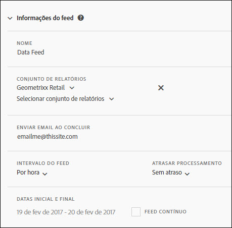

# Informações do feed

Use a seção Informações do feed para nomear o feed, especificar o conjunto de relatórios com o qual o feed será executado, determinar a recorrência do feed e especificar o início e o fim do feed.

<table id="table_C98C7C3CE4194BEF819E792793EBC517">
 <thead>
  <tr>
   <th colname="col1" class="entry"> Campo </th>
   <th colname="col2" class="entry"> Descrição </th>
  </tr>
 </thead>
 <tbody> 
  <tr> 
   <td colname="col1"> 
Nome (obrigatório) 
 </td>
   <td colname="col2"> 
Insira um nome para o feed. 
 
O nome deve ser único dentre o conjunto de relatórios e deve ter, no máximo, 255 caracteres. 
 </td>
  </tr>
  <tr>
   <td colname="col1"> 
Conjunto de relatórios (obrigatório) 
 </td>
   <td colname="col2"> 
Especifique os conjuntos de relatórios para a consulta de feed. 
 
Pelo menos um conjunto de relatórios deve ser selecionado. Não é permitido listar o mesmo conjunto de relatórios duas vezes. 
 
Todos os conjuntos de relatórios não virtuais disponíveis para o usuário conectado estão disponíveis. 
</td>
  </tr>
  <tr>
   <td colname="col1"> 
Enviar email ao concluir (obrigatório) 
 </td>
   <td colname="col2"> 
Especifique o email do destinatário que receberá as atualizações de entrega do feed. 
 
Este campo não pode ser deixado em branco. Deve conter um endereço de email devidamente formatado. 
 </td>
  </tr>
  <tr>
   <td colname="col1"> 
Intervalo de feed (obrigatório) 
 </td>
   <td colname="col2"> 
Especifique a recorrência da programação. 
 
Observação: devido ao tamanho potencial dos arquivos da compactação do feed de dados, verifique se o processo de ETL usa um utilitário de compactação de 64 bits. 
 </td>
  </tr>
  <tr>
   <td colname="col1"> 
Atraso de processamento (opcional) 
 </td>
   <td colname="col2"> 
Especifique o atraso para aplicar a cada instância da programação. 
 </td>
  </tr>
  <tr>
   <td colname="col1"> 
Data inicial e final (obrigatório) 
 
Feed contínuo (opcional) 
 </td>
   <td colname="col2"> 
Programe as datas de início e término do feed. 
 

     <ul id="ul_509977336CD34032924B48E043E8CBC7">
      <li id="li_BFB5B6ADCB184D839C9BA42DB3DCAF32">Data inicial: o padrão é a data de hoje </li>
      <li id="li_34F8DB45D9B54076840D1A0B782812D3">Data de término: o padrão é a data de amanhã </li>
     </ul>
     
 </td>
  </tr>
 </tbody>
</table>