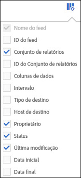

# Classificar colunas

Você pode determinar quais colunas estão disponíveis e classificá-las de acordo com suas necessidades.

1. To determine which columns are visible, click the **[!UICONTROL Columns Configuration]** button.

   

1. Para classificar uma coluna, clique no cabeçalho da coluna.

   Colunas alfabéticas são classificadas em ordem alfabética. Clique no cabeçalho para classificar por ordem alfabética reversa.

   Colunas numéricas são classificadas numericamente. Clique no cabeçalho para alternar a classificação de menor para maior ou maior para menor.
