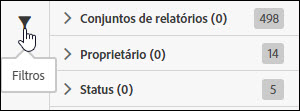
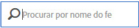

# Pesquisar e filtrar

A pesquisa e a filtragem ajudam você a localizar um feed na lista.

1. Clique ou passe o mouse sobre o ícone Filtrar para visualizar as opções de filtragem.

   

   Há três opções de filtragem disponíveis:

   * Conjunto de relatórios
   * Proprietário
   * Status

1. Insira um termo de busca para pesquisar a lista de feeds.

   

Você pode mesclar filtragem e pesquisa para ajudá-lo a encontrar seus feeds. Filtros mesclados são unidos por um operador AND.
