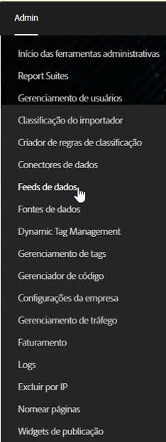
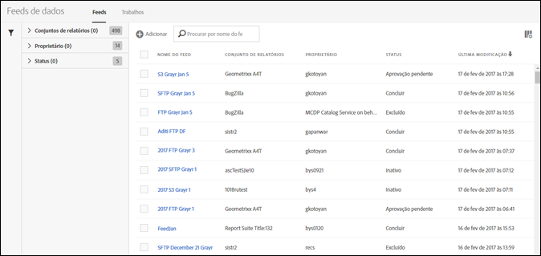

# Abrir a interface do Feed de dados

A interface do usuário do Feed de dados pode ser acessada na guia Administrador.

1. Abra a tab de Admin.
1. Select **[!UICONTROL Data Feeds]**.

   

A página inicial do Feed de dados lista todos os feeds definidos atualmente para a sua empresa, para todos os conjuntos de relatórios acessíveis ao usuário administrador.

Se nenhum feed for configurado, a página exibe um botão **[!UICONTROL Criar novo feed de dados].**

To view your [jobs](../../../export/analytics-data-feed/c-data-feed-actions/t-feed-job-history.md#task_0D05F2D1B41B4E4A95B570DC78014480), click **[!UICONTROL Jobs]**. Para retornar para a exibição do feed, clique em **[!UICONTROL Feeds]**.