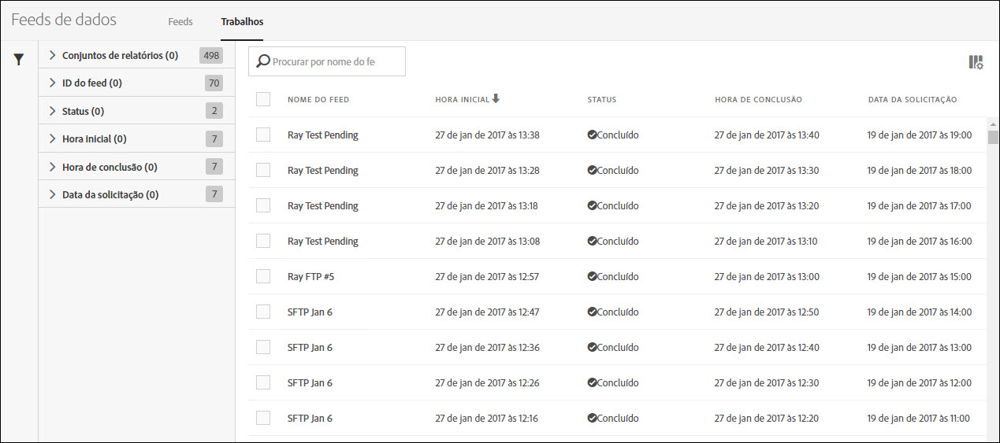
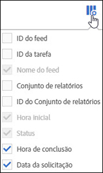

# Tarefas do feed de dados - visão geral

Use a tag Tarefas para visualizar históricos de tarefas e gerenciar tarefas.

A lista de Tarefas fornece informações tais como status da tarefa, quando as tarefas são iniciadas e terminadas, quanto tempo a tarefa demorou para ser executada, entre outros.

Clique no cabeçalho da coluna para alternar a ordem em que as tarefas são exibidas.

Para configurar as informações que você quer exibir na lista de Tarefas, clique no ícone de Configurações e selecione os nomes das colunas desejadas.

Nome do feed, Hora inicial e Status são colunas obrigatórias e não podem ser removidas da lista de Tarefas.

| Coluna | Descrição |
|---|---|
| ID do feed | Identificador único para o feed. |
| ID da tarefa | Identificador único para a tarefa. |
| Nome do feed | Nome do feed. |
| Hora inicial | Nome de início para a tarefa, exibido no seu fuso horário. |
| Tempo de execução | A quantidade de tempo necessária para a tarefa ser executada. Exibido como dd hh:mm:ss. |
| Status | O [status](/help/export/analytics-data-feed/c-df-jobs/r-job-status.md) atual da tarefa. |
| Hora de conclusão | O horário em que a execução da tarefa foi concluída. Exibido no seu fuso horário. |
| Data da solicitação | Carimbo de dados para os dados contidos na tarefa. |

