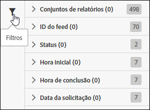

# Filtrar lista de tarefas

Ao pesquisar e filtrar na ajuda você localiza uma tarefa na lista.

1. Clique ou passe o mouse sobre o ícone Filtrar para visualizar as opções de filtragem.

   

   Há várias opções de filtragem disponíveis:

   * Conjunto de relatórios
   * ID do feed
   * Status
   * Hora inicial
   * Hora de conclusão
   * Data da solicitação

1. Insira um termo de busca para pesquisar a lista de tarefas.

   

Você pode mesclar filtragem e pesquisa para ajudá-lo a encontrar suas tarefas. Filtros diversos e termos de pesquisa são unidos com uma operação AND.
