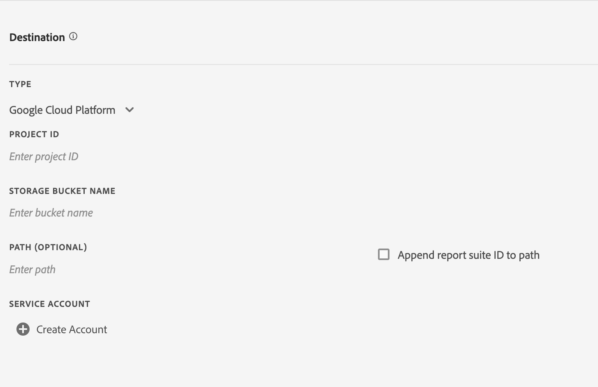
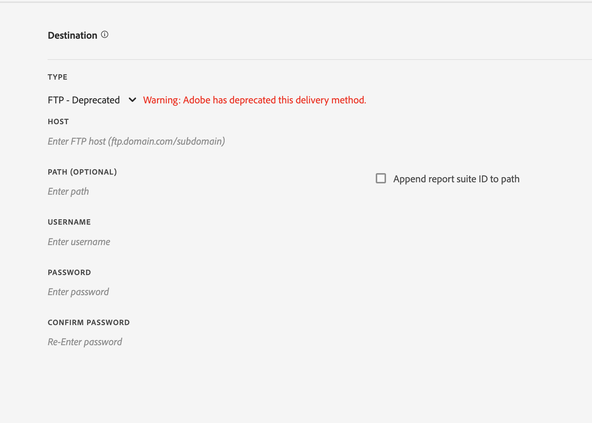

# Criar ou editar um feed de dados

A criação de um feed de dados permite que a Adobe saiba onde enviar arquivos de dados brutos e o que você desejaria incluir em cada arquivo. Esta página lista configurações individuais que você pode personalizar ao criar um feed de dados.

É recomendado o conhecimento básico dos feeds de dados antes da leitura desta página. Consulte [Visão geral dos feeds de dados](data-feed-overview.md) para verificar se você atende aos requisitos para criar um feed de dados.

## Campos de informações do feed

* **Nome**: o nome do feed de dados. Deve ser único dentre o conjunto de relatórios e deve ter, no máximo, 255 caracteres.
* **Conjunto de relatórios**: o conjunto de relatórios no qual o feed de dados se baseia. Se vários feeds de dados forem criados para o mesmo conjunto de relatórios, eles deverão ter definições de colunas diferentes. Somente conjuntos de relatórios de origem são compatíveis com feeds de dados; os conjuntos de relatórios virtuais não são compatíveis.
* **Enviar email ao concluir**: o endereço de email a ser notificado quando um feed terminar o processamento. O endereço de email deve estar formatado corretamente.
* **Intervalo do feed**: os feeds por hora contêm dados de uma hora. Os feeds diários contêm dados de um dia inteiro; eles incluem dados da meia-noite a meia-noite no fuso horário do conjunto de relatórios.
* **Atraso no processamento**: aguarde um algum tempo antes de processar um arquivo de feed de dados. Um atraso pode ser útil para dar às implementações móveis uma oportunidade para que os dispositivos offline fiquem online e enviem dados. Ele também pode ser usado para acomodar os processos do lado do servidor de sua organização ao gerenciar arquivos processados anteriormente. Na maioria dos casos, não é necessário atrasar. Um feed pode ser atrasado em até 120 minutos.
* **Datas de início e término**: a data de início indica a primeira data em que você deseja um feed de dados. Defina essa data no passado para iniciar imediatamente o processamento do feeds de dados para dados históricos. Os feeds continuam a ser processados até atingirem a data de término. As datas de início e término são baseadas no fuso horário do conjunto de relatórios.
* **Alimentação contínua**: essa caixa de seleção remove a data de término, permitindo que um feed seja executado indefinidamente. Quando um feed terminar de processar dados históricos, ele aguarda que os dados terminem de coletar por uma determinada hora ou dia. Quando a hora ou o dia atual terminar, o processamento será iniciado após o atraso especificado.

## Campo de destino

Os campos disponíveis nos campos de destino dependem do tipo de destino.

### Google Cloud Platform

Acessar compartimentos de armazenamento GCP como destino seguro

**Campos**
* *Tipo:* Tipo de destino da Google Cloud Platform
* *ID do projeto:* ID do projeto GCP onde existe o bucket de armazenamento
* *Nome do bucket de armazenamento:* Nomes de bucket sem pontos são limitados a 3-63 caracteres. Os nomes que contêm pontos podem conter até 222 caracteres, mas cada componente separado por pontos não pode ter mais de 63 caracteres.
* *Caminho (Opcional):* &amp; *Anexar a ID do conjunto de relatórios ao caminho:* Localização dos recursos a recuperar ou armazenar



**Processo de criação da conta de serviço**

O usuário precisará criar uma conta de serviço para o destino da Google Cloud Platform .

Somente uma conta de serviço GCP será permitida por organização de análise. Depois que a conta de serviço tiver sido criada para o feed de dados, todos os feeds de dados adicionais dentro da organização serão pré-preenchidos com a conta de serviço.


### Amazon S3

Armazenamento de bucket do Amazon S3 acessado por meio da Função IAM em uma Entidade Confiável.

**Campos**

* *Tipo:* Tipo de destino do Amazon S3
* *Bucket:* Nome do bucket S3
* *Entidade confiável ARN:* ARN de entidade do AWS IAM `arn:aws:iam::<12 digit account number>:user/<username>`
* *Função ARN:* Função do AWS IAM ARN `arn:aws:iam::<12 digit account number>:role/<role name>`
* *Caminho (Opcional):* &amp; *Anexar a ID do conjunto de relatórios ao caminho:* Localização dos recursos a recuperar ou armazenar
* *Especificar Região (Opcional):* Lista suspensa de todas as regiões AWS disponíveis, incluindo as regiões CN


**Criar e selecionar entidade confiável**

O usuário pode selecionar uma entidade confiável de qualquer opção listada na lista suspensa ou criar e recuperar uma nova clicando no botão `Create Entity` botão.

Depois de clicar no `Create Entity` , o usuário será redirecionado para um processo de autenticação. Depois que o usuário é autenticado, a entidade confiável é criada e adicionada às opções na lista suspensa.

A lista suspensa lista todas as entidades confiáveis que foram criadas na organização por esse usuário.


Você pode enviar feeds diretamente para buckets do Amazon S3 por meio do método herdado. Consulte [Requisitos de nomenclatura de bucket do Amazon S3](https://docs.aws.amazon.com/pt_br/awscloudtrail/latest/userguide/cloudtrail-s3-bucket-naming-requirements.html) nos documentos do Amazon S3 para obter mais informações.

**Campos - Obsoleto**

* *Tipo:* Tipo de destino do método S3 obsoleto
* *Bucket:* Nome do bucket do Amazon S3
* *Caminho (Opcional):* &amp; *Anexar a ID do conjunto de relatórios ao caminho:* Localização dos recursos a recuperar ou armazenar
* *Chave de acesso:* ID da chave de acesso do usuário do AWS
* *Chave secreta:* Chave secreta do usuário do AWS
* *Confirmar Chave Secreta:* Insira novamente a chave secreta do usuário do AWS


O usuário fornecido para o upload de feeds de dados deve ter as seguintes [permissões](https://docs.aws.amazon.com/pt_br/AmazonS3/latest/API/API_Operations_Amazon_Simple_Storage_Service.html):

* s3:GetObject
* s3:PutObject
* s3:PutObjectAcl

Para cada upload para um bucket do Amazon S3, o [!DNL Analytics] adiciona o proprietário do bucket à ACL BucketOwnerFullControl, independentemente de o bucket ter ou não uma política que o exija. Para obter mais informações, consulte “[Qual é a configuração BucketOwnerFullControl para feeds de dados do Amazon S3?](df-faq.md#BucketOwnerFullControl)”

**Regiões AWS suportadas**:
* us-east-2
* us-east-1
* us-west-1
* us-west-2
* ap-south-1
* ap-northeast-2
* ap-southeast-1
* ap-southeast-2
* ap-northeast-1
* ca-central-1
* eu-central-1
* eu-west-1
* eu-west-2
* eu-west-3
* eu-north-1
* sa-east-1
* cn-north-1
* cn-northwest-1


### Azure Blob

Destino seguro do Azure Blob usando o Controle de Acesso Baseado em Função (RBAC) ou a Assinatura de Acesso Compartilhado (SAS). Ao escolher o controle de acesso, o conteúdo do painel será atualizado para refletir os campos correspondentes.

**Campos - RBAC**
* *Tipo:* Tipo de destino do Azure Blob
* *Controle de acesso:* Opção para usar RBAC ou SAS
* *ID de Locatário do Ative Diretory:* ID da organização da conta do Azure
* *ID do aplicativo:* ID da Aplicação do Adaptador do Ative Diretory
* *Segredo do cliente:* Segredo do Cliente Azure
* *Nome da conta de armazenamento:* Nome da conta que contém objetos de dados
* *Nome do contêiner:* Contêiner pertencente a uma determinada conta de armazenamento.
* *Caminho (Opcional):* &amp; *Anexar a ID do conjunto de relatórios ao caminho:* Localização dos recursos a recuperar ou armazenar


**Campos - SAS**
* *Tipo:* Tipo de destino do Azure Blob
* *Controle de acesso:* Opção para usar RBAC ou SAS
* *ID de Locatário do Ative Diretory:* ID da instância do Azure Ative Diretory
* *ID do aplicativo:* ID da Aplicação do Adaptador do Ative Diretory
* *Segredo do cliente:* Segredo do Cliente Azure
* *URI do Cofre de Chaves:* Localização do Cofre de Chaves do Azure
* *Nome do Segredo do Cofre de Chaves:* Nome secreto para acessar o Cofre de chaves seguro
* *Caminho (Opcional):* &amp; *Anexar a ID do conjunto de relatórios ao caminho:* Localização dos recursos a recuperar ou armazenar


**Campos - Obsoleto**
* *Tipo:* Tipo de destino do Azure Blob
* *Contêiner:* Nome do contentor do Azure
* *Caminho (Opcional):* &amp; *Anexar a ID do conjunto de relatórios ao caminho:* Localização dos recursos a recuperar ou armazenar
* *Conta:* Segredo da conta do Azure
* *URI do Cofre de Chaves:* Localização do Cofre de Chaves do Azure
* *Nome do Segredo do Cofre de Chaves:* Nome secreto para acessar o Cofre de chaves seguro

Você deve implementar seu próprio processo para gerenciar o espaço em disco no destino do feed. A Adobe não exclui dados do servidor.
Consulte [Criar uma conta de armazenamento](https://docs.microsoft.com/pt-br/azure/storage/common/storage-quickstart-create-account?tabs=azure-portal#view-and-copy-storage-access-keys) nos documentos do Microsoft Azure para obter mais informações.


>[!NOTE]
>
>Você deve implementar seu próprio processo para gerenciar o espaço em disco no destino do feed. A Adobe não exclui dados do servidor.

### FTP - Obsoleto

**Campos**
* *Tipo:* Tipo de destino do FTP
* *Host:* Endpoint para acessar o host
* *Caminho (Opcional):* &amp; *Anexar a ID do conjunto de relatórios ao caminho:* Localização dos recursos a recuperar ou armazenar
* *Nome de usuário:* Nome de usuário para host
* *Senha:* Senha do host
* *Confirmar senha:* Digite novamente e verifique a senha do host



### SFTP - Obsoleto

O suporte SFTP para feeds de dados está disponível. Exige que um host SFTP, nome de usuário e site de destino contenham uma chave pública RSA ou DSA válida. Você pode baixar a chave pública apropriada ao criar o feed.

**Campos**
* *Tipo:* Tipo de destino do SFTP
* *Host:* Endpoint para acessar o host
* *Caminho (Opcional):* &amp; *Anexar a ID do conjunto de relatórios ao caminho:* Localização dos recursos a recuperar ou armazenar
* *Chave pública RSA:* ou *Chave pública DSA:* Chave pública para acessar o host


## Definições da coluna de dados

Todas as colunas, independentemente de terem dados, estão disponíveis. Um feed de dados deve incluir pelo menos uma coluna.

* **Remover caracteres de escape**: ao coletar dados, alguns caracteres (como novas linhas) podem causar problemas. Marque essa caixa se desejar que esses caracteres sejam removidos dos arquivos de feed.
* **Formato de compactação**: o tipo de compactação usado. O Gzip gera arquivos no formato `.tar.gz`. O Zip gera arquivos no formato `.zip`.
* **Tipo de empacotamento**: um único arquivo gera o arquivo `hit_data.tsv` em um único arquivo potencialmente massivo. Vários arquivos paginam seus dados em blocos de 2 GB (descompactados). Se vários arquivos forem selecionados e os dados descompactados para a janela de relatório forem menores que 2 GB, um arquivo será enviado. A Adobe recomenda usar vários arquivos para a maioria dos feeds de dados.
* **Manifesto**: se a Adobe deverá ou não fornecer um [arquivo de manifesto](c-df-contents/datafeeds-contents.md#feed-manifest) ao destino quando nenhum dado for coletado para um intervalo de feed. Se selecionar Arquivo de manifesto, você receberá um arquivo de manifesto semelhante ao seguinte quando nenhum dado for coletado:

```text
   Datafeed-Manifest-Version: 1.0
    Lookup-Files: 0
    Data-Files: 0
    Total-Records: 0
```

* **Modelos de colunas**: ao criar muitos feeds de dados, a Adobe recomenda criar um modelo de coluna. A seleção de um modelo de coluna inclui automaticamente as colunas especificadas no modelo. A Adobe também fornece vários modelos por padrão.
* **Colunas disponíveis**: todas as colunas de dados disponíveis no Adobe Analytics. Clique em [!UICONTROL Adicionar tudo] para incluir todas as colunas em um feed de dados.
* **Colunas incluídas**: as colunas a serem incluídas em um feed de dados. Clique em [!UICONTROL Remover tudo] para remover todas as colunas de um feed de dados.
* **Baixar CSV**: faz o download de um arquivo CSV contendo todas as colunas incluídas.
