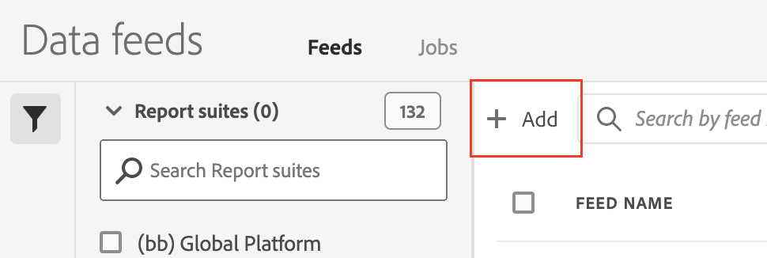
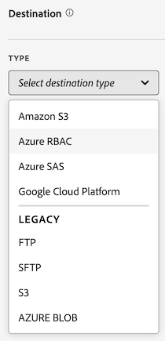

# Criar um feed de dados

Ao criar um feed de dados, você fornece ao Adobe:

* As informações sobre o destino para o qual você deseja que os arquivos de dados brutos sejam enviados

* Os dados que você deseja incluir em cada arquivo

>[!NOTE]
>
>Antes de criar um feed de dados, é importante ter uma compreensão básica dos feeds de dados e e garantir que você atenda a todos os pré-requisitos necessários. Para obter mais informações, consulte [Visão geral dos feeds de dados](data-feed-overview.md).

## Criar e configurar um feed de dados

1. Faça logon em [experiencecloud.adobe.com](https://experiencecloud.adobe.com) usando as credenciais da Adobe ID.
1. Selecione o ícone de 9 quadrados no canto superior direito e selecione [!UICONTROL **Analytics**].
1. Na barra de navegação superior, vá para [!UICONTROL **Admin**] > [!UICONTROL **Feeds de dados**].
1. Selecionar [!UICONTROL **Adicionar**].

   

   Uma página é exibida com três categorias principais: [!UICONTROL **Informações do feed**], [!UICONTROL **Destino**], e [!UICONTROL **Definições da coluna de dados**].
1. No [!UICONTROL **Informações do feed**] preencha os seguintes campos:

   | Campo | Função |
   |---------|----------|
   | [!UICONTROL **Nome**] | O nome do feed de dados. Deve ser único dentre o conjunto de relatórios e deve ter, no máximo, 255 caracteres. |
   | [!UICONTROL **Conjunto de relatórios**] | O conjunto de relatórios no qual o feed de dados se baseia. Se vários feeds de dados forem criados para o mesmo conjunto de relatórios, eles deverão ter definições de colunas diferentes. Somente conjuntos de relatórios de origem são compatíveis com feeds de dados; os conjuntos de relatórios virtuais não são compatíveis. |
   | [!UICONTROL **Enviar email ao concluir**] | O endereço de email a ser notificado quando um feed terminar o processamento. O endereço de email deve estar formatado corretamente. |
   | [!UICONTROL **Intervalo do feed**] | Selecionar **Diariamente** para preenchimento retroativo ou dados históricos. Os feeds diários contêm dados de um dia inteiro, da meia-noite à meia-noite no fuso horário do conjunto de relatórios.  Selecionar **Por hora** para dados contínuos (Daily também está disponível para feeds contínuos, se preferir). Os feeds por hora contêm dados de uma hora. |
   | [!UICONTROL **Atraso no processamento**] | Aguarde um determinado tempo antes de processar um arquivo de feed de dados. Um atraso pode ser útil para dar às implementações móveis uma oportunidade para que os dispositivos offline fiquem online e enviem dados. Ele também pode ser usado para acomodar os processos do lado do servidor de sua organização ao gerenciar arquivos processados anteriormente. Na maioria dos casos, não é necessário atrasar. Um feed pode ser atrasado em até 120 minutos. |
   | [!UICONTROL **Datas de início e término**] | A data de início indica a data em que você deseja que o feed de dados comece. Para iniciar imediatamente o processamento do feeds de dados para dados históricos, defina essa data como qualquer data no passado quando os dados estiverem sendo coletados. As datas de início e término são baseadas no fuso horário do conjunto de relatórios. |
   | [!UICONTROL **Alimentação contínua**] | Essa caixa de seleção remove a data de término, permitindo que um feed seja executado indefinidamente. Quando um feed terminar de processar dados históricos, ele aguarda que os dados terminem de coletar por uma determinada hora ou dia. Quando a hora ou o dia atual terminar, o processamento será iniciado após o atraso especificado. |

1. No [!UICONTROL **Destino**] seção, no campo [!UICONTROL **Tipo**] selecione o destino para onde deseja que os dados sejam enviados.

   >[!NOTE]
   >
   >Considere o seguinte ao configurar um destino de relatório:
   >
   >* Recomendamos o uso de uma conta em nuvem para o destino do seu relatório. [Contas FTP e SFTP herdadas](#legacy-destinations) estão disponíveis, mas não são recomendadas.
   >
   >* As contas em nuvem estão associadas à sua conta de usuário do Adobe Analytics. Outros usuários não podem usar ou exibir contas na nuvem configuradas por você.
   >

   

   Use qualquer um dos seguintes tipos de destino ao criar um feed de dados. Para obter instruções de configuração, expanda o tipo de destino. (Adicional [destinos herdados](#legacy-destinations) também estão disponíveis, mas não são recomendadas.)

   +++Amazon S3

   Você pode enviar feeds diretamente para buckets do Amazon S3. Esse tipo de destino exige somente a conta do Amazon S3 e o local (bucket).

   O Adobe Analytics usa autenticação entre contas para carregar arquivos do Adobe Analytics para o local especificado em sua instância do Amazon S3.

   Para configurar um bucket do Amazon S3 como destino de um feed de dados:

   1. No Admin Console do Adobe Analytics, no [!UICONTROL **Destino**] , selecione [!UICONTROL **Amazon S3**].

      

   1. Selecionar [!UICONTROL **Selecionar local**].

      A página Amazon S3 Export Locations é exibida.

   1. (Condicional) Se você adicionou anteriormente uma conta e um local do Amazon S3:

      1. Selecione a conta na lista suspensa [!UICONTROL **Selecionar conta**] menu suspenso.

      1. Selecione o local na [!UICONTROL **Selecionar local**] menu suspenso.

      1. Selecionar [!UICONTROL **Salvar**] > [!UICONTROL **Salvar**].

         O destino agora está configurado para enviar dados ao local do Amazon S3 especificado.

   1. (Condicional) Se você não tiver adicionado uma conta do Amazon S3 anteriormente:

      1. Selecionar [!UICONTROL **Adicionar conta**] e especifique as seguintes informações:

         | Campo | Função |
         |---------|----------|
         | [!UICONTROL **Nome da conta**] | Um nome para a conta. Pode ser qualquer nome que você escolher. |
         | [!UICONTROL **Descrição da conta**] | Uma descrição para a conta. |
         | [!UICONTROL **Função ARN**] | Você deve fornecer uma Função ARN (Amazon Resource Name) que o Adobe pode usar para obter acesso à conta do Amazon S3. Para fazer isso, crie uma política de permissão IAM para a conta de origem, anexe a política a um usuário e crie uma função para a conta de destino. Para obter informações específicas, consulte [esta documentação do AWS](https://aws.amazon.com/premiumsupport/knowledge-center/cross-account-access-iam/). |
         | [!UICONTROL **ARN do usuário**] | O usuário ARN (Amazon Resource Name) é fornecido pelo Adobe. Você deve anexar este usuário à política criada. |

         {style="table-layout:auto"}

         1. Selecionar [!UICONTROL **Adicionar localização**] e especifique as seguintes informações:

         | Campo | Função |
         |---------|----------|
         | [!UICONTROL **Nome**] | Um nome para a conta. |
         | [!UICONTROL **Descrição**] | Uma descrição para a conta. |
         | [!UICONTROL **Bucket**] | O bucket da conta do Amazon S3 para o qual você deseja que os dados do Adobe Analytics sejam enviados. Certifique-se de que o usuário ARN fornecido pelo Adobe tenha acesso para carregar arquivos nesse bucket. |
         | [!UICONTROL **Prefixo**] | A pasta dentro do bucket onde você deseja colocar os dados. Especifique um nome de pasta e adicione uma barra invertida depois do nome para criar a pasta. Por exemplo, `folder_name/` |

         {style="table-layout:auto"}

      1. Selecionar [!UICONTROL **Criar**] > [!UICONTROL **Salvar**].

         O destino agora está configurado para enviar dados ao local do Amazon S3 especificado.

+++

   +++Azure RBAC

   Você pode enviar feeds diretamente para um container do Azure usando a autenticação RBAC. Este tipo de destino requer uma ID de Aplicativo, uma ID de Locatário e um Segredo.

   Para configurar uma conta do RBAC do Azure como destino para um feed de dados:

   1. Caso ainda não o tenha feito, crie um aplicativo do Azure que o Adobe Analytics possa usar para autenticação e, em seguida, conceda permissões de acesso no controle de acesso (IAM).

      Para obter mais informações, consulte a [Documentação do Microsoft Azure sobre como criar um aplicativo do Azure Ative Diretory](https://learn.microsoft.com/en-us/azure/active-directory/develop/howto-create-service-principal-portal).

   1. No Admin Console do Adobe Analytics, no [!UICONTROL **Destino**] , selecione [!UICONTROL **RBAC do Azure**].

      

   1. Selecionar [!UICONTROL **Selecionar local**].

      A página Locais de exportação do Azure RBAC é exibida.

   1. (Condicional) Se você adicionou anteriormente uma conta e um local do RBAC do Azure:

      1. Selecione a conta na lista suspensa [!UICONTROL **Selecionar conta**] menu suspenso.

      1. Selecione o local na [!UICONTROL **Selecionar local**] menu suspenso.

      1. Selecionar [!UICONTROL **Salvar**] > [!UICONTROL **Salvar**].

         O destino agora está configurado para enviar dados para o local RBAC do Azure especificado.

   1. (Condicional) Se você não tiver adicionado anteriormente uma conta RBAC do Azure:

      1. Selecionar [!UICONTROL **Adicionar conta**] e especifique as seguintes informações:

         | Campo | Função |
         |---------|----------|
         | [!UICONTROL **Nome da conta**] | Um nome para a conta RBAC do Azure. Esse nome é exibido no campo [!UICONTROL **Selecionar conta**] e pode ser qualquer nome que você escolher. |
         | [!UICONTROL **Descrição da conta**] | Uma descrição para a conta RBAC do Azure. Essa descrição é exibida na variável [!UICONTROL **Selecionar conta**] e pode ser qualquer nome que você escolher. |
         | [!UICONTROL **ID do aplicativo**] | Copie essa ID do aplicativo do Azure que você criou. No Microsoft Azure, essas informações estão localizadas no **Visão geral** no aplicativo. Para obter mais informações, consulte [Documentação do Microsoft Azure sobre como registrar um aplicativo na Microsoft identity platform](https://learn.microsoft.com/en-us/azure/active-directory/develop/quickstart-register-app). |
         | [!UICONTROL **ID do locatário**] | Copie essa ID do aplicativo do Azure que você criou. No Microsoft Azure, essas informações estão localizadas no **Visão geral** no aplicativo. Para obter mais informações, consulte [Documentação do Microsoft Azure sobre como registrar um aplicativo na Microsoft identity platform](https://learn.microsoft.com/en-us/azure/active-directory/develop/quickstart-register-app). |
         | [!UICONTROL **Segredo**] | Copie o segredo do aplicativo do Azure que você criou. No Microsoft Azure, essas informações estão localizadas no **Certificados e segredos** no aplicativo. Para obter mais informações, consulte [Documentação do Microsoft Azure sobre como registrar um aplicativo na Microsoft identity platform](https://learn.microsoft.com/en-us/azure/active-directory/develop/quickstart-register-app). |

         {style="table-layout:auto"}

      1. Selecionar [!UICONTROL **Adicionar localização**] e especifique as seguintes informações:

         | Campo | Função |
         |---------|----------|
         | [!UICONTROL **Nome**] | Um nome para o local. Esse nome é exibido no campo [!UICONTROL **Selecionar local**] e pode ser qualquer nome que você escolher. |
         | [!UICONTROL **Descrição**] | Uma descrição para o local. Essa descrição é exibida na variável [!UICONTROL **Selecionar local**] e pode ser qualquer nome que você escolher. |
         | [!UICONTROL **Conta**] | A conta de armazenamento do Azure. |
         | [!UICONTROL **Contêiner**] | O container na conta especificada para onde você deseja que os dados do Adobe Analytics sejam enviados. Conceda permissões para carregar arquivos para o aplicativo do Azure criado anteriormente. |
         | [!UICONTROL **Prefixo**] | A pasta no container onde você deseja colocar os dados. Especifique um nome de pasta e adicione uma barra invertida depois do nome para criar a pasta. Por exemplo, `folder_name/` |

         {style="table-layout:auto"}

      1. Selecionar [!UICONTROL **Criar**] > [!UICONTROL **Salvar**].

         O destino agora está configurado para enviar dados para o local RBAC do Azure especificado.

+++

   +++Azure SAS

   Você pode enviar feeds diretamente para um contêiner do Azure usando a autenticação SAS. Este tipo de destino requer uma ID do aplicativo, ID do locatário, URI do cofre de chaves, nome do segredo do cofre de chaves e segredo.

   Para configurar o Azure SAS como destino para um feed de dados:

   1. Caso ainda não o tenha feito, crie um aplicativo do Azure que o Adobe Analytics possa usar para autenticação.

      Para obter mais informações, consulte a [Documentação do Microsoft Azure sobre como criar um aplicativo do Azure Ative Diretory](https://learn.microsoft.com/en-us/azure/active-directory/develop/howto-create-service-principal-portal).

   1. No Admin Console do Adobe Analytics, no [!UICONTROL **Destino**] , selecione [!UICONTROL **Azure SAS**].

      

   1. Selecionar [!UICONTROL **Selecionar local**].

      A página Locais de exportação de SAS do Azure é exibida.

   1. (Condicional) Se você adicionou anteriormente uma conta e um local SAS do Azure:

      1. Selecione a conta na lista suspensa [!UICONTROL **Selecionar conta**] menu suspenso.

      1. Selecione o local na [!UICONTROL **Selecionar local**] menu suspenso.

      1. Selecionar [!UICONTROL **Salvar**] > [!UICONTROL **Salvar**].

         O destino agora está configurado para enviar dados ao local SAS do Azure especificado.

   1. (Condicional) Se você não tiver adicionado anteriormente uma conta SAS do Azure:

      1. Selecionar [!UICONTROL **Adicionar conta**] e especifique as seguintes informações:

         | Campo | Função |
         |---------|----------|
         | [!UICONTROL **Nome da conta**] | Um nome para a conta SAS do Azure. Esse nome é exibido no campo [!UICONTROL **Selecionar conta**] e pode ser qualquer nome que você escolher. |
         | [!UICONTROL **Descrição da conta**] | Uma descrição para a conta SAS do Azure. Essa descrição é exibida na variável [!UICONTROL **Selecionar conta**] e pode ser qualquer nome que você escolher. |
         | [!UICONTROL **ID do aplicativo**] | Copie essa ID do aplicativo do Azure que você criou. No Microsoft Azure, essas informações estão localizadas no **Visão geral** no aplicativo. Para obter mais informações, consulte [Documentação do Microsoft Azure sobre como registrar um aplicativo na Microsoft identity platform](https://learn.microsoft.com/en-us/azure/active-directory/develop/quickstart-register-app). |
         | [!UICONTROL **ID do locatário**] | Copie essa ID do aplicativo do Azure que você criou. No Microsoft Azure, essas informações estão localizadas no **Visão geral** no aplicativo. Para obter mais informações, consulte [Documentação do Microsoft Azure sobre como registrar um aplicativo na Microsoft identity platform](https://learn.microsoft.com/en-us/azure/active-directory/develop/quickstart-register-app). |
         | [!UICONTROL **URI do cofre de chaves**] | 
O caminho para o token SAS no Cofre de Chaves do Azure.  Para configurar o Azure SAS, você precisa armazenar um token SAS como um segredo usando o Cofre de Chaves do Azure. Para obter informações, consulte a [Documentação do Microsoft Azure sobre como definir e recuperar um segredo do Cofre de Chaves do Azure](https://learn.microsoft.com/en-us/azure/key-vault/secrets/quick-create-portal?source=recommendations).

Depois que o URI do cofre de chaves for criado, adicione uma política de acesso ao Cofre de Chaves para conceder permissão ao aplicativo do Azure que você criou. Para obter informações, consulte a [Documentação do Microsoft Azure sobre como atribuir uma política de acesso do Cofre da Chave](https://learn.microsoft.com/en-us/azure/key-vault/general/assign-access-policy?tabs=azure-portal).
 |
         | [!UICONTROL **Nome secreto do cofre de chaves**] | O nome secreto que você criou ao adicionar o segredo ao Cofre de Chaves do Azure. No Microsoft Azure, essas informações estão localizadas no Cofre de Chaves que você criou, na **Cofre da Chave** páginas de configurações. Para obter informações, consulte a [Documentação do Microsoft Azure sobre como definir e recuperar um segredo do Cofre de Chaves do Azure](https://learn.microsoft.com/en-us/azure/key-vault/secrets/quick-create-portal?source=recommendations). |
         | [!UICONTROL **Segredo**] | Copie o segredo do aplicativo do Azure que você criou. No Microsoft Azure, essas informações estão localizadas no **Certificados e segredos** no aplicativo. Para obter mais informações, consulte [Documentação do Microsoft Azure sobre como registrar um aplicativo na Microsoft identity platform](https://learn.microsoft.com/en-us/azure/active-directory/develop/quickstart-register-app). |

         {style="table-layout:auto"}

      1. Selecionar [!UICONTROL **Adicionar localização**] e especifique as seguintes informações:

         | Campo | Função |
         |---------|----------|
         | [!UICONTROL **Nome**] | Um nome para o local. Esse nome é exibido no campo [!UICONTROL **Selecionar local**] e pode ser qualquer nome que você escolher. |
         | [!UICONTROL **Descrição**] | Uma descrição para o local. Essa descrição é exibida na variável [!UICONTROL **Selecionar local**] e pode ser qualquer nome que você escolher. |
         | [!UICONTROL **Contêiner**] | O container na conta especificada para onde você deseja que os dados do Adobe Analytics sejam enviados. |
         | [!UICONTROL **Prefixo**] | A pasta no container onde você deseja colocar os dados. Especifique um nome de pasta e adicione uma barra invertida depois do nome para criar a pasta. Por exemplo, `folder_name/` |

         {style="table-layout:auto"}

      1. Selecionar [!UICONTROL **Criar**] > [!UICONTROL **Salvar**].

         O destino agora está configurado para enviar dados ao local SAS do Azure especificado.

+++

   +++Google Cloud Platform

   Você pode enviar feeds diretamente para buckets da Google Cloud Platform (GCP). Esse tipo de destino exige apenas o nome da sua conta GCP e o nome do local (bucket).

   O Adobe Analytics usa autenticação entre contas para carregar arquivos do Adobe Analytics para o local especificado em sua instância GCP.

   Para configurar um bucket de GCP como destino de um feed de dados:

   1. No Admin Console do Adobe Analytics, no [!UICONTROL **Destino**] , selecione [!UICONTROL **Google Cloud Platform**].

      

   1. Selecionar [!UICONTROL **Selecionar local**].

      A página Locais de exportação de GCP é exibida.

   1. (Condicional) Se você adicionou anteriormente uma conta e um local GCP:

      1. Selecione a conta na lista suspensa [!UICONTROL **Selecionar conta**] menu suspenso.

      1. Selecione o local na [!UICONTROL **Selecionar local**] menu suspenso.

      1. Selecionar [!UICONTROL **Salvar**] > [!UICONTROL **Salvar**].

         O destino agora está configurado para enviar dados ao local GCP especificado.

   1. (Condicional) Se você não tiver adicionado anteriormente uma conta GCP:

      1. Selecionar [!UICONTROL **Adicionar conta**] e especifique as seguintes informações:

         | Campo | Função |
         |---------|----------|
         | [!UICONTROL **Nome da conta**] | Um nome para a conta. Pode ser qualquer nome que você escolher. |
         | [!UICONTROL **Descrição da conta**] | Uma descrição para a conta. |
         | [!UICONTROL **ID do projeto**] | Sua ID de projeto da Google Cloud. Consulte a [Documentação da Google Cloud sobre como obter uma ID de projeto](https://cloud.google.com/resource-manager/docs/creating-managing-projects#identifying_projects). |

         {style="table-layout:auto"}

         1. Selecionar [!UICONTROL **Adicionar localização**] e especifique as seguintes informações:

         | Campo | Função |
         |---------|----------|
         | [!UICONTROL **Principal**] | O Principal é fornecido pelo Adobe. Você deve conceder permissão para receber feeds para este principal. |
         | [!UICONTROL **Nome**] | Um nome para a conta. |
         | [!UICONTROL **Descrição**] | Uma descrição para a conta. |
         | [!UICONTROL **Bucket**] | O bucket da conta GCP para o qual você deseja que os dados do Adobe Analytics sejam enviados. Verifique se você concedeu permissão ao Principal fornecido pelo Adobe para fazer upload de arquivos para esse bucket. |
         | [!UICONTROL **Prefixo**] | A pasta dentro do bucket onde você deseja colocar os dados. Especifique um nome de pasta e adicione uma barra invertida depois do nome para criar a pasta. Por exemplo, `folder_name/` |

         {style="table-layout:auto"}

      1. Selecionar [!UICONTROL **Criar**] > [!UICONTROL **Salvar**].

         O destino agora está configurado para enviar dados ao local GCP especificado.

+++

1. No  [!UICONTROL **Definições da Coluna de Dados**] selecione o mais recente [!UICONTROL **Todos os Adobe Columns**] modelo na lista suspensa e preencha os seguintes campos:

   | Campo | Função |
   |---------|----------|
   | [!UICONTROL **Remover caracteres de escape**] | Ao coletar dados, alguns caracteres (como novas linhas) podem causar problemas. Marque essa caixa se desejar que esses caracteres sejam removidos dos arquivos de feed. |
   | [!UICONTROL **Formato de compactação**] | O tipo de compactação usado. **** O Gzip gera arquivos no formato `.tar.gz`. **** O Zip gera arquivos no formato `.zip`. |
   | [!UICONTROL **Tipo de embalagem**] | Selecionar **Vários arquivos** para a maioria dos feeds de dados. Essa opção faz a paginação dos dados em blocos descompactados de 2 GB. (Se vários arquivos forem selecionados e os dados descompactados para a janela de relatório forem menores que 2 GB, um arquivo será enviado.) Selecionar **Arquivo único** gera o `hit_data.tsv` em um único arquivo potencialmente massivo. |
   | [!UICONTROL **Manifesto**] | Se o Adobe deve ou não fornecer um [arquivo manifest](c-df-contents/datafeeds-contents.md#feed-manifest) ao destino quando nenhum dado for coletado para um intervalo de feed. Se você selecionar **Arquivo de manifesto**, você receberá um arquivo de manifesto semelhante ao seguinte quando nenhum dado for coletado:
`text`

`Datafeed-Manifest-Version: 1.0`

`Lookup-Files: 0`

`Data-Files: 0`

 `Total-Records: 0`
 |
   | [!UICONTROL **Modelos de coluna**] | Ao criar muitos feeds de dados, o Adobe recomenda criar um modelo de coluna. A seleção de um modelo de coluna inclui automaticamente as colunas especificadas no modelo. A Adobe também fornece vários modelos por padrão. |
   | [!UICONTROL **Colunas disponíveis**] | Todas as colunas de dados disponíveis no Adobe Analytics. Clique em [!UICONTROL Adicionar tudo] para incluir todas as colunas em um feed de dados. |
   | [!UICONTROL **Colunas incluídas**] | As colunas a serem incluídas em um feed de dados. Clique em [!UICONTROL Remover tudo] para remover todas as colunas de um feed de dados. |
   | [!UICONTROL **Download em CSV**] | Baixa um arquivo CSV contendo todas as colunas incluídas. |

1. Selecionar [!UICONTROL **Salvar**] no canto superior direito.

   O processamento de dados históricos começa imediatamente. Quando os dados terminam o processamento de um dia, o arquivo é enviado para o destino que você configurou.

   Para obter informações sobre como acessar o feed de dados e compreender melhor seu conteúdo, consulte [Conteúdos do feed de dados - visão geral](/help/export/analytics-data-feed/c-df-contents/datafeeds-contents.md).

## Destinos herdados

>[!IMPORTANT]
>
>Os destinos descritos nesta seção são herdados e não são recomendados. Em vez disso, use um dos seguintes destinos ao criar um feed de dados: Amazon S3, Google Cloud Platform, Azure RBAC ou Azure SAS. Consulte [Criar e configurar um feed de dados](#create-and-configure-a-data-feed) para obter informações detalhadas sobre cada um desses destinos recomendados.

As informações a seguir fornecem informações de configuração para cada um dos destinos herdados:

### FTP

Os dados do feed de dados podem ser entregues a um Adobe ou local FTP hospedado pelo cliente. Requer um host FTP, nome de usuário e senha. Use o campo de caminho para colocar arquivos de feed em uma pasta. As pastas já devem existir; os feeds exibem um erro se o caminho especificado não existir.

Use as seguintes informações ao preencher os campos disponíveis:

* [!UICONTROL **Host**]: digite o URL de destino FTP desejado. Por exemplo, `ftp://ftp.omniture.com`.
* [!UICONTROL **Caminho**]: pode ser deixado em branco
* [!UICONTROL **Nome de usuário**]: digite o nome de usuário para fazer logon no site FTP.
* [!UICONTROL **Senha e confirmação da senha**]: digite a senha para fazer logon no site FTP.

### SFTP

O suporte SFTP para feeds de dados está disponível. Exige que um host SFTP, nome de usuário e site de destino contenham uma chave pública RSA ou DSA válida. Você pode baixar a chave pública apropriada ao criar o feed.

### S3

Você pode enviar feeds diretamente para buckets do Amazon S3. Este tipo de destino requer um nome de bucket, uma ID de chave de acesso e uma chave secreta. Consulte [Requisitos de nomenclatura de bucket do Amazon S3](https://docs.aws.amazon.com/pt_br/awscloudtrail/latest/userguide/cloudtrail-s3-bucket-naming-requirements.html) nos documentos do Amazon S3 para obter mais informações.

O usuário fornecido para o upload de feeds de dados deve ter as seguintes [permissões](https://docs.aws.amazon.com/pt_br/AmazonS3/latest/API/API_Operations_Amazon_Simple_Storage_Service.html):

* s3:GetObject
* s3:PutObject
* s3:PutObjectAcl

  >[!NOTE]
  >
  >Para cada upload para um bucket do Amazon S3, o [!DNL Analytics] adiciona o proprietário do bucket à ACL BucketOwnerFullControl, independentemente de o bucket ter ou não uma política que o exija. Para obter mais informações, consulte &quot;[Qual é a configuração BucketOwnerFullControl para feeds de dados do Amazon S3?](df-faq.md#BucketOwnerFullControl)&quot;

As 16 regiões AWS padrão a seguir são compatíveis (usando o algoritmo de assinatura apropriado, quando necessário):

* us-east-2
* us-east-1
* us-west-1
* us-west-2
* ap-south-1
* ap-northeast-2
* ap-southeast-1
* ap-southeast-2
* ap-northeast-1
* ca-central-1
* eu-central-1
* eu-west-1
* eu-west-2
* eu-west-3
* eu-north-1
* sa-east-1

>[!NOTE]
>
>A região cn-north-1 não é compatível.

### Azure Blob

Os feeds de dados são compatíveis com destinos do Azure Blob. Requer um contêiner, uma conta e uma chave. A Amazon criptografa automaticamente os dados em repouso. Os dados são descriptografados automaticamente ao baixá-los. Consulte [Criar uma conta de armazenamento](https://docs.microsoft.com/pt-br/azure/storage/common/storage-quickstart-create-account?tabs=azure-portal#view-and-copy-storage-access-keys) nos documentos do Microsoft Azure para obter mais informações.

>[!NOTE]
>
>Você deve implementar seu próprio processo para gerenciar o espaço em disco no destino do feed. A Adobe não exclui dados do servidor.
