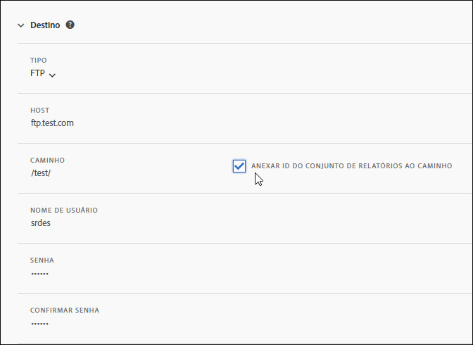
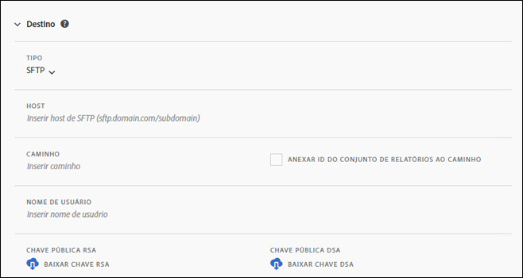
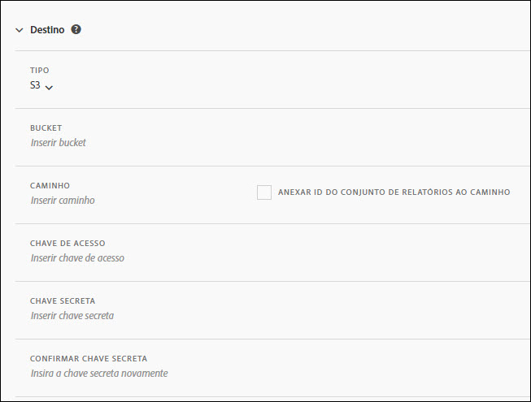
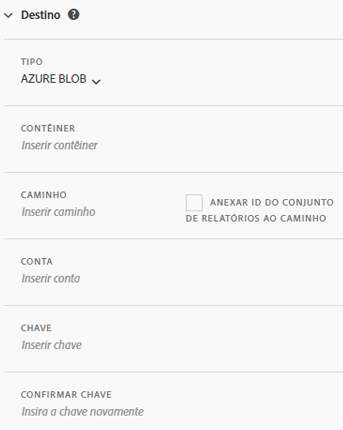

# Criar ou editar um feed de dados

A criação de um feed de dados permite que a Adobe saiba onde enviar arquivos de dados brutos e o que você desejaria incluir em cada arquivo. Esta página lista configurações individuais que você pode personalizar ao criar um feed de dados.

É recomendado o conhecimento básico dos feeds de dados antes da leitura desta página. Consulte [Visão geral dos feeds de dados](data-feed-overview.md) para verificar se você atende aos requisitos para criar um feed de dados.

## Campos de informações do feed

* **Nome**: o nome do feed de dados. Deve ser único dentre o conjunto de relatórios e deve ter, no máximo, 255 caracteres.
* **Conjunto de relatórios**: o conjunto de relatórios no qual o feed de dados se baseia. Se vários feeds de dados forem criados para o mesmo conjunto de relatórios, eles deverão ter definições de colunas diferentes. Somente conjuntos de relatórios de origem são compatíveis com feeds de dados; os conjuntos de relatórios virtuais não são compatíveis.
* **Enviar email ao concluir**: o endereço de email a ser notificado quando um feed terminar o processamento. O endereço de email deve estar formatado corretamente.
* **Intervalo do feed**: os feeds por hora contêm dados de uma hora. Os feeds diários contêm dados de um dia inteiro.
* **Atraso no processamento**: aguarde um algum tempo antes de processar um arquivo de feed de dados. Um atraso pode ser útil para dar às implementações móveis uma oportunidade para que os dispositivos offline fiquem online e enviem dados. Ele também pode ser usado para acomodar os processos do lado do servidor de sua organização ao gerenciar arquivos processados anteriormente. Na maioria dos casos, não é necessário atrasar. Um feed pode ser atrasado em até 120 minutos.
* **Datas de início e término**: a data de início indica a primeira data em que você deseja um feed de dados. Defina essa data no passado para iniciar imediatamente o processamento do feeds de dados para dados históricos. Os feeds continuam a ser processados até atingirem a data de término.
* **Alimentação contínua**: essa caixa de seleção remove a data de término, permitindo que um feed seja executado indefinidamente. Quando um feed terminar de processar dados históricos, ele aguarda que os dados terminem de coletar por uma determinada hora ou dia. Quando a hora ou o dia atual terminar, o processamento será iniciado após o atraso especificado.

## Campos de destino

Os campos disponíveis nos campos de destino dependem do tipo de destino.

### FTP

Os dados do feed de dados podem ser entregues para um local FTP hospedado na Adobe ou no cliente. Requer um host FTP, nome de usuário e senha. Use o campo de caminho para colocar arquivos de feed em uma pasta. As pastas já devem existir; os feeds exibem um erro se o caminho especificado não existir.

### SFTP

O suporte SFTP para feeds de dados está disponível. Exige que um host SFTP, nome de usuário e site de destino contenham uma chave pública RSA ou DSA válida. Você pode baixar a chave pública apropriada ao criar o feed.

### S3

Você pode enviar feeds diretamente para buckets do Amazon S3. Requer um nome de bucket, uma ID de chave de acesso e uma chave secreta. Consulte [Requisitos de nomenclatura de bucket do Amazon S3](https://docs.aws.amazon.com/awscloudtrail/latest/userguide/cloudtrail-s3-bucket-naming-requirements.html) nos documentos do Amazon S3 para obter mais informações.

As 11 regiões AWS padrão a seguir são compatíveis (usando o algoritmo de assinatura apropriado, quando necessário):

* us-east-1
* us-west-1
* us-west-2
* ap-south-1
* ap-northeast-2
* ap-southeast-1
* ap-southeast-2
* ap-northeast-1
* eu-central-1
* eu-west-1
* sa-east-1

>[!NOTE] A região cn-north-1 não é compatível.

### Azure Blob

Os feeds de dados são compatíveis com destinos do Azure Blob. Requer um contêiner, uma conta e uma chave. A Amazon criptografa automaticamente os dados em repouso. Os dados são descriptografados automaticamente ao baixá-los. Consulte [Criar uma conta de armazenamento](https://docs.microsoft.com/pt-br/azure/storage/common/storage-quickstart-create-account?tabs=azure-portal#view-and-copy-storage-access-keys) nos documentos do Microsoft Azure para obter mais informações.

>[!NOTE] Você deve implementar seu próprio processo para gerenciar o espaço em disco no destino do feed. A Adobe não exclui dados do servidor.

## Definições da coluna de dados

Todas as colunas, independentemente de terem dados, estão disponíveis. Um feed de dados deve incluir pelo menos uma coluna.

* **Remover caracteres de escape**: ao coletar dados, alguns caracteres (como novas linhas) podem causar problemas. Marque essa caixa se desejar que esses caracteres sejam removidos dos arquivos de feed.
* **Formato de compactação**: o tipo de compactação usado. O Gzip gera arquivos no formato `.tar.gz`. O Zip gera arquivos no formato `.zip`.
* **Tipo de empacotamento**: um único arquivo gera o arquivo `hit_data.tsv` em um único arquivo potencialmente massivo. Vários arquivos paginam seus dados em blocos de 2 GB (descompactados). Se vários arquivos forem selecionados e os dados descompactados para a janela de relatório forem menores que 2 GB, um arquivo será enviado. A Adobe recomenda usar vários arquivos para a maioria dos feeds de dados.
* **Modelos de colunas**: ao criar muitos feeds de dados, a Adobe recomenda criar um modelo de coluna. A seleção de um modelo de coluna inclui automaticamente as colunas especificadas no modelo. A Adobe também fornece vários modelos por padrão.
* **Colunas disponíveis**: todas as colunas de dados disponíveis no Adobe Analytics. Click [!UICONTROL Add all] to include all columns in a data feed.
* **Colunas incluídas**: as colunas a serem incluídas em um feed de dados. Click [!UICONTROL Remove all] to remove all columns from a data feed.
* **Baixar CSV**: faz o download de um arquivo CSV contendo todas as colunas incluídas.
