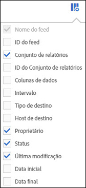

# Gerenciar feeds de dados

O gerenciador de feed de dados permite criar, editar e excluir feeds de dados para sua organização. Se você tiver permissões para acessar o gerenciador de feed de dados, poderá gerenciar feeds de dados para todos os conjuntos de relatórios visíveis a você.

+++Assista a um vídeo sobre gerenciamento de feed de dados.

>[!VIDEO](https://video.tv.adobe.com/v/25452/?quality=12)

+++

## Exibir feeds de dados

1. Faça logon em [experiencecloud.adobe.com](https://experiencecloud.adobe.com) usando as credenciais da Adobe ID.
1. Selecione o ícone de 9 quadrados no canto superior direito e selecione [!UICONTROL **Analytics**].
1. Na barra de navegação superior, vá para [!UICONTROL **Admin**] > [!UICONTROL **Feeds de dados**].

   Os feeds de dados de todos os conjuntos de relatórios aos quais você tem acesso são exibidos. Ou, se nenhum feed for configurado, a página exibirá um botão [!UICONTROL Criar novo feed de dados].

   

## Criar um feed de dados

O botão [!UICONTROL Adicionar] permite criar um novo feed. Consulte [Criar um feed de dados](create-feed.md) para obter mais informações.

## Editar um feed de dados

1. No Adobe Analytics, selecione [!UICONTROL **Administrador**] > [!UICONTROL **Feeds de dados**].

1. Localize o feed de dados que deseja editar. Para localizar um feed de dados, você pode [filtrar e pesquisar a lista de feeds de dados](#filter-and-search-the-list-of-data-feeds).

1. Selecione o feed de dados na coluna [!UICONTROL **Nome do feed**].

1. Faça as alterações desejadas no feed de dados.

   Ao atualizar a seção [!UICONTROL **Destino**] de um feed de dados que você está editando, você pode escolher uma conta e um local diferentes para usar no novo feed de dados nos campos suspensos [!UICONTROL **Conta**] e [!UICONTROL **Local**].

   Se quiser editar a conta e o local de todos os feeds de dados em que estão sendo usados, edite as contas e os locais diretamente, conforme descrito em [Configurar contas de importação e exportação na nuvem](/help/components/locations/configure-import-accounts.md) e [Configurar locais de importação e exportação na nuvem](/help/components/locations/configure-import-locations.md). Contas e locais que não são de nuvem não podem ser editados.

1. Selecione [!UICONTROL **Salvar**].

## Filtrar e pesquisar a lista de feeds de dados

1. No Adobe Analytics, selecione [!UICONTROL **Administrador**] > [!UICONTROL **Feeds de dados**].

1. Use a pesquisa ou os filtros para localizar um feed específico.

   * No campo de pesquisa, comece digitando o nome de um feed. Somente os feeds correspondentes são mostrados na lista de feeds disponíveis.

   * Na extremidade esquerda, clique no ícone de filtro para mostrar ou ocultar as opções de filtragem. Os filtros são organizados por categoria. É possível recolher ou expandir categorias de filtragem. Marque a caixa de seleção ao lado de qualquer filtro que deseja aplicar.

## Exibir trabalhos do feed de dados

1. No Adobe Analytics, selecione [!UICONTROL **Administrador**] > [!UICONTROL **Feeds de dados**].

1. Selecione a guia [!UICONTROL **Trabalhos**] para exibir trabalhos individuais criados por cada um dos feeds.

   Ou

   Para exibir trabalhos para feeds de dados específicos, marque a caixa de seleção ao lado de um ou mais feeds de dados e selecione [!UICONTROL **Histórico de trabalhos**].

   Para obter mais informações, consulte [Gerenciar trabalhos do feed de dados](df-manage-jobs.md).

## Copiar um feed de dados

1. No Adobe Analytics, selecione [!UICONTROL **Administrador**] > [!UICONTROL **Feeds de dados**].

1. Marque a caixa de seleção ao lado do feed de dados que você deseja copiar e selecione [!UICONTROL **Copiar**].

   Direciona para [criar um novo feed](create-feed.md) com todas as configurações do feed atual. Essa opção não estará visível se mais de um feed de dados for selecionado.

   Ao atualizar a seção [!UICONTROL **Destino**] de um feed de dados que você está copiando, você pode escolher uma conta e um local diferentes para usar no novo feed de dados nos campos suspensos [!UICONTROL **Conta**] e [!UICONTROL **Local**].

   Se quiser editar a conta e o local de todos os feeds de dados em que estão sendo usados, edite as contas e os locais diretamente, conforme descrito em [Configurar contas de importação e exportação na nuvem](/help/components/locations/configure-import-accounts.md) e [Configurar locais de importação e exportação na nuvem](/help/components/locations/configure-import-locations.md). Contas e locais que não são de nuvem não podem ser editados.

## Pausar um feed de dados

Você pode parar o processamento do feed, definindo seu status como [!UICONTROL Inativo].

1. No Adobe Analytics, selecione [!UICONTROL **Administrador**] > [!UICONTROL **Feeds de dados**].

1. Marque a caixa de seleção ao lado do feed de dados que você deseja pausar e selecione [!UICONTROL **Pausar**].

## Ativar um feed de dados

Você pode ativar feeds que estão inativos.

Os feeds de preenchimento retroativo (feeds que processam apenas dados históricos) retomam o processamento de dados de onde pararam, preenchendo retroativamente qualquer data, se necessário. Os feeds em tempo real também reiniciam o processamento dos dados de onde pararam.

>[!AVAILABILITY]
>
>A seguinte alteração na forma como os feeds em tempo real retomam o processamento de dados está na fase de Teste limitado da versão:
> 
>**Os feeds ao vivo retomam o processamento dos dados a partir da hora atual.**
>
>Essa alteração pode não estar disponível ainda em seu ambiente.
>
>Essa nota será removida quando essa alteração estiver disponível. Para obter informações sobre o processo de lançamento do Analytics, consulte [Versões de recursos do Adobe Analytics](/help/release-notes/releases.md).

Para ativar um feed de dados:

1. No Adobe Analytics, selecione [!UICONTROL **Administrador**] > [!UICONTROL **Feeds de dados**].

1. Marque a caixa de seleção ao lado do feed de dados inativo que você deseja ativar e selecione [!UICONTROL **Ativar**].

## Excluir um feed de dados

Quando você exclui um feed de dados, seu status é definido como [!UICONTROL Excluído].

1. No Adobe Analytics, selecione [!UICONTROL **Administrador**] > [!UICONTROL **Feeds de dados**].

1. Marque a caixa de seleção ao lado do feed de dados que você deseja excluir e selecione [!UICONTROL **Excluir**].

## Configurar colunas no gerenciador de feed de dados

Cada feed criado mostra várias colunas fornecendo informações sobre ele. Selecione um cabeçalho de coluna para classificá-lo em ordem crescente. Selecione um cabeçalho de coluna novamente para classificá-lo em ordem decrescente. Se não conseguir ver uma coluna específica, clique no ícone de coluna no canto superior direito.

As seguintes colunas estão disponíveis:

* **Nome do feed**: coluna obrigatória. Exibe o nome do feed.
* **ID do feed**: exibe a ID do feed, um identificador exclusivo.
* **Conjunto de relatórios**: o conjunto de relatórios do qual o feed faz referência aos dados.
* **ID do conjunto de relatórios**: o identificador exclusivo do conjunto de relatórios.
* **Colunas de dados**: quais colunas de dados estão ativas para o feed. Na maioria dos casos, há colunas demais para exibir nesse formato.
* **Intervalo**: indica se o feed é por hora ou por dia.
* **Tipo de destino**: o tipo de destino do feed. Por exemplo, Amazon S3, GCP ou Azure.
* **Host de Destino**: o local onde o arquivo é colocado.
* **Proprietário**: a conta do usuário que criou o feed.
* **Status**: o status do feed.
   * Ativo: o feed é operacional.
   * Aprovação pendente: em algumas circunstâncias, um feed requer a aprovação da Adobe antes de começar a gerar trabalhos.
   * Excluído: o feed é excluído.
   * Concluído: o feed terminou de ser processado. Um feed concluído pode ser editado, suspenso ou cancelado.
   * Pendente: o feed é criado, mas ainda não está ativo. Os feeds permanecem nesse estado por um curto período de transição.
   * Inativo: equivalente a um estado &quot;pausado&quot; ou &quot;em espera&quot;. Para obter informações sobre o que acontece com feeds de preenchimento retroativo e feeds em tempo real quando um feed inativo é reativado, consulte [Ativar um feed de dados](#activate-a-data-feed).
* **Última modificação**: a data em que o feed foi modificado pela última vez. A data e a hora são mostradas no fuso horário do conjunto de relatórios com deslocamento GMT.
* **Data de início**: a data do primeiro trabalho para este feed. A data e a hora são mostradas no fuso horário do conjunto de relatórios com deslocamento GMT.
* **Data final**: a data do último trabalho para este feed. Os feeds de dados em andamento não têm uma data de término.

