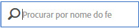

# Gerenciar feeds de dados

O gerenciador de feed de dados permite criar, editar e excluir feeds de dados para sua organização. Se você tiver permissões para acessar o gerenciador de feed de dados, poderá gerenciar feeds de dados para todos os conjuntos de relatórios visíveis a você.

Acesse o gerenciamento do feed de dados seguindo estas etapas:

1. Faça logon em [experiencecloud.adobe.com](https://experiencecloud.adobe.com).
2. Clique no menu de 9 linhas na parte superior direita e em [!UICONTROL Analytics].
3. No menu superior, clique em [!UICONTROL Administração] &gt; [!UICONTROL Feeds de dados].

## Navegação na interface

Ao chegar à página do gerenciador do feed de dados, a interface é semelhante ao seguinte:

Se nenhum feed for configurado, a página exibe um botão [!UICONTROL Criar novo feed de dados].

### Filtros e pesquisa

Use filtros e a pesquisa a para localizar o feed exato que você está procurando.

Na extremidade esquerda, clique no ícone de filtro para mostrar ou ocultar as opções de filtragem. Os filtros são organizados por categoria. Clique na divisa para recolher ou expandir as categorias de filtragem. Clique na caixa de seleção para aplicar esse filtro.

Use a pesquisa para localizar um feed por nome.

### Feeds e trabalhos

Clique na guia Trabalhos para ver os trabalhos individuais criados por cada um dos feeds. Consulte [Gerenciar trabalhos de feed de dados](df-manage-jobs.md).

### Adicionar

Próximo às guias de feeds e trabalhos, clique no botão + [!UICONTROL Adicionar] para criar um novo feed. Consulte [Adicionar um feed](create-feed.md) para obter mais informações.

### Colunas

Cada feed criado mostra várias colunas fornecendo informações sobre ele. Clique em um cabeçalho de coluna para classificá-lo em ordem crescente. Clique novamente em um cabeçalho de coluna para classificá-lo em ordem decrescente. Se não conseguir ver uma coluna específica, clique no ícone de coluna na parte superior direita.

* **Nome do feed**: coluna obrigatória. Exibe o nome do feed.
* **ID do feed**: exibe a ID do feed, um identificador exclusivo.
* **Conjunto de relatórios**: o conjunto de relatórios do qual o feed faz referência aos dados.
* **ID do conjunto de relatórios**: o identificador exclusivo do conjunto de relatórios.
* **Colunas de dados**: quais colunas de dados estão ativas para o feed. Na maioria dos casos, há colunas demais para exibir nesse formato.
* **Intervalo**: indica se o feed é por hora ou por dia.
* **Tipo de destino**: o tipo de destino do feed. Por exemplo, FTP, Amazon S3 ou Azure.
* **Host de destino**: o local onde o arquivo é colocado. Por exemplo, `ftp.example.com`.
* **Proprietário**: a conta do usuário que criou o feed.
* **Status**: o status do feed.
   * Ativo: o feed é operacional.
   * Aprovação pendente: em algumas circunstâncias, um feed requer a aprovação da Adobe antes de começar a gerar trabalhos.
   * Excluído: o feed é excluído.
   * Concluído: o feed terminou de ser processado. Um feed concluído pode ser editado, suspenso ou cancelado.
   * Pendente: o feed é criado, mas ainda não está ativo. Os feeds permanecem nesse estado por um curto período de transição.
   * Inativo: equivalente a um estado "pausado" ou "em espera". Quando o feed é reativado, ele reinicia a entrega de trabalhos a partir de onde parou.
* **Última modificação**: a data em que o feed foi modificado pela última vez. A data e a hora são mostradas no fuso horário do conjunto de relatórios com deslocamento GMT.
* **Data de início**: a data do primeiro trabalho para este feed. A data e a hora são mostradas no fuso horário do conjunto de relatórios com deslocamento GMT.
* **Data final**: a data do último trabalho para este feed. Os feeds de dados em andamento não têm uma data de término.

## Ações do feed de dados

Clique na caixa de seleção ao lado de um feed de dados para revelar as ações disponíveis.

* **Histórico de tarefas**: exibir todos os trabalhos vinculados a esses feeds de dados. Direciona automaticamente para a [interface de gerenciamento de trabalhos](df-manage-jobs.md).
* **Excluir**: exclui o feed de dados, definindo o status como [!UICONTROL Excluído].
* **Copiar**: é necessário [criar um novo feed](create-feed.md) com todas as configurações do feed atual. Não é possível copiar um feed de dados se mais de um estiver selecionado.
* **Pausar**: interrompe o processamento do feed, definindo seu status como [!UICONTROL Inativo].
* **Ativar**: disponível somente para feeds inativos. Seleciona os dados de processamento exatamente onde pararam, preenchendo as datas retroativas, se necessário.
