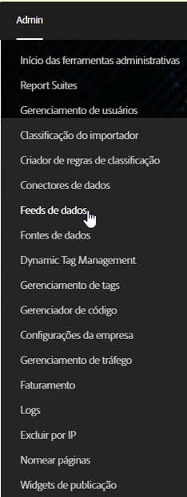
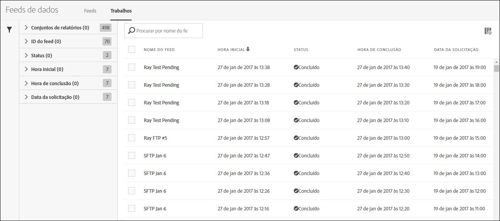
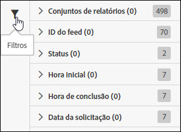
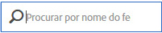
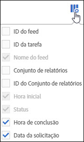

# Gerenciar trabalhos do feed de dados

Os trabalhos são tarefas individuais que geram um arquivo compactado. Eles são criados e governados por feeds.

Acesse o gerenciamento de trabalhos do feed de dados seguindo estas etapas:

1. Faça logon em [experiencecloud.adobe.com](https://experiencecloud.adobe.com).
2. Clique no menu de 9 linhas na parte superior direita e em [!UICONTROL Analytics].
3. No menu superior, clique em [!UICONTROL Administração] > [!UICONTROL Feeds de dados].
4. Clique na guia Trabalhos perto da parte superior.

## Navegação na interface

Uma tarefa de feed de dados é uma única instância em que a Adobe processa e gera um arquivo compactado para uma determinada janela de relatório. O gerenciador de trabalhos fornece uma visão mais aprofundada para ver o estado dos trabalho individuais.

### Filtros e pesquisa

Use filtros e a pesquisa para localizar o trabalho exato que você está procurando.

Na extremidade esquerda, clique no ícone de filtro para mostrar ou ocultar as opções de filtragem. Os filtros são organizados por categoria. Clique na divisa para recolher ou expandir as categorias de filtragem. Clique na caixa de seleção para aplicar esse filtro.

Use a pesquisa para localizar um trabalho por nome.

### Feeds e trabalhos

Clique na guia Feeds para ver os feeds abrangentes que criam esses trabalhos. Consulte [Gerenciar feeds de dados](df-manage-feeds.md).

### Colunas

Cada tarefa mostra várias colunas com informações sobre ela. Clique em um cabeçalho de coluna para classificá-lo em ordem crescente. Clique novamente em um cabeçalho de coluna para classificá-lo em ordem decrescente. Se não conseguir ver uma coluna específica, clique no ícone de coluna na parte superior direita.

* **ID do feed**: exibe a ID do feed, um identificador exclusivo. Os trabalhos criados pelo mesmo feed têm a mesma ID do feed.
* **ID do trabalho**: um identificador exclusivo para a tarefa. Todos os trabalhos têm uma ID de trabalho diferente.
* **Nome do feed**: coluna obrigatória. Exibe o nome do feed. Os trabalhos criados pelo mesmo feed têm o mesmo Nome de feed.
* **Conjunto de relatórios**: o conjunto de relatórios do qual o trabalho faz referência aos dados.
* **ID do conjunto de relatórios**: o identificador exclusivo do conjunto de relatórios.
* **Hora de início**: a hora em que o trabalho começou. A data e a hora são mostradas no fuso horário do conjunto de relatórios com deslocamento GMT. Os feeds diários normalmente começam perto da meia-noite no fuso horário do conjunto de relatórios.
* **Status**: o status do feed.
   * Aguardando dados: o trabalho é operacional e os dados da janela de relatório estão sendo coletados.
   * Processamento: a tarefa está criando os arquivos de dados e se preparando para enviá-los.
   * Concluído: o trabalho foi concluído sem problemas.
   * Falha: o trabalho não foi concluído. Consulte [Solução de problemas de trabalhos](jobs-troubleshooting.md) para ajudar a determinar a causa da falha.
   * Aguardando exportação: os dados da janela de relatórios ainda não foram totalmente processados.
   * Sem dados: não há dados no conjunto de relatórios na janela de relatórios solicitada.
* **Hora de conclusão**: a hora em que o trabalho terminou. A data e a hora são mostradas no fuso horário do conjunto de relatórios com deslocamento GMT.
* **Data de solicitação**: a janela de relatório do arquivo. Os feeds diários normalmente mostram de 00:00 às 23:59, com um deslocamento GMT, indicando um dia inteiro com base no fuso horário do conjunto de relatórios. Os feeds por hora mostram a hora individual na qual o trabalho é feito.
