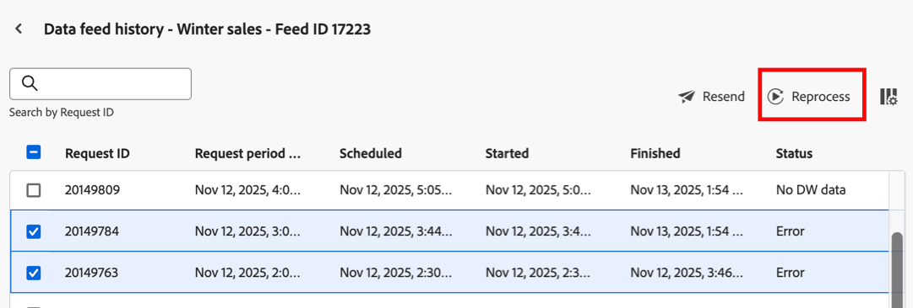

# Gerenciar processos de feed de dados {#manage-data-feed-jobs}

Os trabalhos são tarefas individuais que geram um arquivo compactado. Eles são criados e governados por feeds.

Você pode visualizar o histórico de trabalhos de cada feed de dados, reenviar trabalhos ou reprocessar trabalhos.

<!-- markdownlint-disable MD034 -->

>[!CONTEXTUALHELP]
>id="aa_datafeed_job_history"
>title="Histórico de tarefas do feed de dados"
>abstract="É possível exibir uma lista de trabalhos do feed de dados para um feed específico nesta página. Pesquise trabalhos por ID de solicitação ou Data de início do período de solicitação. As informações sobre cada trabalho são mostradas nas colunas disponíveis. Também é possível reenviar um trabalho com os mesmos dados ou reprocessar os dados de origem de um trabalho antes de reenviá-lo."

<!-- markdownlint-enable MD034 -->

## Exibir o histórico de tarefas de um feed de dados

Você pode exibir uma lista de trabalhos do feed de dados para um determinado feed de dados, juntamente com informações sobre cada trabalho.

Para exibir o histórico de tarefas de um feed de dados:

1. Faça logon em [experiencecloud.adobe.com](https://experiencecloud.adobe.com) usando as credenciais da Adobe ID.

1. Selecione o ícone de 9 quadrados no canto superior direito e escolha [!UICONTROL **Analytics**].

1. Na barra de navegação superior, acesse [!UICONTROL **Admin**] > [!UICONTROL **Feeds de dados**].

   Os feeds de dados de todos os conjuntos de relatórios aos quais você tem acesso são exibidos. Ou, se nenhum feed for configurado, a página exibirá um botão **[!UICONTROL Criar feed de dados]**.

   

1. Marque a caixa de seleção ao lado do feed de dados que contém os trabalhos que você deseja exibir e selecione [!UICONTROL **Histórico de trabalhos**].

   O histórico de tarefas do feed de dados é mostrado com informações sobre cada trabalho nas colunas disponíveis.

1. (Opcional) Para ajustar as colunas visíveis na tabela, selecione o ícone de coluna  no canto superior direito e, na caixa de diálogo Personalizar tabela, selecione cada coluna que deseja exibir e desmarque cada coluna que deseja ocultar.

   As seguintes colunas estão disponíveis:

   * **[!UICONTROL Início do período de solicitação]**

   * **[!UICONTROL Fim do período de solicitação]**

   * **[!UICONTROL Programado]**

   * **[!UICONTROL Iniciado]**

   * **[!UICONTROL Concluído]**

   * **[!UICONTROL Executar nº]**

   * **[!UICONTROL Status]**

   * **[!UICONTROL Código de erro]**

   * **[!UICONTROL Mensagem de erro]**

## Reenviar trabalhos de feed de dados

Quando você reenvia uma tarefa de feed de dados, ele envia o arquivo de feed de dados novamente com os mesmos dados e processamento de quando o arquivo foi enviado originalmente. Como alternativa, você pode [reprocessar um trabalho de feed de dados](#reprocess-data-feed-jobs).

Para reenviar um ou mais trabalhos do feed de dados:

1. No Adobe Analytics, selecione [!UICONTROL **Administrador**] > [!UICONTROL **Feeds de dados**].

1. Marque a caixa de seleção ao lado do feed de dados que contém os trabalhos que você deseja reenviar e selecione [!UICONTROL **Histórico de trabalhos**].

1. (Opcional) No campo de pesquisa, pesquise por ID de solicitação ou data de início do período de solicitação para pesquisar a lista de trabalhos do feed de dados.

1. Marque a caixa de seleção ao lado de um ou mais trabalhos de feed de dados e selecione **[!UICONTROL Reenviar]**. <!-- What does the status need to be? Error, ... -->

   

## Reprocessar trabalhos do feed de dados

Quando você reprocessa uma tarefa de feed de dados, ela reprocessa os dados de origem de uma tarefa de feed de dados e os envia novamente com os dados reprocessados. Como alternativa, você pode [reenviar um trabalho de feed de dados](#resend-data-feed-jobs).

Para reprocessar um ou mais trabalhos do feed de dados:

1. No Adobe Analytics, selecione [!UICONTROL **Administrador**] > [!UICONTROL **Feeds de dados**].

1. Marque a caixa de seleção ao lado do feed de dados que contém os trabalhos que você deseja reprocessar e selecione [!UICONTROL **Histórico de trabalhos**].

1. (Opcional) No campo de pesquisa, pesquise por ID de solicitação ou data de início do período de solicitação para pesquisar a lista de trabalhos do feed de dados.

1. Marque a caixa de seleção ao lado de um ou mais trabalhos de feed de dados e selecione **[!UICONTROL Reprocessar]**. <!-- What does the status need to be? Error, ... -->

   
