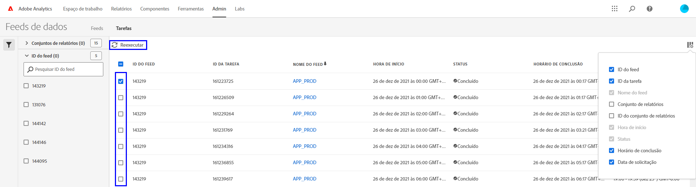

# Solução de problemas dos feeds de dados

Determine possíveis motivos pelos quais uma tarefa pode não ser processada ou entregue.

## Solução de problemas de um feed de dados existente

Se você tiver um feed de dados que opera com êxito por hora ou por dia, mas que falhou recentemente, verifique cada um dos seguintes itens:

* Use o [Ferramenta Status do Adobe](https://status.adobe.com/en/experience_cloud) para determinar se há alguma janela de manutenção programada ou problemas de disponibilidade. Se houver um problema conhecido no momento, o Adobe processará automaticamente os feeds de dados agendados assim que o serviço for restaurado.
* Certifique-se de que haja espaço disponível suficiente no site FTP. Se o site FTP ficar sem espaço em disco, exclua alguns arquivos do servidor para abrir espaço para novos arquivos.
* Se não houver problemas conhecidos e o site FTP tiver espaço em disco suficiente, você poderá reenviar o feed de dados.

   1. Faça logon no Adobe Analytics e navegue até **[!UICONTROL Administrador]** > **[!UICONTROL Feeds de dados]**.
   2. Localize os feeds de dados desejados e clique na caixa de seleção ao lado de cada um que você deseja executar novamente.
   3. Clique em **[!UICONTROL Reexecutar]**.

   

Se você ainda não receber os arquivos de feed de dados depois de executá-los novamente, entre em contato com o Atendimento ao cliente.

## Solução de problemas de um novo feed de dados

Se um novo feed de dados gerar um erro, solucione o problema carregando manualmente um arquivo de teste no site FTP. Na maioria dos casos, é possível determinar o ponto de falha usando essas etapas.

1. Faça logon no site FTP usando o Explorador de arquivos (Windows) ou o Finder (Mac). Certifique-se de usar o protocolo FTP (`ftp://`) e que você permite [Endereços IP](/help/technotes/ip-addresses.md) por meio do firewall da sua organização. Se não conseguir acessar o site FTP, trabalhe com o proprietário do site FTP para determinar o destino correto.

   

2. Um pop-up solicitando um nome de usuário e senha é exibido. Insira suas credenciais de autenticação. Se as credenciais forem aceitas, a janela mostrará o conteúdo atual no site FTP. Se as credenciais não forem aceitas, entre em contato com o proprietário do FTP para verificar se o nome de usuário e a senha estão corretos. Se estiver usando o SFTP, siga cada etapa no [Guia SFTP](../ftp-and-sftp/c-sftp/ftp-sftp.md). Observe que o Adobe não oferece suporte a todos os casos de uso de SFTP.
3. Carregue um arquivo no site FTP arrastando-o para a janela autenticada. Qualquer imagem ou documento de texto é adequado. Se você receber um erro ao tentar colocar um arquivo no site FTP, entre em contato com o proprietário do FTP para verificar se há espaço em disco suficiente e se o nome de usuário tem permissões de gravação no site FTP.
4. Depois de confirmar que o arquivo está no site FTP, você pode excluir o arquivo carregado na etapa anterior.

Se todas as etapas acima funcionarem e você ainda receber um erro FTP, entre em contato com o Atendimento ao cliente.
