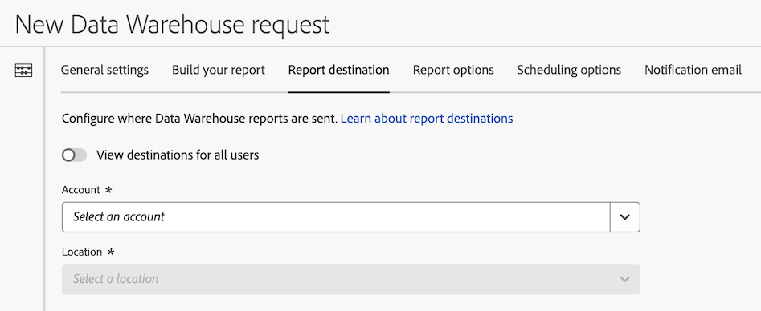

# Configurar um destino de relatório para uma solicitação Data Warehouse

Há várias opções de configuração disponíveis ao criar uma solicitação do Data Warehouse. As informações a seguir descrevem como configurar um destino de relatório para a solicitação.

Para obter informações sobre como começar a criar uma solicitação, bem como links para outras opções de configuração importantes, consulte [Criar uma solicitação Data Warehouse](/help/export/data-warehouse/create-request/t-dw-create-request.md).

>[!NOTE]
>
>Considere o seguinte ao configurar um destino de relatório:
>
>* Recomendamos o uso de uma conta na nuvem ou de um email como destino do seu relatório. Contas FTP e SFTP herdadas estão disponíveis, mas não são recomendadas.
>
>* As contas em nuvem estão associadas à sua conta de usuário do Adobe Analytics. Outros usuários não podem usar ou exibir contas na nuvem configuradas por você.
>
>* Qualquer conta na nuvem que você tenha [configurado para Feeds de dados](/help/export/analytics-data-feed/create-feed.md) estão disponíveis para uso no Data Warehouse.
>
>* Contas em nuvem configuradas para [importação de dados de classificação do Adobe Analytics](/help/components/locations/locations-manager.md) de um destino de nuvem pode ser usado ao configurar um destino de relatório. No entanto, os locais configurados para importar dados de classificação não podem ser usados.

Para configurar o destino para o qual os relatórios de Data Warehouse são enviados:

1. Comece a criar uma solicitação no Adobe Analytics selecionando **[!UICONTROL Ferramentas]** > **[!UICONTROL Data Warehouse]** > [!UICONTROL **Adicionar**].

   Para obter detalhes adicionais, consulte [Criar uma solicitação Data Warehouse](/help/export/data-warehouse/create-request/t-dw-create-request.md).

1. Na página Nova solicitação de Data Warehouse, selecione a variável [!UICONTROL **Destino do relatório**] guia.

   

1. (Condicional) Se você configurou anteriormente uma conta (e um destino nessa conta) que deseja usar como destino do relatório:

   1. Selecione a conta na lista suspensa [!UICONTROL **Selecionar conta**] menu suspenso.

      Qualquer conta de nuvem configurada para [importação de dados de classificação do Adobe Analytics](/help/components/locations/locations-manager.md) de um destino de nuvem são mostrados aqui e podem ser usados. No entanto, os locais configurados para importar dados de classificação não podem ser usados. Em vez disso, adicione um novo destino conforme descrito abaixo.

   1. Selecione o destino associado à conta na [!UICONTROL **Selecionar destino**] menu suspenso. <!-- Is this correct? -->

1. (Condicional) Se você não tiver configurado uma conta anteriormente:

   1. Selecionar [!UICONTROL **Adicionar conta**] e especifique as seguintes informações:

      | Campo | Função |
      |---------|----------|
      | [!UICONTROL **Tipo de conta**] | Selecione o tipo de conta na nuvem. Recomendamos ter uma única conta para cada tipo, com vários locais conforme necessário dentro dessa conta. 
Depois de escolher um tipo de conta, são exibidos campos específicos desse tipo de conta. 
 |
      | [!UICONTROL **Nome da conta**] | Especifique um nome para a conta. Esse nome aparece ao criar um local. <!-- true? --> |
      | [!UICONTROL **Descrição da conta**] | Forneça uma breve descrição da conta para ajudar a diferenciá-la de outras contas do mesmo tipo. |

      Para obter instruções de configuração, expanda a seção abaixo que corresponde à variável [!UICONTROL **Tipo de conta**] selecionado.

      Use qualquer um dos tipos de conta a seguir ao configurar um destino de relatório. Para obter instruções de configuração, expanda o tipo de conta. (Adicional [destinos herdados](#legacy-destinations) também estão disponíveis, mas não são recomendadas.)

      +++Amazon S3

      Especifique as seguintes informações para configurar uma conta ARN da Função S3 do Amazon:

      | Campo | Função |
      |---------|----------|
      | [!UICONTROL **ARN de função**] | Você deve fornecer uma Função ARN (Amazon Resource Name) que o Adobe pode usar para obter acesso à conta do Amazon S3. Para fazer isso, crie uma política de permissão IAM para a conta de origem, anexe a política a um usuário e crie uma função para a conta de destino. Para obter informações específicas, consulte [esta documentação do AWS](https://aws.amazon.com/premiumsupport/knowledge-center/cross-account-access-iam/).
Para obter informações sobre como configurar a permissão do bucket, consulte o artigo [Como posso fornecer acesso entre contas a objetos que estão nos buckets do Amazon S3?](https://repost.aws/knowledge-center/cross-account-access-s3) no centro de conhecimento da Amazon. |
      | [!UICONTROL **Usuário ARN**] | O usuário ARN (Amazon Resource Name) é fornecido pelo Adobe. Você deve anexar este usuário à política criada. |

      {style="table-layout:auto"}

+++

      +++Plataforma de nuvem do Google

      Especifique as seguintes informações para configurar uma conta da Google Cloud Platform:

      | Campo | Função |
      |---------|----------|
      | [!UICONTROL **ID do projeto**] | Sua ID de projeto da Google Cloud. Consulte a [Documentação da Google Cloud sobre como obter uma ID de projeto](https://cloud.google.com/resource-manager/docs/creating-managing-projects#identifying_projects). |

      {style="table-layout:auto"}

+++

      +++SAS do Azure

      Especifique as seguintes informações para configurar uma conta SAS do Azure:

      | Campo | Função |
      |---------|----------|
      | [!UICONTROL **ID do aplicativo**] | Copie essa ID do aplicativo do Azure que você criou. No Microsoft Azure, essas informações estão localizadas no **Visão geral** no aplicativo. Para obter mais informações, consulte [Documentação do Microsoft Azure sobre como registrar um aplicativo na Microsoft identity platform](https://learn.microsoft.com/en-us/azure/active-directory/develop/quickstart-register-app). |
      | [!UICONTROL **ID do inquilino**] | Copie essa ID do aplicativo do Azure que você criou. No Microsoft Azure, essas informações estão localizadas no **Visão geral** no aplicativo. Para obter mais informações, consulte [Documentação do Microsoft Azure sobre como registrar um aplicativo na Microsoft identity platform](https://learn.microsoft.com/en-us/azure/active-directory/develop/quickstart-register-app). |
      | [!UICONTROL **URI do cofre de chaves**] | 
O caminho para o token SAS no Cofre de Chaves do Azure.  Para configurar o Azure SAS, você precisa armazenar um token SAS como um segredo usando o Cofre de Chaves do Azure. Para obter informações, consulte a [Documentação do Microsoft Azure sobre como definir e recuperar um segredo do Cofre de Chaves do Azure](https://learn.microsoft.com/en-us/azure/key-vault/secrets/quick-create-portal?source=recommendations).

Depois que o URI do cofre de chaves for criado, adicione uma política de acesso ao Cofre de Chaves para conceder permissão ao aplicativo do Azure que você criou. Para obter informações, consulte a [Documentação do Microsoft Azure sobre como atribuir uma política de acesso do Cofre da Chave](https://learn.microsoft.com/en-us/azure/key-vault/general/assign-access-policy?tabs=azure-portal).
 |
      | [!UICONTROL **Nome do segredo do cofre de chaves**] | O nome secreto que você criou ao adicionar o segredo ao Cofre de Chaves do Azure. No Microsoft Azure, essas informações estão localizadas no Cofre de Chaves que você criou, na **Cofre da Chave** páginas de configurações. Para obter informações, consulte a [Documentação do Microsoft Azure sobre como definir e recuperar um segredo do Cofre de Chaves do Azure](https://learn.microsoft.com/en-us/azure/key-vault/secrets/quick-create-portal?source=recommendations). |
      | [!UICONTROL **Segredo**] | Copie o segredo do aplicativo do Azure que você criou. No Microsoft Azure, essas informações estão localizadas no **Certificados e segredos** no aplicativo. Para obter mais informações, consulte [Documentação do Microsoft Azure sobre como registrar um aplicativo na Microsoft identity platform](https://learn.microsoft.com/en-us/azure/active-directory/develop/quickstart-register-app). |

      {style="table-layout:auto"}

+++

      +++RBAC do Azure

      Especifique as seguintes informações para configurar uma conta RBAC do Azure:

      | Campo | Função |
      |---------|----------|
      | [!UICONTROL **ID do aplicativo**] | Copie essa ID do aplicativo do Azure que você criou. No Microsoft Azure, essas informações estão localizadas no **Visão geral** no aplicativo. Para obter mais informações, consulte [Documentação do Microsoft Azure sobre como registrar um aplicativo na Microsoft identity platform](https://learn.microsoft.com/en-us/azure/active-directory/develop/quickstart-register-app). |
      | [!UICONTROL **ID do inquilino**] | Copie essa ID do aplicativo do Azure que você criou. No Microsoft Azure, essas informações estão localizadas no **Visão geral** no aplicativo. Para obter mais informações, consulte [Documentação do Microsoft Azure sobre como registrar um aplicativo na Microsoft identity platform](https://learn.microsoft.com/en-us/azure/active-directory/develop/quickstart-register-app). |
      | [!UICONTROL **Segredo**] | Copie o segredo do aplicativo do Azure que você criou. No Microsoft Azure, essas informações estão localizadas no **Certificados e segredos** no aplicativo. Para obter mais informações, consulte [Documentação do Microsoft Azure sobre como registrar um aplicativo na Microsoft identity platform](https://learn.microsoft.com/en-us/azure/active-directory/develop/quickstart-register-app). |

      {style="table-layout:auto"}

+++

      +++Email

      Especifique as seguintes informações para configurar uma conta de email:

      | Campo | Função |
      |---------|----------|
      | [!UICONTROL **Destinatários**] | Notificações por email podem ser enviadas para usuários específicos quando o relatório é enviado. Especifique um único endereço de email ou uma lista de endereços de email separada por vírgulas. <!-- How does this differ from the Notification email tab? --> |

   1. Selecionar [!UICONTROL **Adicionar localização**] e especifique as seguintes informações: |Campo | Função | |—|—| | [!UICONTROL **Nome**] | O nome do local.  | | [!UICONTROL **Descrição**] | Forneça uma breve descrição da conta para ajudar a diferenciá-la de outras contas do mesmo tipo. | | [!UICONTROL **Conta de localização**] | Selecione a conta de localização na qual você criou [Adicionar uma conta](#add-an-account). |

   1. No [!UICONTROL **Propriedades do local**] especifique as informações específicas ao tipo de conta da sua conta de localização.

      Para obter instruções de configuração, expanda a seção abaixo que corresponde à variável [!UICONTROL **Tipo de conta**] que você selecionou anteriormente.

      +++Amazon S3

      Especifique as seguintes informações para configurar um local do Amazon S3:

      | Campo | Função |
      |---------|----------|
      | [!UICONTROL **Nome do bloco**] | O bucket da conta do Amazon S3 para o qual você deseja que os dados do Adobe Analytics sejam enviados. Certifique-se de que o usuário ARN fornecido pelo Adobe tenha acesso para carregar arquivos nesse bucket. |
      | [!UICONTROL **Prefixo da chave**] | A pasta dentro do bucket onde você deseja colocar os dados. Especifique um nome de pasta e adicione uma barra invertida depois do nome para criar a pasta. Por exemplo, folder_name/ |

      {style="table-layout:auto"}

+++

      +++Plataforma de nuvem do Google

      Especifique as seguintes informações para configurar um local da Google Cloud Platform:

      | Campo | Função |
      |---------|----------|
      | [!UICONTROL **Nome do bloco**] | O bucket da conta GCP para o qual você deseja que os dados do Adobe Analytics sejam enviados. Verifique se você concedeu permissão ao Principal fornecido pelo Adobe para fazer upload de arquivos para esse bucket. Para obter informações sobre a concessão de permissões, consulte [Adicionar uma entidade de segurança a uma política no nível do bucket](https://cloud.google.com/storage/docs/access-control/using-iam-permissions#bucket-add) na documentação da Google Cloud. |
      | [!UICONTROL **Prefixo da chave**] | A pasta dentro do bucket onde você deseja colocar os dados. Especifique um nome de pasta e adicione uma barra invertida depois do nome para criar a pasta. Por exemplo, folder_name/ |

      {style="table-layout:auto"}

+++

      +++SAS do Azure

      Especifique as seguintes informações para configurar um local SAS do Azure:

      | Campo | Função |
      |---------|----------|
      | [!UICONTROL **Nome do contêiner**] | O container na conta especificada para onde você deseja que os dados do Adobe Analytics sejam enviados. |
      | [!UICONTROL **Prefixo da chave**] | A pasta no container onde você deseja colocar os dados. Especifique um nome de pasta e adicione uma barra invertida depois do nome para criar a pasta. Por exemplo, `folder_name/` |

      {style="table-layout:auto"}

+++

      +++RBAC do Azure

      Especifique as seguintes informações para configurar um local do Azure RBAC:

      | Campo | Função |
      |---------|----------|
      | [!UICONTROL **Nome do contêiner**] | O container na conta especificada para onde você deseja que os dados do Adobe Analytics sejam enviados. Conceda permissões para carregar arquivos para o aplicativo do Azure criado anteriormente. |
      | [!UICONTROL **Prefixo da chave**] | A pasta no container onde você deseja colocar os dados. Especifique um nome de pasta e adicione uma barra invertida depois do nome para criar a pasta. Por exemplo, `folder_name/` |
      | [!UICONTROL **Nome da conta**] | A conta de armazenamento do Azure. |

      {style="table-layout:auto"}

+++

   1. Selecione [!UICONTROL **Salvar**].

      Agora é possível importar dados para a conta e o local configurados.

1. Continue configurando sua solicitação do Data Warehouse no [!UICONTROL **Opções de relatório**] guia. Para obter mais informações, consulte [Configurar opções de relatório para uma solicitação Data Warehouse](/help/export/data-warehouse/create-request/dw-request-report-options.md).

## Destinos herdados

>[!IMPORTANT]
>
>Os destinos descritos nesta seção são herdados e não são recomendados. Em vez disso, use um dos seguintes destinos ao criar um destino de data warehouse: Amazon S3, Google Cloud Platform, Azure RBAC, Azure SAS ou Email. Consulte as informações acima para obter detalhes sobre cada um desses destinos recomendados.

As informações a seguir fornecem informações de configuração para cada um dos destinos herdados:

### FTP

Os dados do data warehouse podem ser entregues para um Adobe ou local FTP hospedado pelo cliente. Requer um host FTP, nome de usuário e senha. Use o campo de caminho para colocar arquivos de feed em uma pasta. As pastas já devem existir; os feeds exibem um erro se o caminho especificado não existir.

Use as seguintes informações ao preencher os campos disponíveis:

#### Campos de conta

* [!UICONTROL **Nome da conta**]: o nome da conta FTP.

* [!UICONTROL **Descrição da conta**]: uma descrição da conta FTP.

* [!UICONTROL **Nome do host**]: digite o URL de destino FTP desejado. Por exemplo, `ftp.company.com`.

  >[!NOTE]
  >
  >  Não incluir `ftp://` no início do URL.

* [!UICONTROL **Nome de usuário**]: digite o nome de usuário para fazer logon no site FTP.

* [!UICONTROL **Senha e confirmação da senha**]: digite a senha para fazer logon no site FTP.

#### Campos de localização

* [!UICONTROL **Nome do local**]: o nome do local na conta FTP para o qual você deseja enviar os arquivos.

* [!UICONTROL **Descrição do local**]: uma descrição do local na conta FTP.

* [!UICONTROL **Caminho do diretório**]: O caminho para o local na conta FTP.

### SFTP

O suporte SFTP para data warehouse está disponível. Exige que um host SFTP, nome de usuário e site de destino contenham uma chave pública RSA ou DSA válida. Você pode baixar a chave pública apropriada ao criar o destino do data warehouse.

Use as seguintes informações ao preencher os campos disponíveis:

#### Campos de conta

* [!UICONTROL **Nome da conta**]: o nome da conta FTP.

* [!UICONTROL **Descrição da conta**]: uma descrição da conta FTP.

* [!UICONTROL **Nome do host**]: digite o URL de destino do SFTP desejado. Por exemplo, `sftp.company.com`.

  >[!NOTE]
  >
  >  Não incluir `sftp://` no início do URL.

* [!UICONTROL **Nome de usuário**]: digite o nome de usuário para fazer logon no site SFTP.

* [!UICONTROL **Usar extensões de arquivo temporárias durante o upload**]: Quando ativada, a variável `.part` a extensão de arquivo é usada durante o processo de upload. Mantenha essa opção ativada, a menos que o servidor SFTP impeça que os nomes dos arquivos sejam alterados após a conclusão do upload.

* [!UICONTROL **Chaves públicas**]: Baixe a chave pública apropriada ao criar o destino do data warehouse.

#### Campos de localização

* [!UICONTROL **Nome do local**]: o nome do local na conta SFTP para o qual você deseja enviar os arquivos.

* [!UICONTROL **Descrição do local**]: uma descrição do local na conta SFTP.

* [!UICONTROL **Caminho do diretório**]: o caminho para o local na conta SFTP.

Para obter informações adicionais sobre a configuração SFTP, consulte [Enviar solicitações de Data Warehouse para servidores SFTP](/help/export/ftp-and-sftp/c-sftp/ftp-sftp-dw.md).

### S3

Você pode enviar dados do warehouse diretamente para buckets do Amazon S3. Este tipo de destino requer um nome de bucket, uma ID de chave de acesso e uma chave secreta. Consulte [Requisitos de nomenclatura de bucket do Amazon S3](https://docs.aws.amazon.com/pt_br/awscloudtrail/latest/userguide/cloudtrail-s3-bucket-naming-requirements.html) nos documentos do Amazon S3 para obter mais informações.

O usuário fornecido para o upload de dados do data warehouse deve ter o seguinte [permissões](https://docs.aws.amazon.com/pt_br/AmazonS3/latest/API/API_Operations_Amazon_Simple_Storage_Service.html):

* s3:GetObject
* s3:PutObject
* s3:PutObjectAcl

As 16 regiões AWS padrão a seguir são compatíveis (usando o algoritmo de assinatura apropriado, quando necessário):

* us-east-2
* us-east-1
* us-west-1
* us-west-2
* ap-south-1
* ap-northeast-2
* ap-southeast-1
* ap-southeast-2
* ap-northeast-1
* ca-central-1
* eu-central-1
* eu-west-1
* eu-west-2
* eu-west-3
* eu-north-1
* sa-east-1

>[!NOTE]
>
>A região cn-north-1 não é compatível.

### Azure Blob

O data warehouse oferece suporte aos destinos do Azure Blob. Requer um contêiner, uma conta e uma chave. A Amazon criptografa automaticamente os dados em repouso. Os dados são descriptografados automaticamente ao baixá-los. Consulte [Criar uma conta de armazenamento](https://docs.microsoft.com/pt-br/azure/storage/common/storage-quickstart-create-account?tabs=azure-portal#view-and-copy-storage-access-keys) nos documentos do Microsoft Azure para obter mais informações.

>[!NOTE]
>
>Você deve implementar seu próprio processo para gerenciar o espaço em disco no destino do data warehouse. A Adobe não exclui dados do servidor.
