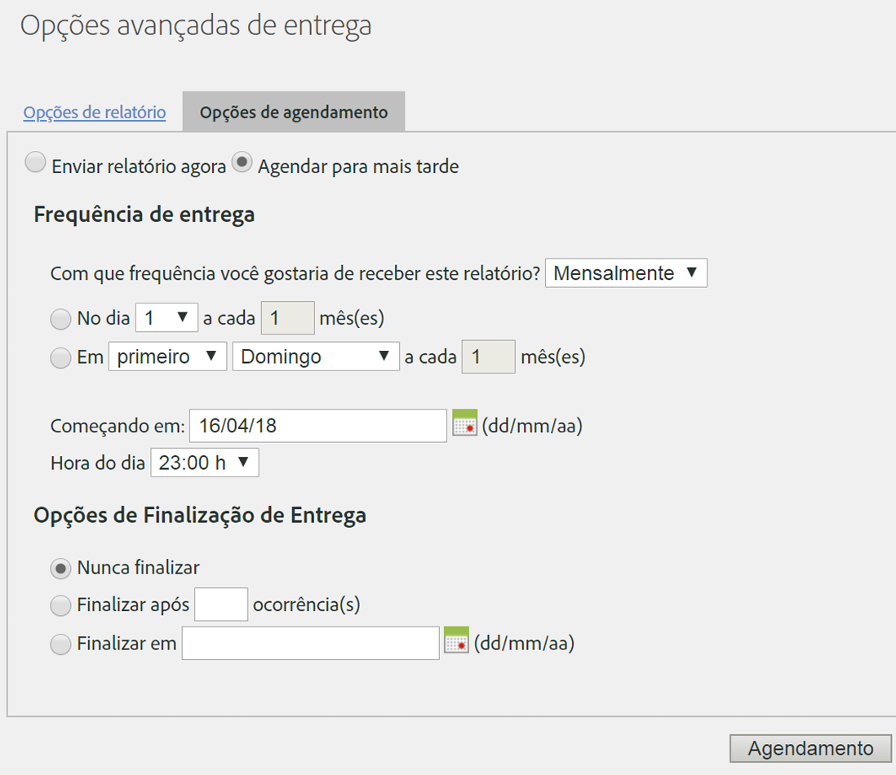

# Agendar uma solicitação recorrente

## Agendar uma solicitação recorrente {#topic_8C3CE0CE8A584F80946D24B377CB51BE}

Para agendar solicitações do Data Warehouse como diárias/mensais/anuais, certifique-se de que *Predefinição* esteja selecionado da maneira correta.

1. Em [!UICONTROL Data de relatório], selecione **[!UICONTROL Predefinição]**.

1. Em [!UICONTROL Agendar entrega], clique em **[!UICONTROL Opções avançadas de entrega]**.

1. Acesse a guia Opções de agendamento e selecione **[!UICONTROL Agendar para mais tarde]**.
1. Selecione as configurações desejadas para [!UICONTROL Frequência da entrega] e [!UICONTROL Opções de entrega final].

   

1. Clique em **[!UICONTROL Agendamento]**.

