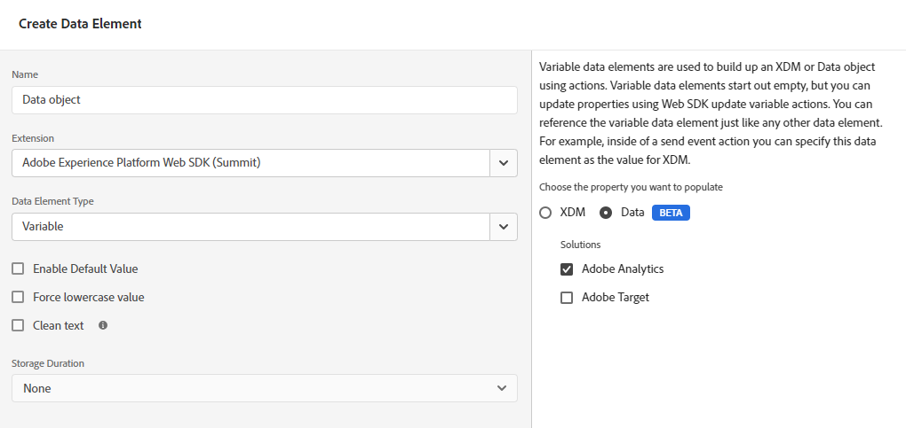

# Migração da extensão de tag do Adobe Analytics para a extensão de tag do SDK da Web

Esse caminho de implementação envolve uma abordagem de migração metódica para mover da extensão de tag da Adobe Analytics para a extensão de tag do SDK da Web. Outros caminhos de implementação são abordados em páginas separadas:

* [AppMeasurement para a biblioteca JavaScript do SDK da Web](appmeasurement-to-web-sdk.md): uma abordagem suave e metódica para migrar para o SDK da Web, exceto pelo fato de que não usa tags. Em vez disso, você remove manualmente a biblioteca de coleta de dados do Adobe Analytics (`AppMeasurement.js`) e substitua-a pela biblioteca JavaScript do SDK da Web (`alloy.js`).
* [Extensão de tag do SDK da Web](web-sdk-tag-extension.md): uma nova instalação do SDK da Web em que você gerencia a implementação usando tags na Coleção de dados da Adobe Experience Platform. Ele requer o grupo de campos Adobe Analytics ExperienceEvent, que inclui variáveis típicas do Analytics para serem incluídas no esquema XDM.
* [Biblioteca JavaScript do SDK da Web](web-sdk-javascript-library.md): uma nova instalação do SDK da Web usando a biblioteca JavaScript do SDK da Web (`alloy.js`). Gerencie você mesmo a implementação, em vez de usar a interface das tags. Ele requer o grupo de campos Adobe Analytics ExperienceEvent, que inclui variáveis típicas do Analytics para serem incluídas no esquema XDM.

## Vantagens e desvantagens desse caminho de implementação

O uso dessa abordagem de migração tem vantagens e desvantagens. Avalie cuidadosamente cada opção para decidir qual abordagem é a melhor para sua organização.

| Benefícios | Desvantagens |
| --- | --- |
| <ul><li>**Não há alterações de código em seu site**: como sua implementação já tem tags instaladas, todas as atualizações de migração podem ser feitas na interface de tags.</li><li>**Usa sua implementação existente**: essa abordagem não requer uma implementação totalmente nova. Embora isso exija novas ações de regra, é possível reutilizar os elementos de dados existentes e as condições da regra com o mínimo de alterações.</li><li>**Não requer um esquema**: nessa etapa de migração para o SDK da Web, você não precisa de um esquema XDM. Em vez disso, você pode preencher o `data` que envia dados diretamente para o Adobe Analytics. Quando a migração para o SDK da Web estiver concluída, você poderá criar um esquema para sua organização e usar o mapeamento de sequência de dados para preencher campos XDM aplicáveis. Se um esquema fosse necessário nesta fase do processo de migração, sua organização seria forçada a usar um esquema XDM da Adobe Analytics. O uso desse esquema torna mais difícil para sua organização usar seu próprio esquema no futuro.</li></ul> | <ul><li>**Dívida técnica de implementação**: como essa abordagem usa uma forma modificada da implementação existente, pode ser mais difícil rastrear a lógica de implementação e executar alterações quando necessário. O código personalizado pode ser particularmente difícil de depurar.</li><li>**Requer mapeamento para enviar dados para a Plataforma**: quando sua organização estiver pronta para usar o Customer Journey Analytics, você deverá enviar dados para um conjunto de dados na Adobe Experience Platform. Essa ação exige que todos os campos na `data` ser uma entrada na ferramenta de mapeamento de sequência de dados que o atribui a um campo de esquema XDM. O mapeamento só precisa ser feito uma vez para esse fluxo de trabalho e não envolve fazer alterações de implementação. No entanto, essa é uma etapa extra que não é necessária ao enviar dados em um objeto XDM.</li></ul> |

A Adobe recomenda seguir esse caminho de implementação nos seguintes cenários:

* Você tem uma implementação existente usando a extensão de tag da Adobe Analytics. Se você tiver uma implementação usando o AppMeasurement, siga [Migração do AppMeasurement para o SDK da Web](appmeasurement-to-web-sdk.md) em vez disso.
* Você pretende usar o Customer Journey Analytics no futuro, mas não deseja substituir sua implementação do Analytics por uma implementação de SDK da Web do zero. Substituir sua implementação do zero no SDK da Web requer mais esforço, mas também oferece a arquitetura de implementação de longo prazo mais viável. Se a organização estiver disposta a realizar o esforço de uma implementação limpa do SDK da Web, consulte [Assimilar dados por meio do SDK da Web da Adobe Experience Platform](https://experienceleague.adobe.com/en/docs/analytics-platform/using/cja-data-ingestion/ingest-use-guides/edge-network/aepwebsdk) no guia do usuário Customer Journey Analytics.

## Etapas necessárias para migrar para o SDK da Web

As etapas a seguir contêm objetivos concretos a serem atingidos. Clique em cada etapa para obter instruções detalhadas sobre como realizá-la.

+++**1. Criar e configurar um fluxo de dados**

Crie um fluxo de dados na Coleção de dados da Adobe Experience Platform. Ao enviar dados para esse fluxo de dados, ele encaminha dados para a Adobe Analytics. No futuro, esse mesmo fluxo de dados encaminha dados para o Customer Journey Analytics.

1. Navegue até [experience.adobe.com](https://experience.adobe.com) e faça logon usando suas credenciais.
1. Use a página inicial ou o seletor de produto no canto superior direito para navegar até **[!UICONTROL Coleta de dados]**.
1. Na navegação à esquerda, selecione **[!UICONTROL Datastreams]**.
1. Selecione **[!UICONTROL Novo fluxo de dados]**.
1. Insira o nome desejado e selecione **[!UICONTROL Salvar]**.
1. Depois que o fluxo de dados for criado, selecione **[!UICONTROL Adicionar serviço]**.
1. No menu suspenso do serviço, selecione **[!UICONTROL Adobe Analytics]**.
1. Insira a mesma ID de conjunto de relatórios do site para o qual você envia dados de análise. Clique em **[!UICONTROL Salvar]**.

 {style="border:1px solid gray"}

Seu fluxo de dados agora está pronto para receber e transmitir dados para a Adobe Analytics.

+++

+++**2. Adicionar a extensão SDK da Web à propriedade da tag**

Esta seção prepara a tag para a maior parte do esforço de migração que ocorrerá na próxima etapa.

1. Clique no ícone de hambúrguer na parte superior esquerda da interface do Adobe Experience Platform e selecione **[!UICONTROL Tags]**.
1. Selecione a propriedade de tag desejada.
1. Na navegação à esquerda da propriedade da tag, selecione **[!UICONTROL Extensões]**.
1. Selecionar **[!UICONTROL Catálogo]** próximo à parte superior para ver uma lista de todas as extensões disponíveis.
1. Procure por e selecione o **[!UICONTROL Adobe Experience Platform Web SDK]** e clique em **[!UICONTROL Instalar]** à direita.

    {style="border:1px solid gray"}

1. As definições de configuração de extensão são exibidas. Localize a seção Fluxos de dados e selecione o fluxo de dados criado na etapa anterior.

    {style="border:1px solid gray"}

1. Selecione **[!UICONTROL Salvar]**.

Agora a propriedade da tag tem o SDK da Web instalado.

+++

+++**3. Criar um elemento de dados de objeto de dados**

O elemento de dados do objeto de dados fornece uma estrutura intuitiva para configurar uma carga que o SDK da Web usa para enviar para um fluxo de dados. A maioria das regras que você atualiza na etapa a seguir interage com esse elemento de dados.

1. Na navegação à esquerda da interface de tags, selecione **[!UICONTROL Elementos de dados]**.
1. Selecionar **[!UICONTROL Adicionar elemento de dados]**
1. Atribua ao elemento de dados as seguintes configurações:
   * [!UICONTROL Nome]: qualquer coisa que você desejar, como &quot;Camada de dados&quot; ou &quot;Objeto de dados&quot;
   * [!UICONTROL Extensão]: [!UICONTROL Adobe Experience Platform Web SDK]
   * [!UICONTROL Variável]: [!UICONTROL Variável]
   * As caixas de seleção podem permanecer como estão
1. À direita, selecione as seguintes configurações:
   * Botão de opção de propriedade: [!UICONTROL Dados]
   * Solução: [!UICONTROL Adobe Analytics]
1. Selecione **[!UICONTROL Salvar]**.

 {style="border:1px solid gray"}

Agora, a propriedade da tag tem tudo o que é necessário para atualizar cada regra.

+++

+++**4. Atualizar regras para usar a extensão SDK da Web em vez da extensão do Analytics**

Essa etapa contém a maior parte do esforço necessário para migrar para o SDK da Web e requer conhecimento sobre como a implementação funciona. Um exemplo é fornecido abaixo de como editar uma regra de tag típica. Atualize todas as regras de tag na implementação para substituir todas as referências à extensão do Adobe Analytics pela extensão SDK da Web.

1. Na navegação à esquerda da interface de tags, selecione **[!UICONTROL Regras]**.
1. Selecione uma regra para editar.
1. Selecionar a ação **[!UICONTROL Adobe Analytics - Definir variáveis]**
1. Observe todas as variáveis do Analytics definidas nesta regra. Observe as variáveis definidas nos menus suspensos e as variáveis definidas no código personalizado.
1. Altere o [!UICONTROL Configuração de ação] para as seguintes configurações:
   * [!UICONTROL Extensão]: [!UICONTROL Adobe Experience Platform Web SDK]
   * [!UICONTROL Tipo de ação]: Atualizar variável
1. Certifique-se de que o objeto de dados esteja selecionado no menu suspenso à direita.
1. Defina as variáveis do Analytics com os mesmos valores que foram configurados na extensão do Analytics.
   * As variáveis definidas na interface de tags podem ser traduzidas diretamente para os mesmos valores.
   * As variáveis de string definidas no código personalizado exigem ajustes mínimos. Em vez de usar o `s` objeto, uso `data.__adobe.analytics` em vez disso. Por exemplo, `s.eVar1` seria traduzido para `data.__adobe.analytics.eVar1`.
   * As variáveis de configuração e chamadas de método do Analytics no código personalizado podem exigir lógica de implementação modificada. Ver cada respectivo [variável](/help/implement/vars/overview.md) para determinar como atingir o equivalente usando o SDK da Web.
1. Depois que toda a lógica da regra for replicada usando a extensão SDK da Web, selecione **[!UICONTROL Manter alterações]**.
1. Repita essas etapas para cada configuração de ação que usa a extensão Adobe Analytics para definir valores. Essa etapa inclui as variáveis definidas usando a interface de tags e as definidas usando o código personalizado. Blocos de código personalizados não podem fazer referência ao `s` em qualquer lugar.

As etapas acima se aplicam apenas às regras que definem valores. As etapas a seguir substituem todas as ações que usam o [!UICONTROL Configuração de ação] [!UICONTROL Enviar sinal].

1. Selecione uma regra que envie um sinal.
1. Selecionar a ação **[!UICONTROL Adobe Analytics - Enviar sinal]**.
1. Observe o valor atual do [!UICONTROL Rastreamento] botão à direita ([`s.t()`](../../vars/functions/t-method.md) ou [`s.tl()`](../../vars/functions/tl-method.md)).
1. Altere o [!UICONTROL Configuração de ação] para as seguintes configurações:
   * [!UICONTROL Extensão]: [!UICONTROL Adobe Experience Platform Web SDK]
   * [!UICONTROL Tipo de ação]: [!UICONTROL Enviar evento]
1. À direita, altere as configurações da ação para o seguinte:
   * [!UICONTROL Tipo]: Para `s.t()`, use **[!UICONTROL Exibições de Página de Detalhes da Página da Web]**. Para `s.tl()`, use **[!UICONTROL Cliques de link de interação na Web]**. Se você usar [`s.tl()`](../../vars/functions/tl-method.md), você também deve incluir os seguintes campos no objeto de dados. Esses campos estão listados em [!UICONTROL Propriedades adicionais] ao executar a [!UICONTROL Atualizar variável] configuração de ação:
      * [Nome do link](../../vars/functions/tl-method.md)
      * [Tipo de link](../../vars/functions/tl-method.md)
      * [URL do link](../../vars/config-vars/linkurl.md)
1. Selecione **[!UICONTROL Manter alterações]**.
1. Repita essas etapas para cada configuração de ação que usa o Adobe Analytics para enviar um beacon.

+++

+++**5. Publicar regras atualizadas**

A publicação de regras atualizadas segue o mesmo fluxo de trabalho de qualquer outra alteração na configuração de tags.

1. Na navegação à esquerda da interface de tags, selecione **[!UICONTROL Fluxo de publicação]**.
1. Selecionar **[!UICONTROL Adicionar biblioteca]**.
1. Nomeie essa confirmação de tag, como &quot;Atualizar para o SDK da Web&quot;.
1. Selecionar **[!UICONTROL Adicionar todos os recursos alterados]**.
1. Selecione **[!UICONTROL Salvar]**.
1. O fluxo de trabalho de publicação exibe um ponto laranja, indicando que está sendo criado. Quando o ponto ficar verde, as alterações estarão disponíveis no ambiente de desenvolvimento.
1. Teste as alterações no ambiente de desenvolvimento para garantir que todas as regras sejam acionadas corretamente e que o objeto de dados seja preenchido com os valores esperados.
1. Quando estiver pronto, envie a biblioteca para aprovação, crie para preparo e, em seguida, aprove e publique para produção.

 {style="border:1px solid gray"}

+++

+++**6. Desativar extensão do Analytics**

Assim que a implementação de tag estiver totalmente no SDK da Web, você poderá desativar a extensão do Adobe Analytics.

1. Na navegação à esquerda da interface de tags, selecione **[!UICONTROL Extensões]**.
1. Localize e selecione o [!UICONTROL Adobe Analytics] extensão. À direita, selecione **[!UICONTROL Desativar]**.
1. Siga o mesmo fluxo de trabalho de publicação acima para publicar a remoção da [!UICONTROL Adobe Analytics] extensão.
1. Depois que a extensão for desativada na produção, você poderá desinstalá-la totalmente. Selecione a extensão, o menu de três pontos à direita e selecione **[!UICONTROL Desinstalar]**.
1. Siga o mesmo fluxo de trabalho de publicação acima para publicar essas alterações na produção.

+++

Neste ponto, a implementação do Analytics está totalmente no SDK da Web e está preparada adequadamente para mudar para o Customer Journey Analytics no futuro.
