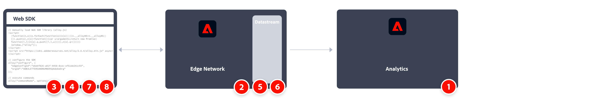

# Enviar dados para a Adobe Analytics usando a biblioteca JavaScript do SDK da Web

Esse caminho de implementação envolve uma instalação nova do SDK da Web usando a biblioteca JavaScript do SDK da Web. Outros caminhos de implementação são abordados em páginas separadas:

* [Extensão de tag do SDK da Web](web-sdk-tag-extension.md): uma instalação do SDK da Web atualizada usando a extensão de tag do SDK da Web. Semelhante à abordagem da biblioteca de JavaScript do SDK da Web (esta página), exceto que você gerencia a implementação usando tags na Coleção de dados da Adobe Experience Platform. Ele requer o grupo de campos Adobe Analytics ExperienceEvent, que inclui variáveis típicas do Analytics para serem incluídas no esquema XDM.
* [Extensão do Analytics para a extensão do SDK da Web](analytics-extension-to-web-sdk.md): adote uma abordagem suave e metódica para mover da extensão de marcas da Adobe Analytics para a extensão de marcas do SDK da Web. Essa abordagem elimina a necessidade de usar o XDM até que sua organização esteja pronta para usar os serviços da Adobe Experience Platform, como o Customer Journey Analytics. Use o objeto `data` em vez do objeto `xdm` para enviar dados ao Adobe.
* AppMeasurement [Biblioteca JavaScript do SDK da Web](appmeasurement-to-web-sdk.md): uma abordagem suave e metódica para migrar para o SDK da Web, exceto por não usar marcas. Em vez disso, você pode remover manualmente a biblioteca de coleção de dados do Adobe Analytics (`AppMeasurement.js`) e substituí-la pela biblioteca JavaScript do SDK da Web (`alloy.js`).

## Vantagens e desvantagens desse caminho de implementação

O uso da biblioteca JavaScript do SDK da Web para enviar dados para a Adobe Analytics tem vantagens e desvantagens. Avalie cuidadosamente cada opção para decidir qual abordagem é a melhor para sua organização.

| Vantagens | Desvantagens |
| --- | --- |
| <ul><li>**Abordagem direta**: esse caminho de implementação é mais simples do que as abordagens que movem implementações existentes do Adobe Analytics. Se você não tiver uma implementação atual do Adobe Analytics com a qual se preocupar, preencha os campos XDM do SDK da Web aplicáveis.</li><li>**Esquema predefinido**: se sua organização não tiver uma necessidade para seu próprio esquema, você pode simplesmente usar o esquema direcionado para a Adobe Analytics. Esse conceito se aplica mesmo quando você avança em direção ao Customer Journey Analytics; o conceito de props e eVars não se aplica ao Customer Journey Analytics, mas você pode continuar usando props e eVars como dimensões personalizadas simples.</li></ul> | <ul><li>**As alterações na implementação exigem intervenção do desenvolvedor**: se você quiser fazer alterações na implementação do SDK da Web, deverá trabalhar com a equipe de desenvolvimento para editar o código no site. A abordagem que usa a [extensão de tag do SDK da Web](web-sdk-tag-extension.md) evita essa desvantagem.</li><li>**Bloqueado para usar um esquema específico**: quando sua organização mudar para o Customer Journey Analytics, você deve optar por continuar usando o esquema do Adobe Analytics ou migrar para o esquema de sua própria organização (que seria um conjunto de dados separado). Se a sua organização quiser evitar o esquema do Adobe Analytics e a migração para um conjunto de dados separado ao mudar para o Customer Journey Analytics, o Adobe recomenda um dos dois métodos a seguir:</li><ul><li>Usar o objeto `data`: o objeto `data` permite enviar dados para a Adobe Analytics sem estar em conformidade com um esquema XDM. Depois que o esquema da sua organização for criado, você poderá usar o mapeamento de sequência de dados para mapear campos de objeto `data` para o XDM. A [extensão do Analytics para a extensão do SDK da Web](analytics-extension-to-web-sdk.md) e a [biblioteca JavaScript do AppMeasurement para o SDK da Web](appmeasurement-to-web-sdk.md) usam este objeto `data`.</li><li>Ignorar totalmente o Adobe Analytics: se estiver implementando o SDK da Web, você pode enviar esses dados para um conjunto de dados na Adobe Experience Platform para uso no Customer Journey Analytics. Você pode usar qualquer esquema que desejar; a Adobe Analytics não está envolvida nesse fluxo de trabalho e, portanto, não requer o grupo de campos Adobe Analytics ExperienceEvent. Este método incorre no menor montante de dívida técnica, mas também deixa a Adobe Analytics totalmente fora de contexto.</li></ul></ul> |

>[!IMPORTANT]
>
>Esse método de implementação exige que você use um esquema configurado para o Adobe Analytics. Se sua organização planeja usar seu próprio esquema com o Customer Journey Analytics no futuro, o uso do esquema do Adobe Analytics pode criar confusão para administradores de dados ou arquitetos. Há várias opções para atenuar esse obstáculo:
>
>* Você pode usar o esquema do Adobe Analytics no CJA. Observe que o CJA não tem um conceito de props ou eVars; eles são tratados como qualquer outro campo de esquema. Observe também que o uso do esquema do Adobe Analytics no CJA pode dificultar o uso de outros serviços de plataforma, como o Adobe Journey Optimizer ou o Real-time Customer Data Platform.
>* Você pode usar o objeto de dados, de modo semelhante a um fluxo de trabalho de migração. Observe que o uso do objeto de dados exige o mapeamento de cada campo de objeto de dados para um campo de esquema XDM.
>* Você pode ignorar completamente a implementação do Adobe Analytics e enviar dados para o Adobe Experience Platform usando seu próprio esquema. Essa abordagem é ideal a longo prazo e permite que sua organização comece a usar o Customer Journey Analytics.

## Etapas necessárias para implementar a biblioteca JavaScript do SDK da Web

Uma visão geral de alto nível das tarefas de implementação:

<table style="width:100%">

<tr>
<th style="width:5%"></th><th style="width:60%"><b>Tarefa</b></th><th style="width:35%"><b>Mais informações</b></th>
</tr>

<tr>
<td>1</td>
<td>Certifique-se de que você <b>definiu um conjunto de relatórios</b>.</td>
<td><a href="/help/admin/admin/c-manage-report-suites/report-suites-admin.md">Gerenciador do conjunto de relatórios</a></td>
</tr>

<tr>
<td>2</td>
<td><b>Configurar esquemas</b>. Para padronizar a coleta de dados para uso em aplicativos que utilizam a Adobe Experience Platform, a Adobe criou o padrão aberto e documentado publicamente, o Experience Data Model (XDM).</td>
<td><a href="https://experienceleague.adobe.com/docs/experience-platform/xdm/ui/overview.html?lang=pt-BR">Visão geral da interface de esquemas</a></td>
</tr>

<tr>
<td>3</td>
<td><b>Criar uma camada de dados</b> para gerenciar o rastreamento dos dados no seu site.</td>
<td><a href="../../prepare/data-layer.md">Criar uma camada de dados</a></td>
</tr>

<tr>
<td> 4</td>
<td><b>Instalar a versão independente pré-criada</b>. Você pode fazer referência à biblioteca (<code>alloy.js</code>) na CDN diretamente na sua página ou baixá-la e hospedá-la na sua própria infraestrutura. Como alternativa, você pode usar o pacote NPM.</td>
<td><a href="https://experienceleague.adobe.com/docs/experience-platform/web-sdk/install/library.html?lang=pt-BR">Instalar a versão independente pré-criada</a> e <a href="https://experienceleague.adobe.com/docs/experience-platform/web-sdk/install/npm.html?lang=pt-BR">Usar o pacote NPM</a></td>
</tr>

<tr>
<td>5</td>
<td><b>Configurar uma sequência de dados</b>. Uma sequência de dados representa a configuração do lado do servidor ao implementar o SDK da Web da Adobe Experience Platform.</td>
<td><a href="https://experienceleague.adobe.com/docs/experience-platform/edge/datastreams/configure.html?lang=pt-BR">Configurar uma sequência de dados<a></td> 
</tr>

<td>6</td>
<td><b>Adicionar um serviço do Adobe Analytics</b> à sua sequência de dados. Esse serviço controla se e como os dados são enviados para o Adobe Analytics e para quais conjuntos de relatórios especificamente.</td>
<td><a href="https://experienceleague.adobe.com/docs/experience-platform/edge/datastreams/configure.html?lang=pt-BR#analytics">Adicionar o serviço Adobe Analytics a uma sequência de dados</a></td>
</tr>

<tr>
<td>7</td>
<td><b>Configurar o SDK da Web</b>. Verifique se a biblioteca instalada na etapa 4 está configurada corretamente com a ID da sequência de dados (anteriormente conhecida como id de configuração de borda (<code>datastreamId</code>)), id da organização (<code>orgId</code>) e outras opções disponíveis. Garanta o mapeamento adequado das variáveis. </td>
<td><a href="https://experienceleague.adobe.com/docs/experience-platform/web-sdk/commands/configure/overview.html?lang=pt-BR">Configurar o SDK da Web</a> <a href="../xdm-var-mapping.md">mapeamento de variável de objeto XDM</a></td>
</tr>

<tr>
<td>8</td>
<td><b>Executar comandos</b> e/ou <b>rastrear eventos</b>. Depois que o código base tiver sido implementado em sua página da Web, você poderá começar a executar comandos e rastrear eventos com o SDK.
</td>
<td><a href="https://experienceleague.adobe.com/docs/experience-platform/web-sdk/commands/sendevent/overview.html?lang=pt-BR">Enviar eventos</a></td>
</tr>

<tr>
<td>9</td><td><b>Estender e validar sua implementação</b> antes de empurrá-lo para a produção.</td><td></td> 
</tr>
</table>
