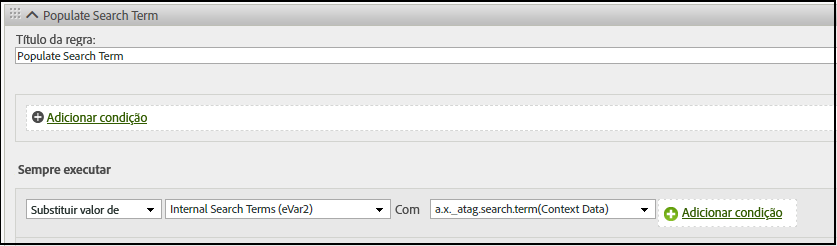

# Mapear dados do XDM para o Analytics manualmente

O SDK da Web da Adobe Experience Platform (AEP) fornece assistência para mapear dados manualmente entre a Platform e o Analytics.

Para dados XDM que não são mapeados automaticamente para o Analytics, é possível adicionar [dados de contexto](https://docs.adobe.com/content/help/pt-BR/analytics/implementation/vars/page-vars/contextdata.html) para corresponder ao [esquema](https://docs.adobe.com/content/help/pt-BR/experience-platform/xdm/schema/composition.html). Assim, ele pode ser utilizado pelas [regras de processamento](https://docs.adobe.com/content/help/pt-BR/analytics/admin/admin-tools/processing-rules/processing-rules-configuration/t-processing-rules.html) para preencher as variáveis do Analytics.

Além disso, é possível utilizar um conjunto padrão de ações e listas de produtos para enviar ou recuperar dados com o SDK da Web da AEP. Para fazer isso, consulte [Produtos](https://docs.adobe.com/content/help/pt-BR/experience-platform/edge/implement/commerce.html).

## Dados de contexto

Para serem utilizados pelo Analytics, os dados do XDM são nivelados através de uma notação de pontos e disponibilizados como `contextData`. A lista de pares de valores a seguir mostra um exemplo de `context data`:

```javascript
{
          "bh": "900",
          "bw": "1680",
          "c": "24",
          "c.a.d.key.[0]": "value1",
          "c.a.d.key.[1]": "value2",
          "c.a.d.object.key1": "value1",
          "c.a.d.object.key2.[0]": "value2",
          "c.a.x.environment.browserdetails.javascriptenabled": "true",
          "c.a.x.environment.type": "browser",
          "cust_hit_time_gmt": "1579781427",
          "g": "http://example.com/home",
          "gn": "home",
          "j": "1.8.5",
          "k": "Y",
          "s": "1680x1050",
          "tnta": "218287:1:0|0,218287:1:0|2,218287:1:0|1,218287:1:0|32767,218287:1:0|1,218287:1:0|0,218287:1:0|1,218287:1:0|0,218287:1:0|1",
          "user_agent": "Mozilla/5.0 AppleWebKit/537.36 Safari/537.36",
          "v": "Y"
        }
```

## Regras de processamento

Todos os dados coletados pela rede de borda podem ser acessados pelas [regras de processamento](https://docs.adobe.com/content/help/pt-BR/analytics/admin/admin-tools/processing-rules/processing-rules-configuration/t-processing-rules.html). No Analytics, você pode utilizar as regras de processamento para incorporar dados de contexto às variáveis do Analytics.

Por exemplo, na regra a seguir, o Analytics é definido para preencher **termos de pesquisa interna (eVar2)** com os dados associados a **a.x_atag.search.term(Dados de contexto)**.




## Esquema do XDM

A Experience Platform utiliza esquemas para descrever a estrutura dos dados de forma consistente e reutilizável. Ao definir os dados de forma consistente em todos os sistemas, fica mais fácil manter o significado e, portanto, obter valor dos dados. Os dados de contexto do Analytics funcionam com a estrutura definida pelo esquema.

O exemplo a seguir mostra como o [`event` comando](https://docs.adobe.com/content/help/pt-BR/experience-platform/edge/fundamentals/tracking-events.html) pode ser utilizado com a opção `xdm` para enviar e recuperar dados com o SDK da Web da AEP. Neste exemplo, o comando `event` corresponde ao [esquema de detalhes de comércio do ExperienceEvent](https://github.com/adobe/xdm/blob/1c22180490558e3c13352fe3e0540cb7e93c69ca/docs/reference/context/experienceevent-commerce.schema.md) para que productListItems `name` e os valores `SKU` sejam rastreados:


```
alloy("event",{
  "xdm":{
    "commerce":{
      "productViews":{
        "value":1
      }
    },
    "productListItems":[
      {
        "SKU":"HT105",
        "name":"Large Field Hat",
      },
      {
        "SKU":"HT104",
        "name":"Small Field Hat",
      }
    ]
  }
});
```

Para obter mais informações sobre o rastreamento de eventos com o SDK da Web da AEP, consulte [Rastreamento de eventos](https://docs.adobe.com/content/help/pt-BR/experience-platform/edge/fundamentals/tracking-events.html).