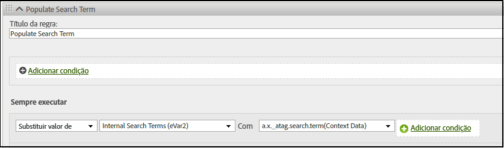

# Mapeamento da variável de objeto XDM para o Adobe Analytics

A tabela a seguir mostra as variáveis XDM que o Edge Network Adobe Experience Platform mapeia automaticamente para o Adobe Analytics. Se você usar esses caminhos de campo XDM, nenhuma configuração adicional será necessária para enviar dados para o Adobe Analytics. Esses campos estão incluídos na variável **[!UICONTROL Modelo de evento de experiência do Adobe Analytics]** grupo de campos. O uso desses campos é recomendado se você pretende enviar dados para o Adobe Analytics e o Adobe Experience Platform.

Se sua organização planeja migrar para o Customer Journey Analytics, o Adobe recomenda o uso de `data` para enviar dados diretamente para a Adobe Analytics sem estar em conformidade com um esquema. Essa estratégia permite que sua organização use seu próprio esquema, em vez de usar o [!UICONTROL Modelo de evento de experiência do Adobe Analytics] (que é menos aplicável ao Customer Journey Analytics). Consulte [Mapeamento da variável de objeto de dados para o Adobe Analytics](data-var-mapping.md) para uma tabela de mapeamento semelhante.

## Prioridades de valor

A maioria dos campos de objeto XDM nesta tabela coincide com um [campo do objeto de dados](data-var-mapping.md). Se você definir um determinado campo de objeto XDM e seu respectivo campo de objeto de dados, o campo de objeto de dados terá prioridade. Se você usar os campos de objeto XDM e objeto de dados, o Adobe recomenda definir eventos personalizados usando o campo objeto de dados. Se o campo `data.__adobe.analytics.events` estiver presente, substituirá todos os campos de objeto XDM relacionados ao comércio e aos eventos personalizados.

## Mapeamento de campo do objeto XDM

As atualizações anteriores desta tabela podem ser encontradas no [histórico de confirmações desta página no GitHub](https://github.com/AdobeDocs/analytics.en/commits/main/help/implement/aep-edge/xdm-var-mapping.md).

| Caminho de campo XDM | Variável e descrição do Analytics |
| --- | --- |
| `xdm.application.isClose` | Ajuda a definir a métrica de ciclo de vida móvel [Falhas](https://developer.adobe.com/client-sdks/documentation/mobile-core/lifecycle/metrics/). |
| `xdm.application.isInstall` | Ajuda a determinar quando aumentar a métrica de ciclo de vida móvel [Primeiras inicializações](https://developer.adobe.com/client-sdks/documentation/mobile-core/lifecycle/metrics/). |
| `xdm.application.closeType` | Determina se um evento de encerramento é uma falha ou não. Os valores válidos incluem `close` (Uma sessão de ciclo de vida termina e um evento de pausa foi recebido para a sessão anterior) e `unknown` (Uma sessão do ciclo de vida termina sem um evento de pausa). Ajuda a definir a métrica de ciclo de vida móvel [Falhas](https://developer.adobe.com/client-sdks/documentation/mobile-core/lifecycle/metrics/). |
| `xdm.application.isInstall` | A métrica de ciclo de vida móvel [Instalações](https://developer.adobe.com/client-sdks/documentation/mobile-core/lifecycle/metrics/). |
| `xdm.application.isLaunch` | A métrica de ciclo de vida móvel [Inicializações](https://developer.adobe.com/client-sdks/documentation/mobile-core/lifecycle/metrics/). |
| `xdm.application.name` | Ajuda a definir a dimensão de ciclo de vida móvel [ID do aplicativo](https://developer.adobe.com/client-sdks/documentation/mobile-core/lifecycle/metrics/). |
| `xdm.application.isUpgrade` | A métrica de ciclo de vida móvel [Atualizações](https://developer.adobe.com/client-sdks/documentation/mobile-core/lifecycle/metrics/). |
| `xdm.application.version` | Ajuda a definir a dimensão de ciclo de vida móvel [ID do aplicativo](https://developer.adobe.com/client-sdks/documentation/mobile-core/lifecycle/metrics/). |
| `xdm.application.sessionLength` | A métrica de ciclo de vida móvel [Duração da sessão anterior](https://developer.adobe.com/client-sdks/documentation/mobile-core/lifecycle/metrics/). |
| `xdm.commerce.checkouts.id` | Aplica [serialização de eventos](../vars/page-vars/events/event-serialization.md) para a métrica [Check-outs](../../components/metrics/checkouts.md). |
| `xdm.commerce.checkouts.value` | Aumenta a métrica [Check-outs](../../components/metrics/checkouts.md) pela quantidade desejada. |
| `xdm.commerce.order.currencyCode` | Define a variável da configuração [currencyCode](../vars/config-vars/currencycode.md). |
| `xdm.commerce.order.purchaseID` | Define a variável da página [purchaseID](../vars/page-vars/purchaseid.md). |
| `xdm.commerce.order.payments[0].transactionID` | Define a variável de página [transactionID](../vars/page-vars/transactionid.md). |
| `xdm.commerce.productListAdds.id` | Aplica [serialização de eventos](../vars/page-vars/events/event-serialization.md) à métrica [Adições ao carrinho](../../components/metrics/cart-additions.md). |
| `xdm.commerce.productListAdds.value` | Incrementa a métrica [Adições ao carrinho](../../components/metrics/cart-additions.md). |
| `xdm.commerce.productListOpens.id` | Aplica [serialização de eventos](../vars/page-vars/events/event-serialization.md) à métrica [Carrinhos](../../components/metrics/carts.md). |
| `xdm.commerce.productListOpens.value` | Incrementa a métrica [Carrinhos](../../components/metrics/carts.md). |
| `xdm.commerce.productListRemovals.id` | Aplica [serialização de eventos](../vars/page-vars/events/event-serialization.md) à métrica [Remoções do carrinho](../../components/metrics/cart-removals.md). |
| `xdm.commerce.productListRemovals.value` | Incrementa a métrica [Remoções do carrinho](../../components/metrics/cart-removals.md). |
| `xdm.commerce.productListViews.id` | Aplica [serialização de eventos](../vars/page-vars/events/event-serialization.md) à métrica [Visualizações do carrinho](../../components/metrics/cart-views.md). |
| `xdm.commerce.productListViews.value` | Incrementa a métrica [Visualizações do carrinho](../../components/metrics/cart-views.md). |
| `xdm.commerce.productViews.id` | Aplica [serialização de eventos](../vars/page-vars/events/event-serialization.md) à métrica [Visualizações do produto](../../components/metrics/product-views.md). |
| `xdm.commerce.productViews.value` | Incrementa a métrica [Visualizações de produto](../../components/metrics/product-views.md). |
| `xdm.commerce.purchases.value` | Incrementa a métrica [Pedidos](../../components/metrics/orders.md). |
| `xdm.device.model` | A dimensão de ciclo de vida móvel [Nome do dispositivo](https://developer.adobe.com/client-sdks/documentation/mobile-core/lifecycle/metrics/). |
| `xdm.device.colorDepth` | Ajuda a definir a dimensão [Intensidade de cor](../../components/dimensions/color-depth.md). |
| `xdm.device.screenHeight` | Ajuda a definir a dimensão [Resolução do monitor.](../../components/dimensions/monitor-resolution.md) |
| `xdm.device.screenWidth` | Ajuda a definir a dimensão [Resolução do monitor.](../../components/dimensions/monitor-resolution.md) |
| `xdm.device.type` | O tipo de dispositivo móvel. |
| `xdm.environment.browserDetails.acceptLanguage` | Ajuda a definir a dimensão [Idioma](../../components/dimensions/language.md). |
| `xdm.environment.browserDetails.cookiesEnabled` | Define a dimensão [Suporte a cookies](../../components/dimensions/cookie-support.md). Os valores válidos incluem `Y` (o navegador aceita cookies) e `N` (o navegador rejeita cookies). |
| `xdm.environment.browserDetails.javaEnabled` | Define a dimensão [Java ativado](../../components/dimensions/java-enabled.md). Os valores válidos incluem `Y` (O Java está ativado) e `N` (O Java está desativado). |
| `xdm.environment.browserDetails.userAgent` | Usado como um método de identificação [visitante único](../../components/metrics/unique-visitors.md) de fallback. Normalmente preenchida com o uso do cabeçalho da solicitação HTTP do `User-Agent`. Você pode mapear esse campo para uma eVar se quiser usá-la nos relatórios. |
| `xdm.environment.browserDetails.viewportHeight` | Define a dimensão [Altura da janela do navegador](../../components/dimensions/browser-height.md). |
| `xdm.environment.browserDetails.viewportWidth` | Define a dimensão [Largura do navegador](../../components/dimensions/browser-width.md). |
| `xdm.environment.carrier` | A dimensão de ciclo de vida móvel [Nome da operadora](https://developer.adobe.com/client-sdks/documentation/mobile-core/lifecycle/metrics/). |
| `xdm.environment.connectionType` | Ajuda a definir a dimensão [Tipo de conexão](../../components/dimensions/connection-type.md). |
| `xdm.environment.ipV4` | Usado como um método de identificação [visitante único](../../components/metrics/unique-visitors.md) de fallback. Normalmente preenchida com o uso do cabeçalho HTTP do `X-Forwarded-For`. |
| `xdm.environment.language` | A localidade da dimensão móvel. |
| `xdm.environment.operatingSystem` | A dimensão de ciclo de vida móvel [Sistema operacional](https://developer.adobe.com/client-sdks/documentation/mobile-core/lifecycle/metrics/). |
| `xdm.environment.operatingSystemVersion` | Ajuda a definir a dimensão de ciclo de vida móvel [Versão do sistema operacional](https://developer.adobe.com/client-sdks/documentation/mobile-core/lifecycle/metrics/). |
| `xdm._experience.analytics.customDimensions.`<br/>`eVars.eVar1`<br/>`[...]`<br/>`xdm._experience.analytics.customDimensions.`<br/>`eVars.eVar250` | Define a respectiva dimensão da [eVar](../../components/dimensions/evar.md). |
| `xdm._experience.analytics.customDimensions.`<br/>`hierarchies.hier1`<br/>`[...]`<br/>`xdm._experience.analytics.customDImensions.`<br/>`hierarchies.hier5` | Define a respectiva dimensão da [Hierarquia](/help/components/dimensions/hierarchy.md). |
| `xdm._experience.analytics.customDimensions.`<br/>`listProps.prop1.delimiter`<br/>`[...]`<br/>`xdm._experience.analytics.customDimensions.`<br/>`listProps.prop75.delimiter` | Sobreposição do delimitador de propriedade de lista. O uso desse campo não é recomendado, pois o delimitador é recuperado automaticamente do [Administrador da variável de tráfego](/help/admin/admin/c-manage-report-suites/c-edit-report-suites/c-traffic-variables/traffic-var.md) nas configurações do conjunto de relatórios. O uso desse campo pode criar uma incompatibilidade entre o delimitador usado e o delimitador esperado pelo Analytics. |
| `xdm._experience.analytics.customDimensions.`<br/>`listProps.prop1.values`<br/>`[...]`<br/>`xdm._experience.analytics.customDimensions.`<br/>`listProps.prop75.values` | Uma matriz de sequência de caracteres que contém os respectivos valores da [Propriedade de lista](../vars/page-vars/prop.md#list-props). |
| `xdm._experience.analytics.customDimensions.`<br/>`lists.list1.list[].value`<br/>`[...]`<br/>`xdm._experience.analytics.customDimensions.`<br/>`lists.list3.list[].value` | Concatena todas as strings `value` em cada matriz `list[]` à sua respectiva [variável de lista](../vars/page-vars/list.md). O delimitador é escolhido automaticamente com base no valor definido nas [configurações do conjunto de relatórios](/help/admin/admin/c-manage-report-suites/c-edit-report-suites/conversion-var-admin/list-var-admin.md). |
| `xdm._experience.analytics.customDimensions.`<br/>`props.prop1`<br/>`[...]`<br/>`xdm._experience.analytics.customDimensions.`<br/>`props.prop75` | Define a respectiva dimensão de [Propriedade](../../components/dimensions/prop.md). |
| `xdm._experience.analytics.event1to100.`<br/>`event1.id`<br/>`[...]`<br/>`xdm._experience.analytics.event901to1000.`<br/>`event1000.id` | Aplica a [serialização de eventos](../vars/page-vars/events/event-serialization.md) à respectiva métrica de [Eventos personalizados](../../components/metrics/custom-events.md). Cada ID de evento reside no grupo principal de um conjunto de 100 grupos. Por exemplo, para aplicar a serialização a `event678`, use `xdm._experience.analytics.event601to700.event678.id`. |
| `xdm._experience.analytics.event1to100.`<br/>`event1.value`<br/>`[...]`<br/>`xdm._experience.analytics.event901to1000.`<br/>`event1000.value` | Aumenta a respectiva métrica de [Eventos personalizados](../../components/metrics/custom-events.md) de acordo com o valor desejado. Cada evento reside no grupo principal de um conjunto de 100 grupos. Por exemplo, o campo para `event567` é `xdm._experience.analytics.event501to600.event567.value`. |
| `xdm.identityMap.ECID[0].id` | A [ID do serviço de identidade da Adobe Experience Cloud](https://experienceleague.adobe.com/docs/id-service/using/home.html?lang=pt-BR). |
| `xdm.marketing.trackingCode` | Define a dimensão [Código de rastreamento](../../components/dimensions/tracking-code.md). |
| `xdm.media.mediaTimed.completes.value` | A métrica [Conteúdo concluído](https://experienceleague.adobe.com/docs/media-analytics/using/metrics-and-metadata/audio-video-parameters.html?lang=pt-BR#content-complete) do Media Analytics. |
| `xdm.media.mediaTimed.dropBeforeStart.value` | `c.a.media.view`, `c.a.media.timePlayed`, `c.a.media.play` |
| `xdm.media.mediaTimed.federated.value` | A métrica [Dados federados](https://experienceleague.adobe.com/docs/media-analytics/using/metrics-and-metadata/audio-video-parameters.html?lang=pt-BR#federated-data) do Media Analytics. |
| `xdm.media.mediaTimed.firstQuartiles.value` | A métrica [Marcador de progresso de 25%](https://experienceleague.adobe.com/docs/media-analytics/using/metrics-and-metadata/audio-video-parameters.html?lang=pt-BR#twenty-five-progress-marker) do Media Analytics. |
| `xdm.media.mediaTimed.mediaSegmentView.value` | A métrica [Visualizações do segmento de conteúdo](https://experienceleague.adobe.com/docs/media-analytics/using/metrics-and-metadata/audio-video-parameters.html?lang=pt-BR#content-segment-views) do Media Analytics. |
| `xdm.media.mediaTimed.midpoints.value` | A métrica [Marcador de progresso de 50%](https://experienceleague.adobe.com/docs/media-analytics/using/metrics-and-metadata/audio-video-parameters.html?lang=pt-BR#fifty-progress-marker) do Media Analytics. |
| `xdm.media.mediaTimed.pauseTime.value` | A métrica [Duração total da pausa](https://experienceleague.adobe.com/docs/media-analytics/using/metrics-and-metadata/audio-video-parameters.html?lang=pt-BR#total-pause-duration) do Media Analytics. |
| `xdm.media.mediaTimed.pauses.value` | A métrica [Pausar eventos](https://experienceleague.adobe.com/docs/media-analytics/using/metrics-and-metadata/audio-video-parameters.html?lang=pt-BR#pause-events) do Media Analytics. |
| `xdm.media.mediaTimed.primaryAssetReference.`<br/>`@id` | A dimensão [ID do ativo](https://experienceleague.adobe.com/docs/media-analytics/using/metrics-and-metadata/audio-video-parameters.html?lang=pt-BR#asset-id) do Media Analytics. |
| `xdm.media.mediaTimed.primaryAssetReference.`<br/>`dc:title` | A dimensão [Nome do vídeo](https://experienceleague.adobe.com/docs/media-analytics/using/metrics-and-metadata/audio-video-parameters.html?lang=pt-BR#video-name) do Media Analytics. |
| `xdm.media.mediaTimed.primaryAssetReference.`<br/>`iptc4xmpExt:Creator[N].iptc4xmpExt:Name` | A dimensão [Originador](https://experienceleague.adobe.com/docs/media-analytics/using/metrics-and-metadata/audio-video-parameters.html?lang=pt-BR#originator) do Media Analytics. |
| `xdm.media.mediaTimed.primaryAssetReference.`<br/>`iptc4xmpExt:Episode.iptc4xmpExt:Number` | A dimensão [Episódio](https://experienceleague.adobe.com/docs/media-analytics/using/metrics-and-metadata/audio-video-parameters.html?lang=pt-BR#episode) do Media Analytics. |
| `xdm.media.mediaTimed.primaryAssetReference.`<br/>`iptc4xmpExt:Genre` | A dimensão [Gênero](https://experienceleague.adobe.com/docs/media-analytics/using/metrics-and-metadata/audio-video-parameters.html?lang=pt-BR#genre) do Media Analytics. |
| `xdm.media.mediaTimed.primaryAssetReference.`<br/>`iptc4xmpExt:Rating[N].iptc4xmpExt:RatingValue` | A dimensão [Classificação de conteúdo](https://experienceleague.adobe.com/docs/media-analytics/using/metrics-and-metadata/audio-video-parameters.html?lang=pt-BR#content-rating) do Media Analytics. |
| `xdm.media.mediaTimed.primaryAssetReference.`<br/>`iptc4xmpExt:Season.iptc4xmpExt:Number` | A dimensão [Temporada](https://experienceleague.adobe.com/docs/media-analytics/using/metrics-and-metadata/audio-video-parameters.html?lang=pt-BR#season) do Media Analytics. |
| `xdm.media.mediaTimed.primaryAssetReference.`<br/>`iptc4xmpExt:Series.iptc4xmpExt:Identifier` | A dimensão [ID de conteúdo](https://experienceleague.adobe.com/docs/media-analytics/using/metrics-and-metadata/audio-video-parameters.html?lang=pt-BR#content-id) do Media Analytics. |
| `xdm.media.mediaTimed.primaryAssetReference.`<br/>`iptc4xmpExt:Series.iptc4xmpExt:Name` | A dimensão [Programa](https://experienceleague.adobe.com/docs/media-analytics/using/metrics-and-metadata/audio-video-parameters.html?lang=pt-BR#show) do Media Analytics. |
| `xdm.media.mediaTimed.primaryAssetReference.`<br/>`showType` | A dimensão [Tipo de programa](https://experienceleague.adobe.com/docs/media-analytics/using/metrics-and-metadata/audio-video-parameters.html?lang=pt-BR#show-type) do Media Analytics. |
| `xdm.media.mediaTimed.primaryAssetReference.`<br/>`xmpDM:duration` | A dimensão [Duração do vídeo](https://experienceleague.adobe.com/docs/media-analytics/using/metrics-and-metadata/audio-video-parameters.html?lang=pt-BR#video-length) do Media Analytics. |
| `xdm.media.mediaTimed.primaryAssetViewDetails.`<br/>`@id` | A dimensão [ID da sessão de mídia](https://experienceleague.adobe.com/docs/media-analytics/using/metrics-and-metadata/audio-video-parameters.html?lang=pt-BR#media-session-id) do Media Analytics. |
| `xdm.media.mediaTimed.primaryAssetViewDetails.`<br/>`broadcastChannel` | A dimensão [Canal de conteúdo](https://experienceleague.adobe.com/docs/media-analytics/using/metrics-and-metadata/audio-video-parameters.html?lang=pt-BR#content-channel) do Media Analytics. |
| `xdm.media.mediaTimed.primaryAssetViewDetails.`<br/>`broadcastContentType` | A dimensão [Tipo de conteúdo](https://experienceleague.adobe.com/docs/media-analytics/using/metrics-and-metadata/audio-video-parameters.html?lang=pt-BR#content-type) do Media Analytics. |
| `xdm.media.mediaTimed.primaryAssetViewDetails.`<br/>`broadcastNetwork` | A dimensão [Rede](https://experienceleague.adobe.com/docs/media-analytics/using/metrics-and-metadata/audio-video-parameters.html?lang=pt-BR#network) do Media Analytics. |
| `xdm.media.mediaTimed.primaryAssetViewDetails.`<br/>`mediaSegmentView.value` | A dimensão [Segmento de conteúdo](https://experienceleague.adobe.com/docs/media-analytics/using/metrics-and-metadata/audio-video-parameters.html?lang=pt-BR#content-segment) do Media Analytics. |
| `xdm.media.mediaTimed.primaryAssetViewDetails.`<br/>`playerName` | A dimensão [Nome do reprodutor de conteúdo](https://experienceleague.adobe.com/docs/media-analytics/using/metrics-and-metadata/audio-video-parameters.html?lang=pt-BR#content-player-name) do Media Analytics. |
| `xdm.media.mediaTimed.primaryAssetViewDetails.`<br/>`playerSDKVersion.version` | A dimensão [Versão do SDK](https://experienceleague.adobe.com/docs/media-analytics/using/metrics-and-metadata/audio-video-parameters.html?lang=pt-BR#sdk-version) do Media Analytics. |
| `xdm.media.mediaTimed.primaryAssetViewDetails.`<br/>`sourceFeed` | A dimensão [Tipo de feed de mídia](https://experienceleague.adobe.com/docs/media-analytics/using/metrics-and-metadata/audio-video-parameters.html?lang=pt-BR#media-feed-type) do Media Analytics. |
| `xdm.media.mediaTimed.primaryAssetViewDetails.`<br/>`streamFormat` | A dimensão [Formato de transmissão](https://experienceleague.adobe.com/docs/media-analytics/using/metrics-and-metadata/audio-video-parameters.html?lang=pt-BR#stream-format) do Media Analytics. |
| `xdm.media.mediaTimed.progress10.value` | A métrica [Marcador de progresso de 10 %](https://experienceleague.adobe.com/docs/media-analytics/using/metrics-and-metadata/audio-video-parameters.html?lang=pt-BR#ten-progress-marker) do Media Analytics. |
| `xdm.media.mediaTimed.progress95.value` | A métrica [Marcador de progresso de 95%](https://experienceleague.adobe.com/docs/media-analytics/using/metrics-and-metadata/audio-video-parameters.html?lang=pt-BR#ninety-five-progress-marker) do Media Analytics. |
| `xdm.media.mediaTimed.resumes.value` | A métrica [Resumo do conteúdo](https://experienceleague.adobe.com/docs/media-analytics/using/metrics-and-metadata/audio-video-parameters.html?lang=pt-BR#content-resumes) do Media Analytics. |
| `xdm.media.mediaTimed.starts.value` | A métrica [Inícios da mídia](https://experienceleague.adobe.com/docs/media-analytics/using/metrics-and-metadata/audio-video-parameters.html?lang=pt-BR#media-starts) do Media Analytics. |
| `xdm.media.mediaTimed.thirdQuartiles.value` | A métrica [Marcador de progresso de 75%](https://experienceleague.adobe.com/docs/media-analytics/using/metrics-and-metadata/audio-video-parameters.html?lang=pt-BR#seventy-five-progress-marker) do Media Analytics. |
| `xdm.media.mediaTimed.timePlayed.value` | A métrica [Tempo gasto com conteúdo](https://experienceleague.adobe.com/docs/media-analytics/using/metrics-and-metadata/audio-video-parameters.html?lang=pt-BR#content-time-spent) do Media Analytics. |
| `xdm.media.mediaTimed.totalTimePlayed.value` | A métrica [Tempo gasto com a mídia](https://experienceleague.adobe.com/docs/media-analytics/using/metrics-and-metadata/audio-video-parameters.html?lang=pt-BR#media-time-spent) do Media Analytics. |
| `xdm.placeContext.geo._schema.latitude` | O local de latitude do visitante. Ajuda a definir [Local do ciclo de vida móvel](/help/components/dimensions/lifecycle-dimensions.md) dimensões. |
| `xdm.placeContext.geo._schema.longitude` | O local da longitude do visitante. Ajuda a definir [Local do ciclo de vida móvel](/help/components/dimensions/lifecycle-dimensions.md) dimensões. |
| `xdm.placeContext.geo.postalCode` | A dimensão [Código postal](../../components/dimensions/zip-code.md). |
| `xdm.placeContext.geo.stateProvince` | A dimensão [Estados dos Estados Unidos](../../components/dimensions/us-states.md). |
| `xdm.placeContext.localTime` | Aparece como `t_time_info` nos [feeds de dados](/help/export/analytics-data-feed/c-df-contents/datafeeds-reference.md). |
| `xdm.productListItems[]._experience.analytics.`<br/>`customDimensions.eVars.eVar1`<br/>`[...]`<br/>`xdm.productListItems[]._experience.analytics.`<br/>`customDimensions.eVars.eVar250` | Aplica um merchandising de [sintaxe do produto](../vars/page-vars/products.md) para eVars. |
| `xdm.productListItems[]._experience.analytics.`<br/>`event1to100.event1.value`<br/>`[...]`<br/>`xdm.productListItems[]._experience.analytics.`<br/>`event901-1000.event1000.value` | Aplica um merchandising de [sintaxe do produto](../vars/page-vars/products.md) para eventos. |
| `xdm.productListItems[].productCategories[].categoryID` | A dimensão [Categoria](../../components/dimensions/category.md). Consulte também a variável da página de [produtos](../vars/page-vars/products.md). |
| `xdm.productListItems[].name` | A dimensão [Produto](../../components/dimensions/product.md). Consulte também a variável da página de [produtos](../vars/page-vars/products.md). Se `xdm.productListItems[].SKU` e `xdm.productListItems[].name` contêm dados, o valor em `xdm.productListItems[].SKU` é usado. |
| `xdm.productListItems[].priceTotal` | Ajuda a determinar a métrica [Receita](../../components/metrics/revenue.md). Consulte também a variável da página de [produtos](../vars/page-vars/products.md). |
| `xdm.productListItems[].quantity` | Ajuda a determinar a métrica [Unidades](../../components/metrics/units.md). Consulte também a variável da página de [produtos](../vars/page-vars/products.md). |
| `xdm.productListItems[].SKU` | A dimensão [Produto](../../components/dimensions/product.md). Consulte também a variável da página de [produtos](../vars/page-vars/products.md). Se `xdm.productListItems[].SKU` e `xdm.productListItems[].name` contêm dados, o valor em `xdm.productListItems[].SKU` é usado. |
| `xdm.web.webInteraction.URL` | A variável de implementação [linkURL](../vars/config-vars/linkurl.md). |
| `xdm.web.webInteraction.name` | A dimensão [Link personalizado](../../components/dimensions/custom-link.md), [Link de download](../../components/dimensions/download-link.md) ou [Link de saída](../../components/dimensions/exit-link.md), dependendo do valor em `xdm.web.webInteraction.type` |
| `xdm.web.webInteraction.type` | Determina o tipo de link clicado. Os valores válidos incluem `other` (Links personalizados), `download` (Links de download) e `exit` (Links de saída). |
| `xdm.web.webPageDetails.URL` | A dimensão [URL da página](../../components/dimensions/page-url.md). |
| `xdm.web.webPageDetails.isErrorPage` | Sinalizador que ajuda a determinar a [dimensão](../../components/dimensions/pages-not-found.md) e a [métrica](../../components/metrics/pages-not-found.md) “Páginas não encontradas”. |
| `xdm.web.webPageDetails.name` | A dimensão [Página](../../components/dimensions/page.md). |
| `xdm.web.webPageDetails.server` | A dimensão [Servidor](../../components/dimensions/server.md). |
| `xdm.web.webPageDetails.siteSection` | A dimensão [Seção do site](../../components/dimensions/site-section.md). |
| `xdm.web.webReferrer.URL` | A dimensão [Referenciador](../../components/dimensions/referrer.md). |

{style="table-layout:auto"}

<!-- `environment.browserDetails.javaScriptVersion` and `web.webPageDetails.homePage` were included in the original table, but they no longer exist in Analytics. | -->

## Mapeamento de outros campos XDM para variáveis do Analytics

Se houver dimensões ou métricas que você deseja adicionar ao Adobe Analytics, faça isso por meio de [Variáveis de dados de contexto](../vars/page-vars/contextdata.md).

### Mapeamento implícito

Quaisquer elementos de campo XDM que não são mapeados automaticamente são enviados para o Adobe Analytics como dados de contexto com o prefixo `a.x.` É possível mapear essa variável de dados de contexto para a variável do Analytics desejada usando [Regras de processamento](https://experienceleague.adobe.com/docs/analytics/admin/admin-tools/processing-rules/processing-rules.html?lang=pt-BR). Por exemplo, se você enviar o seguinte evento:

```js
alloy("event",{
    "xdm":{
        "_atag":{
            "search":{
                "term":"Example search term"
            }
        }
    }
})
```

O SDK da Web envia esses dados para o Adobe Analytics como a variável de dados de contexto `a.x._atag.search.term`. Em seguida, você pode usar uma regra de processamento para atribuir esse valor de variável de dados de contexto à variável do Analytics desejada, como uma `eVar`:



## Mapeamento explícito

Também é possível mapear explicitamente elementos de campo XDM como dados de contexto. Qualquer elemento de campo XDM que seja mapeado explicitamente, usando o `contextData` é enviado para o Adobe Analytics como Dados de contexto sem um prefixo. Em seguida, é possível mapear essa variável de dados de contexto para a variável do Analytics desejada usando [Regras de processamento](https://experienceleague.adobe.com/docs/analytics/admin/admin-tools/processing-rules/processing-rules.html?lang=pt-BR). Por exemplo, se você enviar o seguinte evento:

```js
alloy("event",{
    "xdm":{
        "_atag":{
            "analytics": {
                "contextData" : {
                    "someValue" : "1"
                }
            }
        }
    }
})
```

O SDK da Web envia esses dados para o Adobe Analytics como a variável de dados de contexto `somevalue` com valor `1`.  Em seguida, você pode usar uma regra de processamento para atribuir esse valor de variável de dados de contexto à variável do Analytics desejada, como uma `eVar`:


