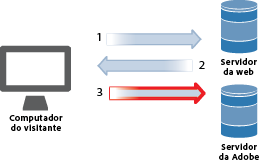
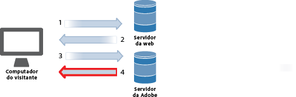
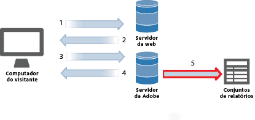
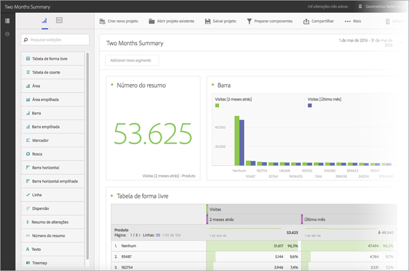

# Coleta de dados

Saiba mais sobre como as visitas no seu site se tornam relatórios no Adobe Analytics.

A coleta de dados do Analytics é realizada por uma solicitação de imagem especial aos servidores de coleta de dados da Adobe. Na maioria das implementações, um código JavaScript é colocado nas páginas da Web que estão sendo monitoradas. Quando uma página da Web com tag é carregada no navegador do visitante, o navegador executa nosso código JavaScript, realizando um processo de lógica computacional para captar informações dos visitantes e preencher as tags corretamente. A última etapa do processamento do JavaScript é uma solicitação de imagem ao servidor de coleta de dados do Analytics, que coleta os dados enviados e retorna uma pequena imagem transparente para o navegador do visitante.

Como o afunilamento típico em um processamento do navegador equivale ao tempo gasto para baixar os elementos da página (imagens etc) dos servidores da Web, o tempo necessário para que o navegador execute o código JavaScript é insignificante. No entanto, a última etapa, na qual o navegador do visitante solicita uma imagem ao servidor de coleta de dados da Adobe, não é acrescentada ao tempo total de download da página. O efeito geral no tempo de download da página depende da proximidade do visitante (geralmente em hops e não em distância geográfica) em relação aos servidores da coleta de dados da Adobe.

A Adobe criou várias maneiras de enviar dados para o Analytics. Esses métodos incluem rastrear informações em tempo real de:

* Aplicativos capazes de acessas a Internet
* Campanhas
* Aplicativos de cliente/servidor
* E-mails
* Dispositivos móveis
* Quiosques baseados na Web
* Sites

<!-- 

Need to reconcile with Data Collection topics in the user guide, in this guide, and in reference. 

 -->

1. Quando um visitante acessa o seu site, uma solicitação é feita ao seu servidor da Web.

   

1. O servidor Web do seu site envia as informações de código da página, que é exibida no navegador.

   

1. A página é carregada e o código JavaScript do Analytics é executado.

   

   O código JavaScript envia uma solicitação de imagem ao servidor da Adobe, passando as variáveis, métricas e os dados da página definidos na sua implementação.

   **Exemplo de código JavaScript:** o código JavaScript é colocado dentro das tags do corpo (body) de uma página:

   

   **Exemplo de solicitação de imagem:** um fragmento de uma solicitação de imagem com o nome da página mencionado:

   

   >[!NOTE]
   >
   >Cada solicitação de imagem contém uma cadeia de caracteres de número aleatória para evitar que o navegador seja armazenado em cache e garantir que as solicitações de imagem subsequentes sejam feitas pelo navegador.

1. A Adobe retorna uma imagem pixelada transparente.

   

   O código coleta detalhes adicionais automaticamente (como sistema operacional, tipo de navegador, altura e largura do navegador, endereço IP e idioma do navegador).

1. Os servidores da Adobe armazenam os dados de análise da Web em *`report suites`* (o repositório de dados).

   

   Um [conjunto de relatórios](https://marketing.adobe.com/resources/help/en_US/reference/report_suites_admin.html) define o relatório completo e independente de um site específico ou subconjuntos de páginas da Web.

1. Os dados do conjunto de relatórios preenchem os relatórios que você pode acessar por um navegador.

   

   **Exemplo de relatório:**

   

   A execução do código JavaScript ocorre rapidamente e a maneira que os tempos de carregamento de uma página são afetados não é visível. Essa abordagem permite que você conte as páginas que foram exibidas quando um visitante clicou em **[!UICONTROL Recarregar]** ou **[!UICONTROL Voltar]** para acessar uma página, já que o JavaScript é executado mesmo quando a página é recuperada do cache.

Para obter mais detalhes, consulte:

* [Coleta de dados](/help/implement/js-implementation/data-collection/query-parameters.md)
* [Criar um elemento de dados](/help/implement/c-implement-with-dtm/t-data-element.md)
* [Data Warehouse](https://marketing.adobe.com/resources/help/en_US/reference/data_warehouse.html)
* [Ad Hoc Analysis](https://marketing.adobe.com/resources/help/en_US/dsc/c_getting_started.html)
* [Fontes de dados](https://marketing.adobe.com/resources/help/en_US/whitepapers/ftp/ftp_datasources.html)
* [Data Connectors](https://marketing.adobe.com/resources/help/en_US/whitepapers/ftp/ftp_genesis.html)
* [Feed de dados do Analytics](/help/export/analytics-data-feed/data-feed-overview.md)

>[!MORELIKETHIS]
>       
>* [Experience Cloud Debugger](/help/implement/impl-testing/debugger.md)

