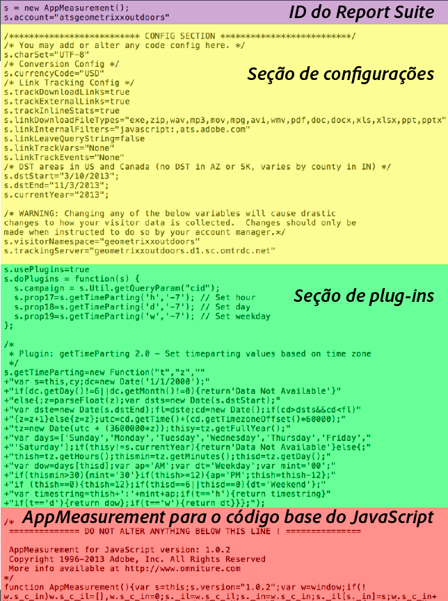

# Código do Analytics

Os dados são enviados a um conjunto de relatórios para serem exibidos no relatório. A maneira mais fácil e comum de enviar dados para o Analytics é usando a implementação DTM. Você também pode inserir o código com a implementação JavaScript.

Para obter informações sobre como usar o [!UICONTROL Dynamic Tag Management] para criar o código de cabeçalho e rodapé para você, consulte [Adicionar código de cabeçalho e rodapé](/help/implement/c-implement-with-dtm/c-headers-footers/t-header-footer-code.md).

Este é um exemplo do arquivo JavaScript [!DNL AppMeasurement] mostrando as partes do código:

