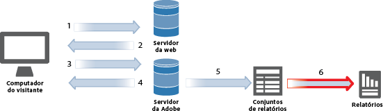

# Relatórios e conjuntos de relatórios

Um conjunto de relatórios define o relatório completo e independente de um site da Web específico ou de subconjuntos de páginas da Web. Geralmente, um conjunto de relatórios representa um site da Web, mas pode ser um segmento global onde você pode combinar diversos números de site para obter totais. Ao fazer logon em relatórios de marketing, na Ad Hoc Analysis e no Report Builder, você selecionará um conjunto de relatórios para usar (exceto quando utilizar roll-ups que combinam conjuntos de relatórios). 

Os relatórios fornecem informações sobre os dados coletados pelo Analytics, com base em parâmetros específicos.

É possível executar um *relatório do Analytics* após implementar o Adobe Analytics. Os relatórios fornecem informações de seus canais com base na Web tradicionais e também de canais móveis, vídeo e de redes sociais. Alguns exemplos de relatórios de marketing incluem:

* Quantas pessoas visitam o seu site
* Quantos desses visitantes são visitantes únicos (contados somente uma vez)
* Como eles chegaram até o site (se os visitantes seguiram um link ou chegaram diretamente ao site)
* Quais palavras-chave os visitantes usaram para pesquisar pelo conteúdo do site
* Por quanto tempo os visitantes permaneceram em uma página específica ou no site
* Em quais links o visitante clicou e quando ele deixou o site
* Quais canais de marketing são os mais eficazes na geração de receita ou eventos de conversão
* Quanto tempo foi utilizado ao assistir a um vídeo
* Quais navegadores e dispositivos eles utilizaram para visitar seu site

Os tipos de relatório de alto nível incluem:

* [Tráfego](https://marketing.adobe.com/resources/help/en_US/reference/reports_traffic.html): oferece informações detalhadas sobre como os visitantes interagem com seu site e suas estatísticas de tráfego personalizadas.
* [Conversão](https://marketing.adobe.com/resources/help/en_US/reference/reports_conversion.html): exibe informações sobre indicadores de sucesso definidos.
* [Caminhos](https://marketing.adobe.com/resources/help/en_US/reference/reports_paths.html): permite rastrear e registrar os caminhos de navegação dos visitantes.

Você pode usar a [Analysis Workspace](https://marketing.adobe.com/resources/help/en_US/analytics/analysis-workspace/) para remover as limitações típicas de um único relatório do Analytics. Ela oferece uma tela robusta e flexível para criar projetos de análise personalizados. Arraste e solte qualquer número de tabelas de dados, visualizações e componentes (dimensões, métricas, segmentos e granularidades de tempo) em um projeto. Crie detalhamentos e segmentos instantaneamente, crie coortes para análise, crie alertas, crie segmentos e gerencie relatórios para compartilhamento com qualquer pessoa na sua empresa.

 <b>Consulte também</b> 

* [Ajuda da Analysis Workspace](/help/analyze/analysis-workspace/analysis-workspace-features.md)
* [Reports and Analytics](/help/analyze/reports-analytics/overview/report-overview.md)
* [Relatórios em tempo real](https://marketing.adobe.com/resources/help/en_US/reference/realtime.html)
* [Ajuda do Report Builder da Adobe](https://marketing.adobe.com/resources/help/en_US/arb/)
* [Extrações de dados](https://marketing.adobe.com/resources/help/en_US/sc/user/data_extract.html)
* [Activity Map](https://marketing.adobe.com/resources/help/en_US/analytics/activitymap/)
* [Gerenciador do Conjunto de relatórios](https://marketing.adobe.com/resources/help/en_US/reference/report_suites_admin.html)
* [Comparação e requisitos de produto do Analytics](https://marketing.adobe.com/resources/help/en_US/reference/analytics-product-comparison.html)
* [Descrições de relatórios](https://marketing.adobe.com/resources/help/en_US/reference/reports_descriptions.html)
* [Painéis e reportlets](https://marketing.adobe.com/resources/help/en_US/sc/user/dashboard.html)
* [Marcadores](/help/analyze/reports-analytics/bookmarks.md)
* [Conjuntos de relatórios virtuais](/help/components/vrs/vrs-about.md)
* [Detecção de anomalias](/help/analyze/analysis-workspace/virtual-analyst/c-anomaly-detection/anomaly-detection.md)
* [Análise de contribuição](/help/analyze/analysis-workspace/virtual-analyst/contribution-analysis/ca-tokens.md)

