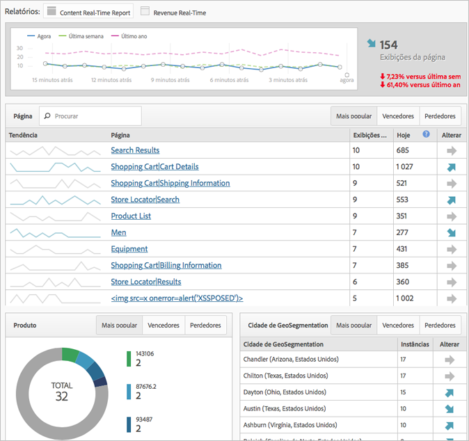

# Implementação modal simplificada

Saiba mais sobre a experiência dos novos clientes ao executarem a implementação do Adobe Analytics.

<!-- 

https://activation.adobedtm.com/index.php?redirected=1 

 -->

New users can quickly create your first [!DNL Analytics] report suite (data repository) using this *`Getting Started with Adobe Analytics`* setup modal. Then, you can deploy [!DNL Analytics] code using [!DNL Dynamic Tag Management].

O [!DNL Dynamic Tag Management] permite administrar a implementação do Adobe Analytics sem precisar fazer alterações ao seu site todas as vezes. Se estiver implementando um aplicativo para dispositivos móveis, você pode obter o SDK que precisa para começar a coletar dados valiosos dos aplicativos.

Esse procedimento permite:

* Criar rapidamente o seu primeiro [conjunto de relatórios](https://marketing.adobe.com/resources/help/en_US/analytics/getting-started/report-suites.html).
* Deploy [!DNL Analytics] and the [Identity Service](https://marketing.adobe.com/resources/help/en_US/mcvid/).

* Executar relatórios de dados básicos a nível de página.

>[!NOTE]
>
>Before you begin, verify that Analytics is [enabled in the Adobe Experience Cloud](https://marketing.adobe.com/resources/help/en_US/mcloud/core_services.html) (the solution provisioning process). Caso tenha recebido um email convidando para efetuar logon no Analytics com o painel Empresa, você completou o pré-requisito.

**Para executar a janela restrita da implementação simplificada**

1. Log in to the [!DNL Adobe Experience Cloud] ( [experiencecloud.adobe.com](https://experiencecloud.adobe.com)).

   Ao acessar o [!DNL Analytics], o sistema identifica se você tem um conjunto de relatórios. Caso não tenha, a página [!UICONTROL Introdução ao Adobe Analytics] é exibida.

   

   Alternatively, you can run this setup in [!DNL Analytics] by clicking **[!UICONTROL Help]** &gt; **[!UICONTROL Welcome to Adobe Analytics]**.

1. Especifique as seguintes informações fundamentais sobre a sua empresa:

   <table id="table_1741878A1B284CB78D297D531DC703D6"> 
     <thead> 
      <tr> 
       <th colname="col1" class="entry"> Elemento </th> 
       <th colname="col2" class="entry"> Descrição </th> 
      </tr> 
     </thead>
     <tbody> 
      <tr> 
       <td colname="col1"> 
Tipo de propriedade 
 </td> 
       <td colname="col2"> 
A implementação é para Web, dispositivos móveis ou ambos? 
 </td> 
      </tr> 
      <tr> 
       <td colname="col1"> 
Setores 
 </td> 
       <td colname="col2"> 
Especifique como a sua empresa ganha dinheiro (produtos, atendimento ao cliente, leads, reconhecimento de marca e anúncios). 
 </td> 
      </tr> 
      <tr> 
       <td colname="col1"> 
Camada de dados 
 </td> 
       <td colname="col2"> 
(Recomendado) Um baco de dados JavaScript é usado para armazenar informações. Se executar a configuração automática usando o Dynamic Tag Management, estará usando uma camada de dados. 
 
For a blog on data layers, see <a href="https://blogs.adobe.com/digitalmarketing/analytics/data-layers-buzzword-best-practice/" format="http" scope="external"> Data Layer: From Buzzword to Best Practice</a>. 
 </td> 
      </tr> 
      <tr> 
       <td colname="col1"> 
Repositório de dados (conjunto de relatórios) 
 </td> 
       <td colname="col2"> 
 Um <a href="https://marketing.adobe.com/resources/help/en_US/analytics/getting-started/report-suites.html" format="html" scope="external">conjunto de relatórios</a> é um conjunto discreto de dados que geralmente corresponde a uma única propriedade (site ou aplicativo) ou marca. Cada conjunto de relatórios tem seu próprio aglomerado de relatórios e métricas. 
 </td> 
      </tr> 
      <tr> 
       <td colname="col1"> 
Fuso Horário 
 </td> 
       <td colname="col2"> 
Seu horário local. (Detectado automaticamente.) 
 </td> 
      </tr> 
      <tr> 
       <td colname="col1"> 
Estimativa de Exibições da página 
 </td> 
       <td colname="col2"> 
Número aproximado de exibições da página que o seu site recebe por dia. 
 </td> 
      </tr> 
      <tr> 
       <td colname="col1"> 
Moeda de base 
 </td> 
       <td colname="col2"> 
A moeda que usa para fazer negócios. 
 </td> 
      </tr> 
     </tbody> 
    </table>

1. Click **[!UICONTROL Next]**.

   O sistema cria um conjunto de relatórios.

1. To begin deployment, click **[!UICONTROL Next]**, then click one of the following options:

   <table id="table_71C7F7B9677346CD8D5130519D32464B"> 
     <thead> 
      <tr> 
       <th colname="col1" class="entry"> Elemento </th> 
       <th colname="col2" class="entry"> Descrição </th> 
      </tr> 
     </thead>
     <tbody> 
      <tr> 
       <td colname="col1"> 
Implantar 
 </td> 
       <td colname="col2"> 
 Inicia o Dynamic Tag Management onde é possível efetuar o logon e implantar o Analytics. This process automatically implements the  AppMeasurement.js file and the Identity Service ( VisitorAPI.js). 
 
 
Importante: em uma nova guia do navegador, uma página de ajuda é exibida, orientando você pela implementação do Adobe Analytics por meio do Dynamic Tag Management. 
 
 </td> 
      </tr> 
      <tr> 
       <td colname="col1"> 
Baixar 
 </td> 
       <td colname="col2"> 
 Baixe o arquivo de instalação chamado INSTALAR &lt;nome do conjunto de relatórios&gt;.js. Essa opção é adequada para usuário experientes que compreendem a <a href="https://marketing.adobe.com/resources/help/en_US/sc/implement/js_implementation.html" format="html" scope="external">implementação do JavaScript</a>. 
 
 
Importante: a ação de baixar o código não equivale a implementar o Analytics. Isso é uma implantação manual realizada nas páginas do site ou pelos serviços do Adobe Consulting. 
 
 </td> 
      </tr> 
     </tbody> 
    </table>

1. Executar um relatório.

   Após implantar a ferramenta Analytics, é possível executar um relatório no Reports &amp; Analytics para confirmar o envio de dados ao seu site. (Consulte [Fazer logon e navegar](https://marketing.adobe.com/resources/help/en_US/analytics/getting-started/analytics-navigation.html) para se familiarizar com a interface do Analytics.)

   For example, a **[!UICONTROL Site Metrics]** &gt; **[!UICONTROL Real-Time]** lets you see immediate data.

   >[!NOTE]
   >
   >The [!UICONTROL Real-Time] report requires some configuration prior to running. Consulte [Configurar relatório em tempo real](https://marketing.adobe.com/resources/help/en_US/reference/t_realtime_admin.html).

**Exemplo de relatório em tempo real**

