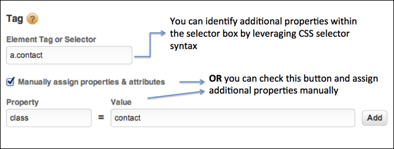

# Criar condições para regras baseadas em eventos

As condições determinam quando uma regra baseada em eventos é acionada.

1. Selecione o tipo de interação que deseja rastrear como cliques de mouse, ou o envio de um formulário.

   

   Para obter mais informações, consulte [Tipos de eventos](https://marketing.adobe.com/resources/help/en_US/dtm/event_types.html) na documentação do produto do Tag Management da Adobe.

1. Ative as opções a seguir se necessário:

   | Elemento | Descrição |
   |--- |--- |
   | Atrasar ativação de link | Ative se o evento ativar um link e você desejar que o link seja atrasado até que o evento tenha tempo de ser acionado. |
   | Aplicar o manipulador de evento diretamente no elemento | Aplica o manipulador de evento no elemento específico que está marcado. Essa configuração está vinculada ao conceito do efeito de bolhas e camadas em um navegador. |

   For example, when you click an image inside an anchor tag like ``, you might expect the click to be associated with the anchor tag, because the tag is in the bubble stream. However, when you inspect the click in the developer tools, the click may actually affect only the `` tag. To ensure that the event is handled correctly, associate the click with the `` tag and do not depend on the browser to bubble up the click to a parent element. Um evento como um clique pode gerar bolhas para `<body>`. É importante entender onde o evento está realmente vinculado, e direcioná-lo especificamente para garantir que a regra seja acionada corretamente.

   *Efeito de bolha* significa que o evento é capturado primeiro e manipulado pelo elemento mais interno e propagado para os elementos externos.

1. Indique o nome da tag que deseja rastrear e outras propriedades da tag que você deseja corresponder.

   

   Consulte [Usar o seletor de CSS](https://marketing.adobe.com/resources/help/en_US/dtm/css-selector.html) na documentação do produto do Dynamic Tag Management para obter informações sobre como descobrir a tag de elemento correta.

1. Selecione e configure outros critérios ou tipos de condição que deseja vincular à regra.

   

1. Indique sua preferência com respeito ao efeito de bolha do evento.

   O efeito de bolha do evento é uma forma de propagação de evento no DOM do HTML.

   | Se você... | Marque esta opção |
   |--- |--- |
   | Quer interações relacionadas em elementos secundários do seletor da regra identificada para acionar a regra. | Permitir que eventos em elementos secundários borbulhem. |
   | Quer impedir o efeito de bolha quando o elemento secundário já acionar seu próprio evento. | Não permitir se o elemento secundário já acionar o evento. |
   | Não deseja que os eventos do seletor de regras identificado ultrapassem o próprio elemento na hierarquia de eventos. | Não permitir que os eventos borbulhem até os principais. |
