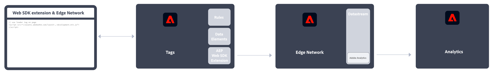

# Implementação do Adobe Analytics

O Adobe Analytics requer código em seu site, aplicativo móvel ou outro aplicativo para enviar dados aos servidores de coleta de dados. Há vários métodos para implementar esse código, dependendo da plataforma e das necessidades da organização.

## Métodos de implementação de site

Os seguintes métodos de implementação estão disponíveis para seu **site**:

### Lado do cliente

* **Extensão do SDK da web**: o método padronizado e recomendado para implementar o Adobe Analytics para novos(as) clientes. Adicione a **extensão do SDK da Web da Adobe Experience Platform** nas **Tags** de Coleção de dados da Adobe Experience Plataform e coloque uma tag de carregador em cada página. A tag envia dados para a **Rede de borda** da Adobe Experience Platform, que encaminha esses dados para o Adobe Analytics.
  
Consulte [Como implementar o Adobe Analytics usando a extensão do SDK da Web da Adobe Experience Platform.](./aep-edge/overview.md) para obter mais informações.

* **SDK da Web**: você pode carregar manualmente as bibliotecas do SDK da web no seu site se não quiser usar a coleção de dados da Adobe Experience Platform. Referencie à biblioteca do SDK da web (`alloy.js`) em cada página e envie as chamadas de rastreamento desejadas para a **rede de borda** da Adobe Experience Platform em um formato conveniente para a sua organização. A Rede de borda encaminha esses dados para o Adobe Analytics.
  
Consulte [Como implementar o Adobe Analytics usando o SDK da Web da Adobe Experience Platform](./aep-edge/overview.md) para obter mais informações.

* **Extensão do Analytics**: adicione a **Extensão do Adobe Analytics** nas **Tags** da Coleção de dados da Adobe Experience Platform e, em seguida, coloque uma tag de carregamento em cada página. A tag envia dados diretamente para o Adobe Analytics. Use esse método de implementação se desejar a praticidade das tags, mas não quiser usar a infraestrutura da rede de borda.
  
Consulte [Como implementar o Adobe Analytics usando a extensão do Analytics](launch/overview.md) para obter mais informações.

* **JavaScript herdado:** o método manual histórico para implementar o Adobe Analytics. Consulte a biblioteca AppMeasurement (`AppMeasurement.js`) em cada página e defina variáveis e configurações no JavaScript.
  
Esse método de implementação pode ser útil para implementações que usam código personalizado e é ideal para tipos de implementação não oferecidos em outro lugar, como para [Páginas AMP](other/amp.md).

O seguinte fluxo de decisão pode ajudar a selecionar um método de implementação no lado do cliente:

>[!TIP]
>
>Entre em contato com a equipe de contas da Adobe para obter orientações e práticas recomendadas sobre qual implementação escolher com base na sua situação atual.

### Lado do servidor

Para implementar o Adobe Analytics no lado do servidor, você tem as seguintes opções:

* **API do servidor de borda**: você implementa o código no servidor que usa a API do servidor de borda da Adobe Experience Platform para se comunicar com o Adobe Analytics por meio de uma sequência de dados.
  
Consulte [Implementar o Adobe Analytics usando a API do servidor de rede de borda da Adobe Experience Platform](/help/implement/aep-edge/server-api/overview.md) para mais informações.

* **API de inserção de dados (em massa)**: você usa as APIs de inserção de dados (em massa) do Adobe Analytics para coletar dados no lado do servidor diretamente para o Adobe Analytics.
  
Consulte [API de inserção de dados](../import/c-data-insertion-api/c-data-insertion-api.md) para mais informações.

## Métodos de implementação para aplicativos móveis

Os seguintes métodos de implementação estão disponíveis para seu **aplicativo móvel**:

* **Extensão do SDK móvel**: o método padronizado e recomendado para implementar o Adobe Analytics no aplicativo móvel. Use bibliotecas dedicadas para enviar dados facilmente à Adobe a partir de seu aplicativo móvel. Adicione a **Extensão do SDK móvel da Adobe Experience Platform** nas **Tags** de coleção de dados da Adobe Experience Platform e, em seguida, implemente a biblioteca do SDK móvel no aplicativo. É possível usar o SDK para importar bibliotecas, registrar extensões e carregar a configuração da tag. Envie dados para a **Rede de borda** da Adobe Experience Platform. A Rede de borda encaminha esses dados para o Adobe Analytics.
  

  Consulte [Implementar o Adobe Analytics usando o SDK móvel da Adobe Experience Platform](../implement/aep-edge/mobile-sdk/overview.md) para obter mais informações.

* **Extensão do Analytics**: adicione a **Extensão do Adobe Analytics** nas **Tags** de coleção de dados da Adobe Experience Platform e implemente a biblioteca do SDK móvel no aplicativo. É possível usar o SDK para importar bibliotecas, registrar extensões e carregar a configuração da tag. Esse método de implementação envia dados diretamente para o Adobe Analytics. É recomendado se você deseja a praticidade da coleção de dados da Adobe Experience Platform, mas não deseja usar a infraestrutura da rede de borda da Adobe Experience Platform.
  

  Consulte [Implementar o Adobe Analytics usando a extensão do Analytics](../implement/aep-edge/mobile-sdk/overview.md) para obter mais informações.

>[!CAUTION]
>
>Para obter suporte para versões mais antigas de SDKs móveis da Adobe, consulte [Anúncios de fim de suporte dos SDKs](https://developer.adobe.com/client-sdks/resources/sdks-end-of-support/).

## Artigos principais de implementação do Analytics

* [Assumir o controle de uma implementação existente do Adobe Analytics](/help/implement/prepare/existing-implementation.md)
* [Adobe Debugger](validate/debugger.md)
* [Criar uma propriedade de tag na Experience Platform](launch/create-analytics-property.md)
* [Atualizações do AppMeasurement](appmeasurement-updates.md)
* [Tutorial de configuração do Adobe Analytics com o SDK da web da Platform](https://experienceleague.adobe.com/pt-br/docs/platform-learn/implement-web-sdk/applications-setup/setup-analytics)
* [Tutorial de como implementar a Adobe Experience Cloud em aplicativos para dispositivos móveis](https://experienceleague.adobe.com/docs/platform-learn/implement-mobile-sdk/overview.html?lang=pt-BR)

## Principais recursos do Analytics

* [Entre em contato com o Atendimento ao cliente](https://experienceleague.adobe.com/?support-solution=Analytics&amp;lang=pt-BR#support)
* [Fórum do Analytics](https://experienceleaguecommunities.adobe.com/t5/adobe-analytics/ct-p/adobe-analytics-community?profile.language=pt)
* [Recursos do Adobe Analytics](https://experienceleaguecommunities.adobe.com/t5/adobe-analytics-discussions/adobe-analytics-resources/m-p/276666?profile.language=pt)
* [Notas de versão mais recentes](../release-notes/latest.md)
