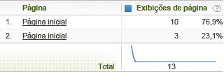

# Uso do espaço em branco em valores de variável

Em HTML, existem vários caracteres que criam espaço em branco.

São eles espaço, tabulação e retorno de carro (ou feed de linha). Considere o exemplo a seguir:

```js
<head> 
 <title> 
   Home Page 
 </title> 
</head> 
<body> 
<script language="javascript"> 
 s.pageName=document.title 
</script> 
```

Nesse caso, document.title preenche [!UICONTROL s.pageName], que deve receber um valor de "Home Page". Observe o espaço antes de "Home Page". Nem todos os navegadores interpretam esse espaço em branco da mesma forma. O resultado pode ser um dos exemplos abaixo:

```js
s.pageName="Home Page"
```

```js
s.pageName="        Home Page"
```

O primeiro valor é exibido corretamente, mas o segundo exibe o espaço em branco antes do texto. O [!DNL Analytics] os trata como valores distintos para a variável [!UICONTROL s.pageName]. A interface do [!DNL Analytics] corta o espaço em branco à esquerda do segundo valor. O resultado é um relatório exibido como mostrado abaixo.



Esse erro de implementação faz com que valores da variável sejam fragmentados em vários itens de linha. O [!DNL SAINT] não permite espaços em branco à esquerda em um valor de chave. Isso significa que ele não pode ser usado para agrupar vários itens de linha como uma solução, caso esse problema afete seu site. A única forma de corrigir o problema é pré-processar o valor de variável desejado (neste caso, a propriedade document.title) para remover qualquer espaço em branco à esquerda (ou direita).

O exemplo acima usa a variável [!UICONTROL s.pageName] com a propriedade document.title. A Adobe não recomenda usar document.title como nome da página, e esse problema não afeta apenas a variável [!UICONTROL s.pageName]. Todas as variáveis que tenham espaço em branco à esquerda/direita em seu valor poderão ser afetadas.
