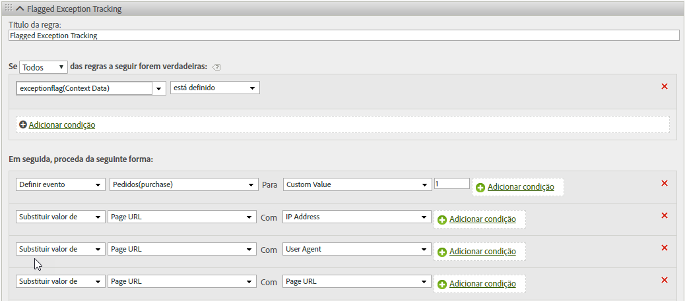

# hitGovernor

O plug-in s.hitGovernor rastreia o número total de solicitações de imagem do Analytics enviadas durante um intervalo de tempo predefinido e pode executar lógica adicional, se necessário, caso esse total exceda um determinado limite.

Embora o tráfego de bots, spiders, agentes de usuário específicos ou de uma lista específica de endereços IP possa ser identificado como tráfego de bot ou de outra forma excluído dos relatórios, algum tráfego que não deveria ser contabilizado poderá ser capturado nos conjuntos de relatórios. Por exemplo, um grande número de cliques ou exibições de página durante um período irrazoável (ou seja, aproximadamente uma solicitação por segundo) poderia ser tráfego duplicado.

A utilização desse plug-in permite o bloqueio automático desse tráfego para o restante da vida útil do visitante, e esse tráfego também pode ser identificado dinamicamente nos relatórios.

## Como funciona o plug-in HitGovernor  {#section_541BC639E31442D09B1C85A2FFCDC02C}

O plug-in incrementa um valor de cookie cada vez que uma solicitação de imagem é enviada para os servidores de rastreamento e rastreia ao longo de um intervalo de tempo contínuo. O intervalo de tempo padrão é de um minuto, embora possa ser substituído. (Consulte  [Implementação](/help/implement/js-implementation/plugins/hitgovernor.md#task_D4BDB524AA294C139AFCAE2B61FEA3F2) abaixo). Se o número total de hits durante esse intervalo de tempo exceder o limite de hits padrão (60), uma solicitação de imagem do link personalizado final será enviada para definir a variável de dados de contexto *`exceptionFlag`*. O limite de hit padrão também pode ser substituído.

Se desejado, a partir desse ponto, o tráfego pode ser impedido de ser coletado para esse visitante específico por um período padrão de sessenta dias. Bloquear o tráfego exige uma linha adicional de código na função doPlugins, conforme descrito abaixo. O intervalo de tempo também pode ser ajustado. A lógica permite que o tempo inclua o endereço IP desse visitante, o Agente do usuário ou a ID de visitante da [!DNL Experience Cloud] na lógica de exceção permanente adequada ou para redefinir o período de tempo limite após o decurso de sessenta dias. Se esse tráfego for identificado como fraudulento pelo plug-in após sessenta dias, ele será sinalizado novamente como uma exceção e não será coletado por mais sessenta dias.

## Relatórios {#section_E742F19B528041808454744DB2C7007C}

Nenhuma variável ou evento padrão precisa ser definido. No entanto, recomendamos que você configure a lógica das regras de processamento para definir variáveis e eventos de acordo. Essas variáveis e eventos personalizados podem incluir:

* [!DNL Experience Cloud] Visitor ID
* Endereço IP
* Agente do usuário
* Evento de exceção sinalizado

A criação de segmentos para essas variáveis permite criar segmentos e conjuntos de relatórios virtuais para exibir o impacto geral desses hits ambíguos no site.

Recomendamos usar os valores capturados no relatório para atualizar as regras de bot, as regras de DB VISTA ou as exclusões de IP da empresa.

## Implementação {#task_D4BDB524AA294C139AFCAE2B61FEA3F2}

Para implementar o plug-in hitGovernor:

1. Modificar a biblioteca do AppMeasurement.

   Para inicializar o plug-in, inclua essa linha de código (em negrito) na função `registerPostTrackCallback` no código de biblioteca do AppMeasurement.

   >[!NOTE]
   >
   >Embora a funcionalidade `registerPostTrackCallback` esteja incluída nas bibliotecas do AppMeasurement 1.8.0+, ela não está incluída em nenhuma configuração de código personalizado por padrão. Ela é incluída após e *fora da* função doPlugins.

   ```
    s.registerPostTrackCallback(function(){ 
    s.governor();
   }); 
   ```

   Abaixo da seção doPlugins do arquivo AppMeasurement, inclua o código do plug-in contido em  [Código fonte do plug-in](/help/implement/js-implementation/plugins/hitgovernor.md#reference_76423C81A7A342B2AC4BE41490B27DE0) abaixo.

   O limite de hit, o limite de tempo de hit e os intervalos de tempo de exclusão de tráfego podem ser substituídos, definindo as seguintes variáveis fora do próprio plug-in e, de preferência, com suas outras variáveis de configuração:

<table id="table_9959A40F5F0B40B39DB86E21D03E25FD"> 
 <thead> 
  <tr> 
   <th colname="col1" class="entry"> Variável </th> 
   <th colname="col2" class="entry"> Sintaxe </th> 
   <th colname="col3" class="entry"> Descrição </th> 
  </tr> 
 </thead>
 <tbody> 
  <tr> 
   <td colname="col1"> <p>Limite de hit </p> </td> 
   <td colname="col2"> <p> <code> s.hl = 60; </code> </p> </td> 
   <td colname="col3"> <p>O número total de hits que não deve ser excedido durante um determinado período de tempo. </p> </td> 
  </tr> 
  <tr> 
   <td colname="col1"> <p>Limite de hora do hit </p> </td> 
   <td colname="col2"> <p> <code> s.ht = 10; </code> </p> </td> 
   <td colname="col3"> <p>A janela, em segundos, para quando os hits são registrados. Esse número é dividido por seis para determinar as janelas de tempo contínuas. </p> </td> 
  </tr> 
  <tr> 
   <td colname="col1"> <p>Limite de exclusão </p> </td> 
   <td colname="col2"> <p> <code> s.he = 60; </code> </p> </td> 
   <td colname="col3"> <p>Número de dias que o cookie de exclusão foi definido para esse visitante. </p> </td> 
  </tr> 
 </tbody> 
</table>

>[!NOTE]
>
>A implementação pode usar um nome de objeto diferente do objeto "s" padrão do Analytics. Em caso afirmativo, atualize o nome do objeto de acordo.

1. Configurar regras de processamento.

   Este plug-in registra as exceções sinalizadas como dados de contexto em uma solicitação de imagem de rastreamento de link. Como tal, as regras de processamento devem ser configuradas para atribuir o rastreamento dessas exceções sinalizadas às variáveis &#x200B;&#x200B;apropriadas, como as abaixo.

   

1. (Opcional) Incluir o código de bloqueio de tráfego em doPlugins.

   Depois que o tráfego tiver sido identificado como uma exceção, todos os hits subsequentes do visitante poderão ser completamente bloqueados, incluindo o seguinte código na função `doPlugins`:

   ```
   //Check for hit governor flag 
         if(s.Util.cookieRead('s_hg')==9)s.abort=true;
   ```

   Se o código não for incluído, o tráfego do visitante será sinalizado, mas não bloqueado.

## Código fonte do plug-in  {#reference_76423C81A7A342B2AC4BE41490B27DE0}

Esse código deve ser adicionado abaixo da seção doPlugins da biblioteca AppMeasurement.

```
//Hit Governor (Version 0.1 BETA, 11-13-17) 
s.governor=new Function("","" 
+"var s=this;if(typeof s.hl=='undefined'){s.hl=60;}if(typeof s.ht=='u" 
+"ndefined'){s.ht=60;}if(typeof s.he=='undefined'){s.he=60;}if(s.Util" 
+".cookieRead('s_hg')==8){var i=new Date(),y=i.getFullYear(),m=i.getM" 
+"onth(),d=i.getDate(),i=new Date(y,m,d+s.he);s.Util.cookieWrite('s_h" 
+"g',9,i);return;}var f=s.Util.cookieRead('s_hc'),g=Number(s.Util.coo" 
+"kieRead('s_ht')),h=Math.floor((new Date()).getTime()),ha=f!=''?f.sp" 
+"lit('|').map(Number):[0,0,0,0,0],i=ha.reduce(function(ha,b){return " 
+"ha+b;},0),j=g==0?0:Math.floor(((h-g)/(s.ht/6))/1000);if(g==0)s.Util" 
+".cookieWrite('s_ht',h);if(i<s.hl){if(j>=1){if(j>=6){ha=[0,0,0,0,0];" 
+"}else{for(var k=0;k<j;k++){ha.unshift(0);ha.pop();}}s.Util.cookieWr" 
+"ite('s_ht',h);}}else{s.Util.cookieWrite('s_hg',8);s.linkTrackVars+=" 
+"',contextData.exceptionFlag';s.contextData['exceptionFlag']='true';" 
+"s.tl(this,'o','exceptionFlag');}ha[0]++;s.Util.cookieWrite('s_hc',h" 
+"a.join('|'));"); 
```

